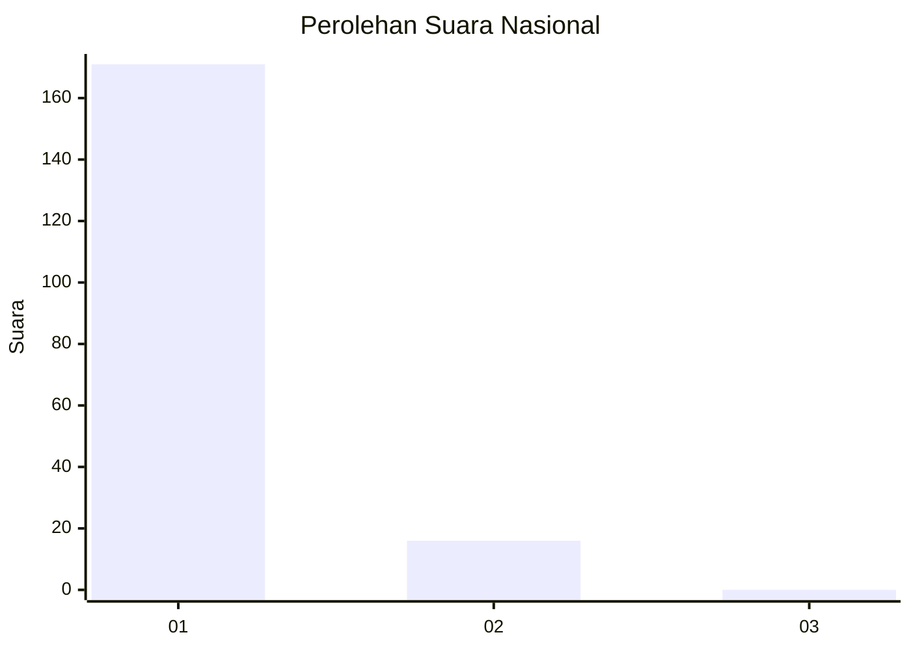
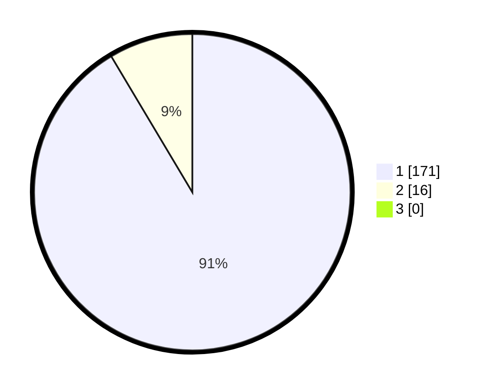

# Hasil

## Grafik

## Tabel

| No. | Nama Paslon    | Suara | Suara (raw) | Persentase |
|:--- |:-------------- | -----:| -----------:| ----------:|
| 1   | ANIES MUHAIMIN | 171   | [171][p-1]  | 91,44      |
| 2   | PRABOWO GIBRAN | 16    | [16][p-2]   | 8,56       |
| 3   | GANJAR MAHFUD  | 0     | [0][p-3]    | 0,00       |

[p-1]: https://github.com/gigit-pemilu/pemilu-2024/blob/main/pilpres/hitung-suara/sub/11-aceh/sub/06-aceh-besar/sub/03-indrapuri/sub/2012-lamlung/sub/002-tps/sub/paslon-1.txt
[p-2]: https://github.com/gigit-pemilu/pemilu-2024/blob/main/pilpres/hitung-suara/sub/11-aceh/sub/06-aceh-besar/sub/03-indrapuri/sub/2012-lamlung/sub/002-tps/sub/paslon-2.txt
[p-3]: https://github.com/gigit-pemilu/pemilu-2024/blob/main/pilpres/hitung-suara/sub/11-aceh/sub/06-aceh-besar/sub/03-indrapuri/sub/2012-lamlung/sub/002-tps/sub/paslon-3.txt

## Foto C Plano

https://sirekap-obj-formc.kpu.go.id/0c2a/pemilu/ppwp/11/06/03/20/12/1106032012002-20240215-013541--ce63eea6-50f6-4a55-b888-6f99eefb5894.jpg

https://sirekap-obj-formc.kpu.go.id/0c2a/pemilu/ppwp/11/06/03/20/12/1106032012002-20240215-014131--dfc0b049-ce79-4e4a-b802-3cb27e627b07.jpg

https://sirekap-obj-formc.kpu.go.id/0c2a/pemilu/ppwp/11/06/03/20/12/1106032012002-20240215-014250--e59611df-e9fa-47f9-847a-3742e3606eb8.jpg

## Metadata

| Key        | Value               |
| ---------- | ------------------- |
| Time Stamp | 2024-02-20 13:00:00 |

