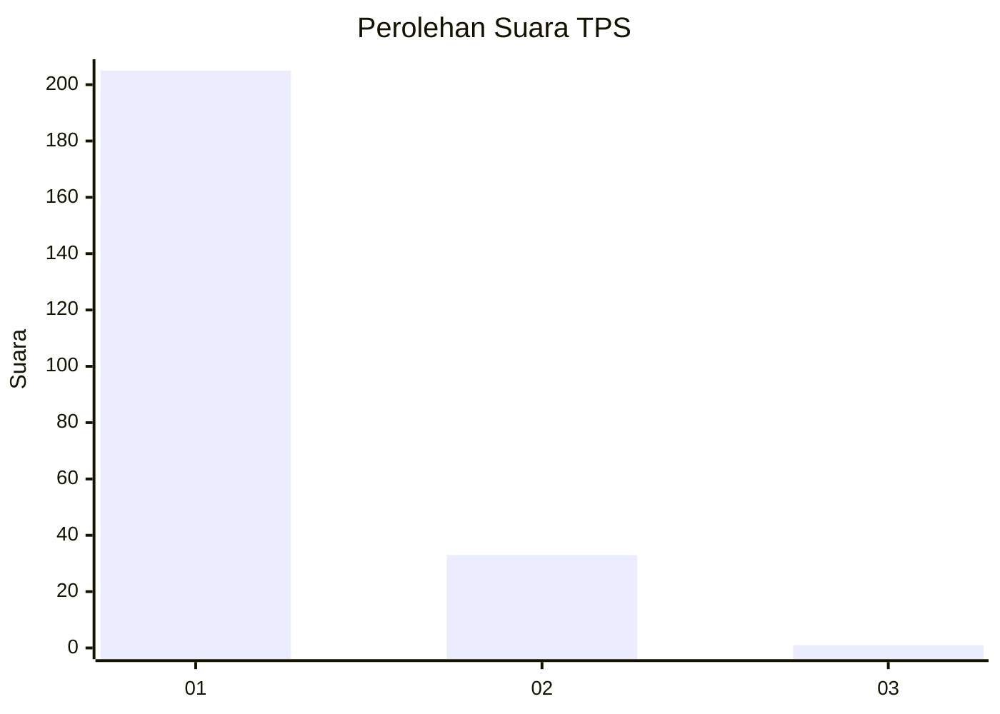
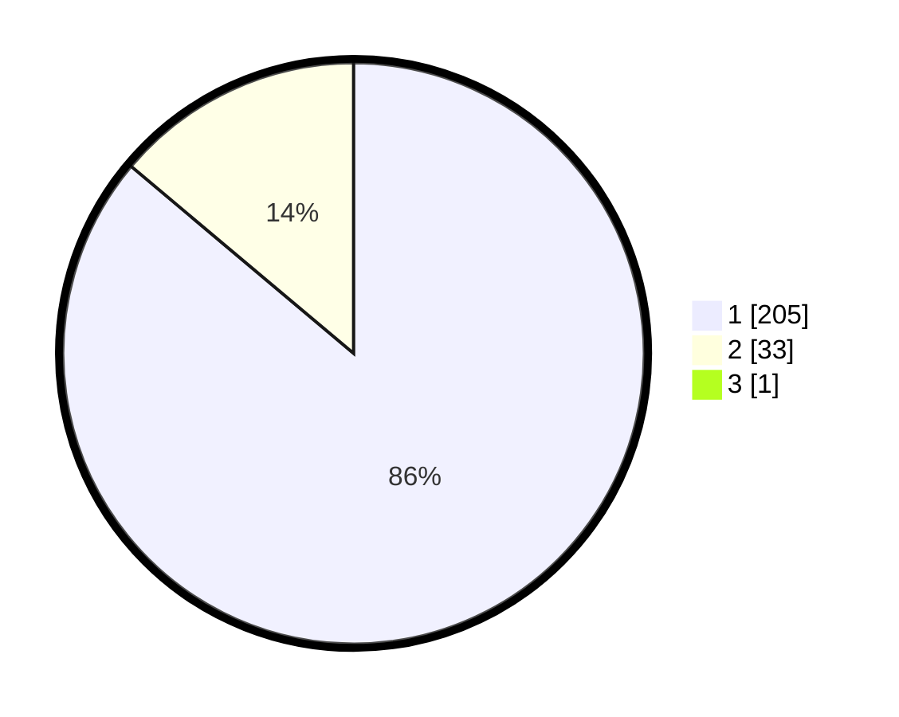

# Hasil

## Grafik

## Tabel

| No. | Nama Paslon    | Suara | Suara (raw) | Persentase |
|:--- |:-------------- | -----:| -----------:| ----------:|
| 1   | ANIES MUHAIMIN | 205   | [205][p-1]  | 85,77      |
| 2   | PRABOWO GIBRAN | 33    | [33][p-2]   | 13,81      |
| 3   | GANJAR MAHFUD  | 1     | [1][p-3]    | 0,42       |

[p-1]: https://github.com/gigit-pemilu/pemilu-2024-11-aceh/blob/main/pilpres/hitung-suara/sub/11-aceh/sub/06-aceh-besar/sub/03-indrapuri/sub/2014-meureu-bueng-u/sub/002-tps/sub/paslon-1.txt
[p-2]: https://github.com/gigit-pemilu/pemilu-2024-11-aceh/blob/main/pilpres/hitung-suara/sub/11-aceh/sub/06-aceh-besar/sub/03-indrapuri/sub/2014-meureu-bueng-u/sub/002-tps/sub/paslon-2.txt
[p-3]: https://github.com/gigit-pemilu/pemilu-2024-11-aceh/blob/main/pilpres/hitung-suara/sub/11-aceh/sub/06-aceh-besar/sub/03-indrapuri/sub/2014-meureu-bueng-u/sub/002-tps/sub/paslon-3.txt

## Foto C Plano

https://sirekap-obj-formc.kpu.go.id/744e/pemilu/ppwp/11/06/03/20/14/1106032014002-20240215-021900--67b3b9b1-1dfc-48f9-9c62-cbcad3bd559e.jpg

https://sirekap-obj-formc.kpu.go.id/744e/pemilu/ppwp/11/06/03/20/14/1106032014002-20240215-022121--c70dc871-fa34-4fcd-863c-caebcc8d3d1f.jpg

https://sirekap-obj-formc.kpu.go.id/744e/pemilu/ppwp/11/06/03/20/14/1106032014002-20240215-022249--3e5954a8-ca6c-4635-bf8b-19eae5f75878.jpg

## Metadata

| Key        | Value               |
| ---------- | ------------------- |
| Time Stamp | 2024-02-20 13:00:00 |

