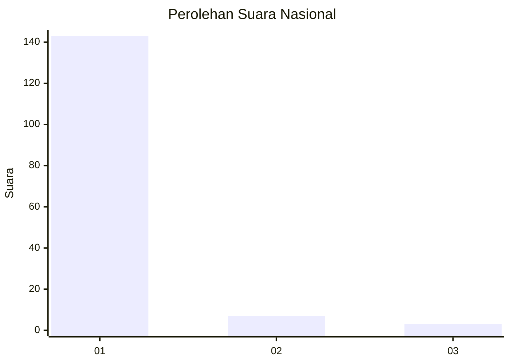
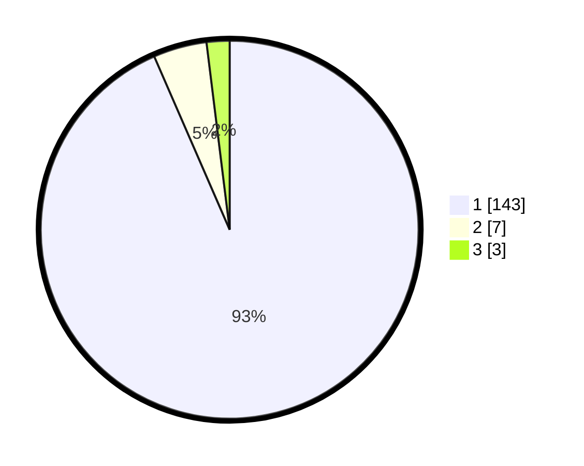

# Hasil

## Grafik

## Tabel

| No. | Nama Paslon    | Suara | Suara (raw) | Persentase |
|:--- |:-------------- | -----:| -----------:| ----------:|
| 1   | ANIES MUHAIMIN | 143   | [143][p-1]  | 93,46      |
| 2   | PRABOWO GIBRAN | 7     | [7][p-2]    | 4,58       |
| 3   | GANJAR MAHFUD  | 3     | [3][p-3]    | 1,96       |

[p-1]: https://github.com/gigit-pemilu/pemilu-2024/blob/main/pilpres/hitung-suara/sub/11-aceh/sub/06-aceh-besar/sub/03-indrapuri/sub/2019-reukih-kupula/sub/001-tps/sub/paslon-1.txt
[p-2]: https://github.com/gigit-pemilu/pemilu-2024/blob/main/pilpres/hitung-suara/sub/11-aceh/sub/06-aceh-besar/sub/03-indrapuri/sub/2019-reukih-kupula/sub/001-tps/sub/paslon-2.txt
[p-3]: https://github.com/gigit-pemilu/pemilu-2024/blob/main/pilpres/hitung-suara/sub/11-aceh/sub/06-aceh-besar/sub/03-indrapuri/sub/2019-reukih-kupula/sub/001-tps/sub/paslon-3.txt

## Foto C Plano

https://sirekap-obj-formc.kpu.go.id/28b1/pemilu/ppwp/11/06/03/20/19/1106032019001-20240215-012402--e2d9bde8-fbf5-4925-af41-697f45c3e3cc.jpg

https://sirekap-obj-formc.kpu.go.id/28b1/pemilu/ppwp/11/06/03/20/19/1106032019001-20240215-012418--05ffdd93-092d-4673-816e-8d2df5f2b697.jpg

https://sirekap-obj-formc.kpu.go.id/28b1/pemilu/ppwp/11/06/03/20/19/1106032019001-20240215-012432--912e881d-8e6f-46c0-8b81-4a1a26493f59.jpg

## Metadata

| Key        | Value               |
| ---------- | ------------------- |
| Time Stamp | 2024-02-15 15:00:29 |

