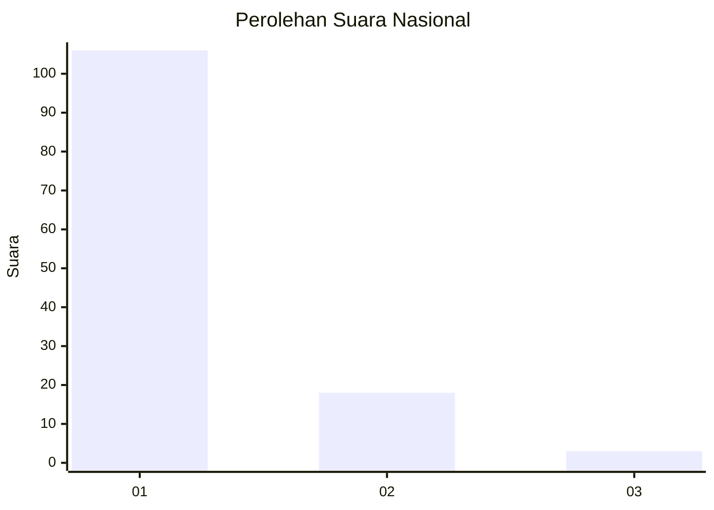
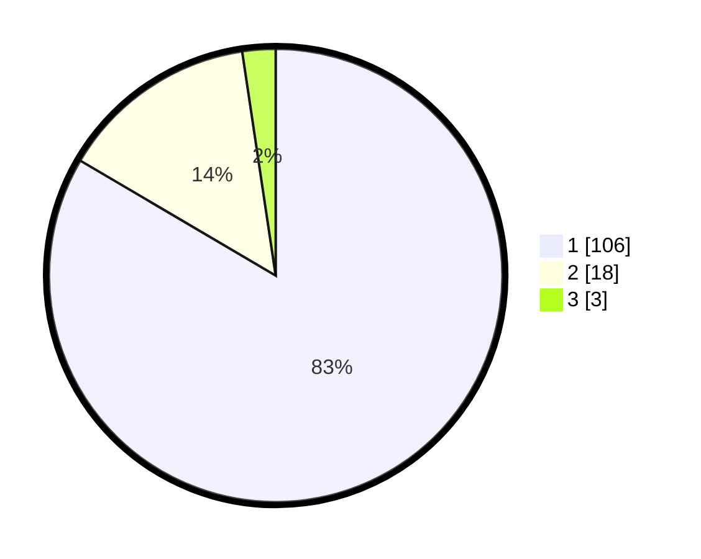

# Hasil

## Grafik

## Tabel

| No. | Nama Paslon    | Suara | Suara (raw) | Persentase |
|:--- |:-------------- | -----:| -----------:| ----------:|
| 1   | ANIES MUHAIMIN | 106   | [106][p-1]  | 83,46      |
| 2   | PRABOWO GIBRAN | 18    | [18][p-2]   | 14,17      |
| 3   | GANJAR MAHFUD  | 3     | [3][p-3]    | 2,36       |

[p-1]: https://github.com/gigit-pemilu/pemilu-2024/blob/main/pilpres/hitung-suara/sub/11-aceh/sub/06-aceh-besar/sub/03-indrapuri/sub/2020-lam-ilie-mesjid/sub/001-tps/sub/paslon-1.txt
[p-2]: https://github.com/gigit-pemilu/pemilu-2024/blob/main/pilpres/hitung-suara/sub/11-aceh/sub/06-aceh-besar/sub/03-indrapuri/sub/2020-lam-ilie-mesjid/sub/001-tps/sub/paslon-2.txt
[p-3]: https://github.com/gigit-pemilu/pemilu-2024/blob/main/pilpres/hitung-suara/sub/11-aceh/sub/06-aceh-besar/sub/03-indrapuri/sub/2020-lam-ilie-mesjid/sub/001-tps/sub/paslon-3.txt

## Foto C Plano

https://sirekap-obj-formc.kpu.go.id/477b/pemilu/ppwp/11/06/03/20/20/1106032020001-20240214-214027--9bfe5c48-a665-4551-aa84-0c1a069968c5.jpg

https://sirekap-obj-formc.kpu.go.id/477b/pemilu/ppwp/11/06/03/20/20/1106032020001-20240214-220707--b261684e-86a7-4fc5-ba37-38f0df9c1bb9.jpg

https://sirekap-obj-formc.kpu.go.id/477b/pemilu/ppwp/11/06/03/20/20/1106032020001-20240214-225615--6125a5ab-2708-404a-ae2d-6e78a0c28c7b.jpg

## Metadata

| Key        | Value               |
| ---------- | ------------------- |
| Time Stamp | 2024-02-20 13:00:00 |

## DATA PEMILIH TETAP

Jumlah pemilih dalam DPT: **127**.
 * L: **51**.
 * P: **76**.

## DATA PENGGUNA HAK PILIH

Jumlah pengguna hak pilih dalam DPT: **127**.
 * L: **51**.
 * P: **76**.

Jumlah pengguna hak pilih dalam DPTb: **0**.
 * L: **0**.
 * P: **0**.

Jumlah pengguna hak pilih dalam DPK: **0**.
 * L: **0**.
 * P: **0**.

Jumlah pengguna hak pilih: **127**.
 * L: **51**.
 * P: **76**.

## JUMLAH SUARA SAH DAN TIDAK SAH

JUMLAH SELURUH SUARA SAH: **127**.

JUMLAH SUARA TIDAK SAH: **0**.

JUMLAH SELURUH SUARA SAH DAN SUARA TIDAK SAH: **127**.

