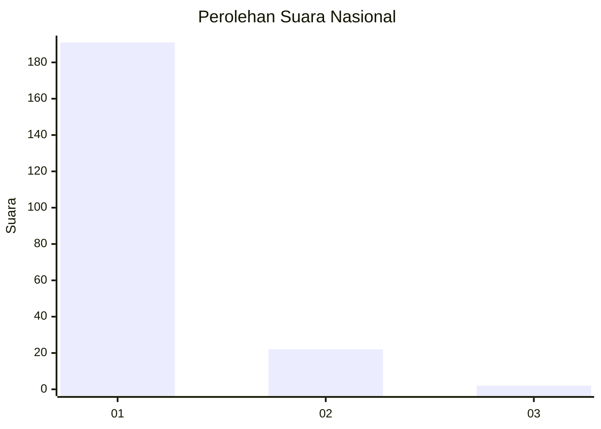
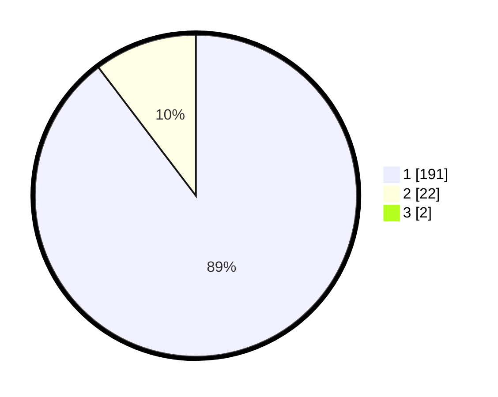

# Hasil

## Grafik

## Tabel

| No. | Nama Paslon    | Suara | Suara (raw) | Persentase |
|:--- |:-------------- | -----:| -----------:| ----------:|
| 1   | ANIES MUHAIMIN | 191   | [191][p-1]  | 88,84      |
| 2   | PRABOWO GIBRAN | 22    | [22][p-2]   | 10,23      |
| 3   | GANJAR MAHFUD  | 2     | [2][p-3]    | 0,93       |

[p-1]: https://github.com/gigit-pemilu/pemilu-2024/blob/main/pilpres/hitung-suara/sub/11-aceh/sub/06-aceh-besar/sub/03-indrapuri/sub/2021-lam-ilie-tengoh/sub/002-tps/sub/paslon-1.txt
[p-2]: https://github.com/gigit-pemilu/pemilu-2024/blob/main/pilpres/hitung-suara/sub/11-aceh/sub/06-aceh-besar/sub/03-indrapuri/sub/2021-lam-ilie-tengoh/sub/002-tps/sub/paslon-2.txt
[p-3]: https://github.com/gigit-pemilu/pemilu-2024/blob/main/pilpres/hitung-suara/sub/11-aceh/sub/06-aceh-besar/sub/03-indrapuri/sub/2021-lam-ilie-tengoh/sub/002-tps/sub/paslon-3.txt

## Foto C Plano

https://sirekap-obj-formc.kpu.go.id/a7e5/pemilu/ppwp/11/06/03/20/21/1106032021002-20240215-051710--181ad2c1-0170-4646-9b50-2fab18f919d8.jpg

https://sirekap-obj-formc.kpu.go.id/a7e5/pemilu/ppwp/11/06/03/20/21/1106032021002-20240215-052001--0529e87b-909c-4941-beb4-ca2d1d5d003e.jpg

https://sirekap-obj-formc.kpu.go.id/a7e5/pemilu/ppwp/11/06/03/20/21/1106032021002-20240215-052038--021aa78a-8ede-4e6a-8a57-9fbef004d076.jpg

## Metadata

| Key        | Value               |
| ---------- | ------------------- |
| Time Stamp | 2024-02-20 13:00:00 |

