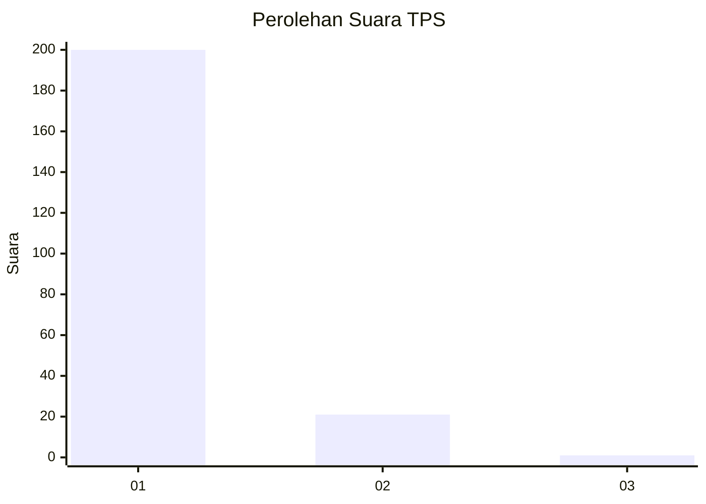
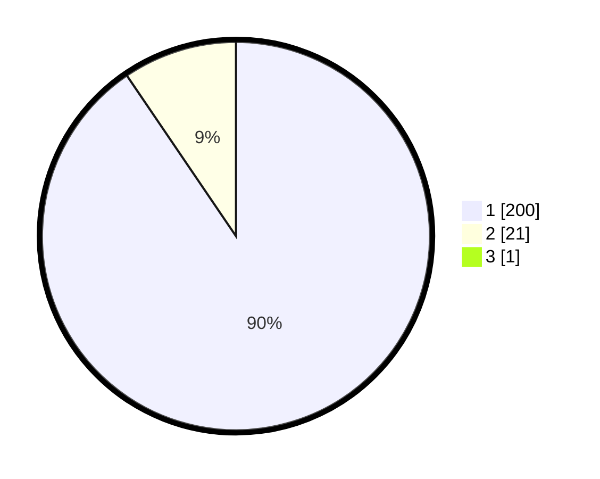

# Hasil

## Grafik

## Tabel

| No. | Nama Paslon    | Suara | Suara (raw) | Persentase |
|:--- |:-------------- | -----:| -----------:| ----------:|
| 1   | ANIES MUHAIMIN | 200   | [200][p-1]  | 90,09      |
| 2   | PRABOWO GIBRAN | 21    | [21][p-2]   | 9,46       |
| 3   | GANJAR MAHFUD  | 1     | [1][p-3]    | 0,45       |

[p-1]: https://github.com/gigit-pemilu/pemilu-2024-11-aceh/blob/main/pilpres/hitung-suara/sub/11-aceh/sub/06-aceh-besar/sub/03-indrapuri/sub/2024-aneuk-glee/sub/003-tps/sub/paslon-1.txt
[p-2]: https://github.com/gigit-pemilu/pemilu-2024-11-aceh/blob/main/pilpres/hitung-suara/sub/11-aceh/sub/06-aceh-besar/sub/03-indrapuri/sub/2024-aneuk-glee/sub/003-tps/sub/paslon-2.txt
[p-3]: https://github.com/gigit-pemilu/pemilu-2024-11-aceh/blob/main/pilpres/hitung-suara/sub/11-aceh/sub/06-aceh-besar/sub/03-indrapuri/sub/2024-aneuk-glee/sub/003-tps/sub/paslon-3.txt

## Foto C Plano

https://sirekap-obj-formc.kpu.go.id/1bdc/pemilu/ppwp/11/06/03/20/24/1106032024003-20240214-234311--15fe800d-d799-4dc3-b0be-59449837bcb8.jpg

https://sirekap-obj-formc.kpu.go.id/1bdc/pemilu/ppwp/11/06/03/20/24/1106032024003-20240214-234518--6c0e274f-1205-4c41-88fc-cd93acdf6038.jpg

https://sirekap-obj-formc.kpu.go.id/1bdc/pemilu/ppwp/11/06/03/20/24/1106032024003-20240214-234711--4d915851-aa76-4cbd-8ef0-04f6821e19f3.jpg

## Metadata

| Key        | Value               |
| ---------- | ------------------- |
| Time Stamp | 2024-02-15 15:00:29 |

