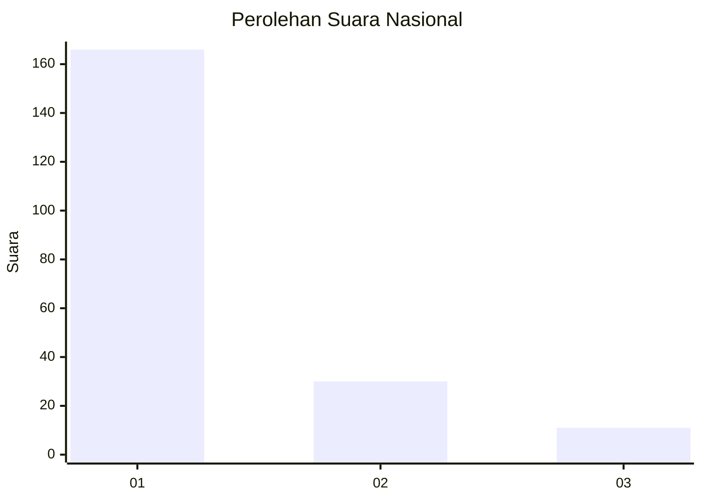
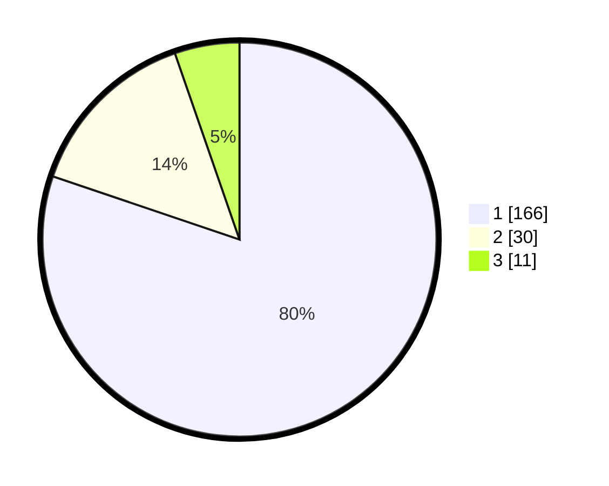

# Hasil

## Grafik

## Tabel

| No. | Nama Paslon    | Suara | Suara (raw) | Persentase |
|:--- |:-------------- | -----:| -----------:| ----------:|
| 1   | ANIES MUHAIMIN | 166   | [166][p-1]  | 80,19      |
| 2   | PRABOWO GIBRAN | 30    | [30][p-2]   | 14,49      |
| 3   | GANJAR MAHFUD  | 11    | [11][p-3]   | 5,31       |

[p-1]: https://github.com/gigit-pemilu/pemilu-2024/blob/main/pilpres/hitung-suara/sub/11-aceh/sub/06-aceh-besar/sub/03-indrapuri/sub/2025-krueng-lamkareung/sub/001-tps/sub/paslon-1.txt
[p-2]: https://github.com/gigit-pemilu/pemilu-2024/blob/main/pilpres/hitung-suara/sub/11-aceh/sub/06-aceh-besar/sub/03-indrapuri/sub/2025-krueng-lamkareung/sub/001-tps/sub/paslon-2.txt
[p-3]: https://github.com/gigit-pemilu/pemilu-2024/blob/main/pilpres/hitung-suara/sub/11-aceh/sub/06-aceh-besar/sub/03-indrapuri/sub/2025-krueng-lamkareung/sub/001-tps/sub/paslon-3.txt

## Foto C Plano

https://sirekap-obj-formc.kpu.go.id/2c9e/pemilu/ppwp/11/06/03/20/25/1106032025001-20240215-121958--e4724900-2493-4ff2-8d99-befabd4c2195.jpg

https://sirekap-obj-formc.kpu.go.id/2c9e/pemilu/ppwp/11/06/03/20/25/1106032025001-20240214-191258--07e9c53d-4fdc-45e5-aa35-b48a28415ce5.jpg

https://sirekap-obj-formc.kpu.go.id/2c9e/pemilu/ppwp/11/06/03/20/25/1106032025001-20240214-193049--a7736020-93df-416b-bd6c-ddefbc4f1a7f.jpg

## Metadata

| Key        | Value               |
| ---------- | ------------------- |
| Time Stamp | 2024-02-15 15:00:29 |

