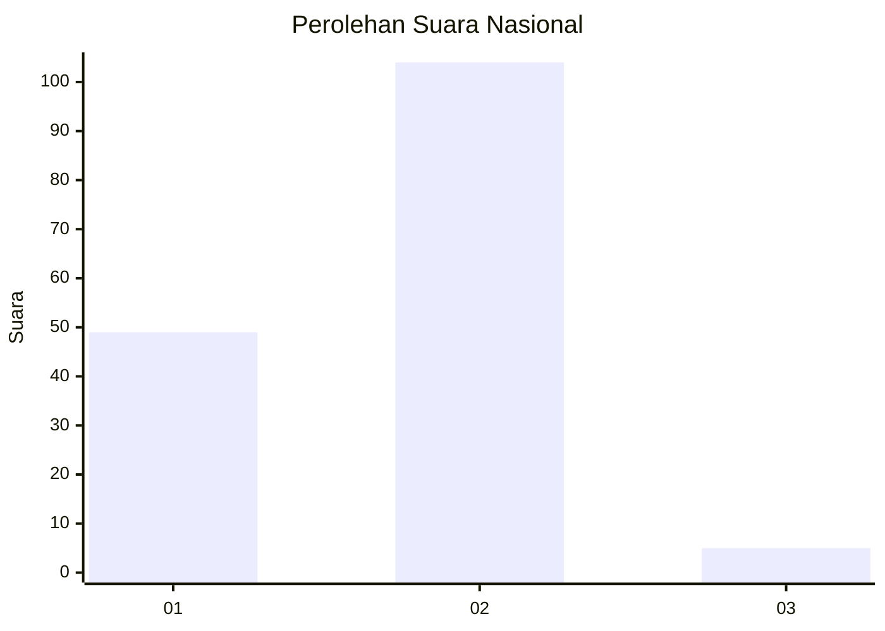
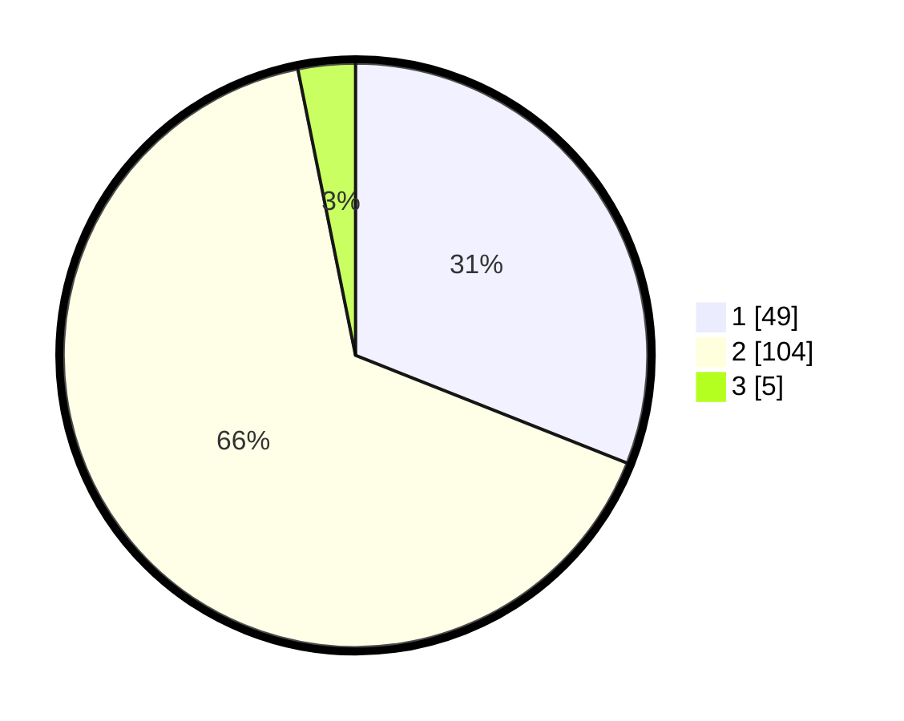

# Hasil

## Grafik

## Tabel

| No. | Nama Paslon    | Suara | Suara (raw) | Persentase |
|:--- |:-------------- | -----:| -----------:| ----------:|
| 1   | ANIES MUHAIMIN | 49    | [49][p-1]   | 31,01      |
| 2   | PRABOWO GIBRAN | 104   | [104][p-2]  | 65,82      |
| 3   | GANJAR MAHFUD  | 5     | [5][p-3]    | 3,16       |

[p-1]: https://github.com/gigit-pemilu/pemilu-2024/blob/main/pilpres/hitung-suara/sub/11-aceh/sub/06-aceh-besar/sub/03-indrapuri/sub/2025-krueng-lamkareung/sub/003-tps/sub/paslon-1.txt
[p-2]: https://github.com/gigit-pemilu/pemilu-2024/blob/main/pilpres/hitung-suara/sub/11-aceh/sub/06-aceh-besar/sub/03-indrapuri/sub/2025-krueng-lamkareung/sub/003-tps/sub/paslon-2.txt
[p-3]: https://github.com/gigit-pemilu/pemilu-2024/blob/main/pilpres/hitung-suara/sub/11-aceh/sub/06-aceh-besar/sub/03-indrapuri/sub/2025-krueng-lamkareung/sub/003-tps/sub/paslon-3.txt

## Foto C Plano

https://sirekap-obj-formc.kpu.go.id/4d81/pemilu/ppwp/11/06/03/20/25/1106032025003-20240215-104310--1acbb2bd-5a9b-4f08-b1b0-4fb4e40c7fda.jpg

https://sirekap-obj-formc.kpu.go.id/4d81/pemilu/ppwp/11/06/03/20/25/1106032025003-20240215-104553--ef0a9e66-d644-460a-a0df-db430fc2a8fc.jpg

https://sirekap-obj-formc.kpu.go.id/4d81/pemilu/ppwp/11/06/03/20/25/1106032025003-20240215-104718--f0960382-bd9e-4381-8d3f-e643ee1bbc43.jpg

## Metadata

| Key        | Value               |
| ---------- | ------------------- |
| Time Stamp | 2024-02-20 13:00:00 |

## DATA PEMILIH TETAP

Jumlah pemilih dalam DPT: **252**.
 * L: **65**.
 * P: **187**.

## DATA PENGGUNA HAK PILIH

Jumlah pengguna hak pilih dalam DPT: **133**.
 * L: **24**.
 * P: **109**.

Jumlah pengguna hak pilih dalam DPTb: **0**.
 * L: **0**.
 * P: **0**.

Jumlah pengguna hak pilih dalam DPK: **27**.
 * L: **8**.
 * P: **19**.

Jumlah pengguna hak pilih: **160**.
 * L: **32**.
 * P: **128**.

## JUMLAH SUARA SAH DAN TIDAK SAH

JUMLAH SELURUH SUARA SAH: **158**.

JUMLAH SUARA TIDAK SAH: **2**.

JUMLAH SELURUH SUARA SAH DAN SUARA TIDAK SAH: **160**.

