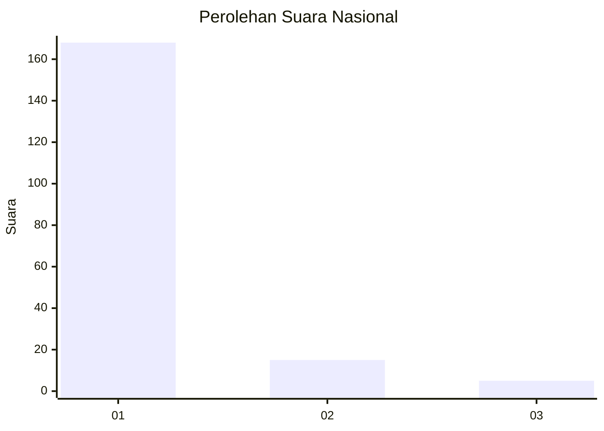
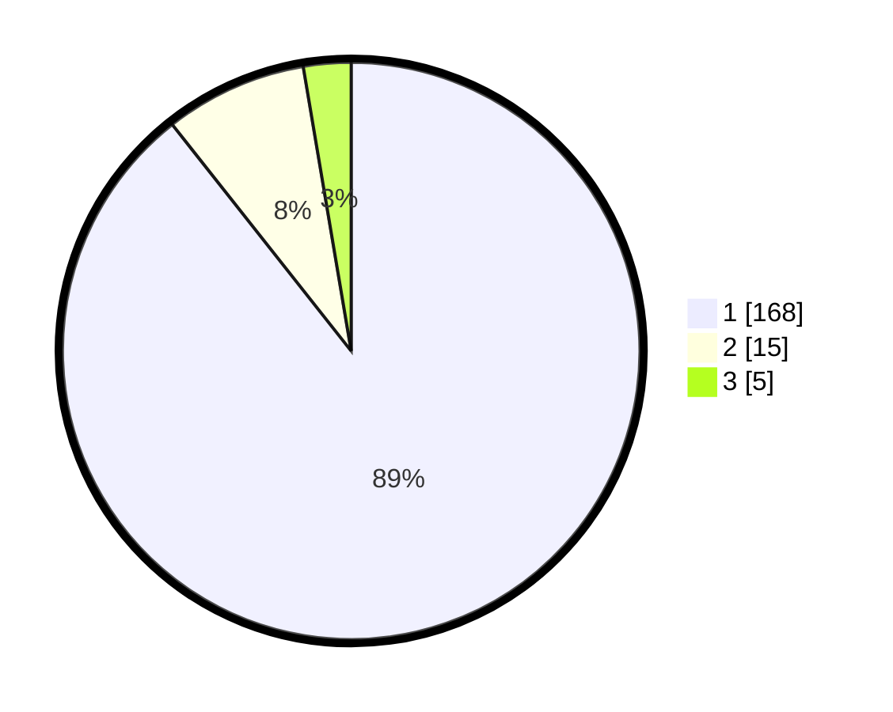

# Hasil

## Grafik

## Tabel

| No. | Nama Paslon    | Suara | Suara (raw) | Persentase |
|:--- |:-------------- | -----:| -----------:| ----------:|
| 1   | ANIES MUHAIMIN | 168   | [168][p-1]  | 89,36      |
| 2   | PRABOWO GIBRAN | 15    | [15][p-2]   | 7,98       |
| 3   | GANJAR MAHFUD  | 5     | [5][p-3]    | 2,66       |

[p-1]: https://github.com/gigit-pemilu/pemilu-2024/blob/main/pilpres/hitung-suara/sub/11-aceh/sub/06-aceh-besar/sub/03-indrapuri/sub/2026-sinyeu/sub/001-tps/sub/paslon-1.txt
[p-2]: https://github.com/gigit-pemilu/pemilu-2024/blob/main/pilpres/hitung-suara/sub/11-aceh/sub/06-aceh-besar/sub/03-indrapuri/sub/2026-sinyeu/sub/001-tps/sub/paslon-2.txt
[p-3]: https://github.com/gigit-pemilu/pemilu-2024/blob/main/pilpres/hitung-suara/sub/11-aceh/sub/06-aceh-besar/sub/03-indrapuri/sub/2026-sinyeu/sub/001-tps/sub/paslon-3.txt

## Foto C Plano

https://sirekap-obj-formc.kpu.go.id/cb76/pemilu/ppwp/11/06/03/20/26/1106032026001-20240215-024638--dbf35351-6d9f-4cbc-9a41-52103962e7cc.jpg

https://sirekap-obj-formc.kpu.go.id/cb76/pemilu/ppwp/11/06/03/20/26/1106032026001-20240215-024737--addafd59-e0da-4746-8ad6-eb1d32181511.jpg

https://sirekap-obj-formc.kpu.go.id/cb76/pemilu/ppwp/11/06/03/20/26/1106032026001-20240215-024845--d4765280-6ca7-472d-ba98-822db4c8fdb2.jpg

## Metadata

| Key        | Value               |
| ---------- | ------------------- |
| Time Stamp | 2024-02-15 15:00:29 |

