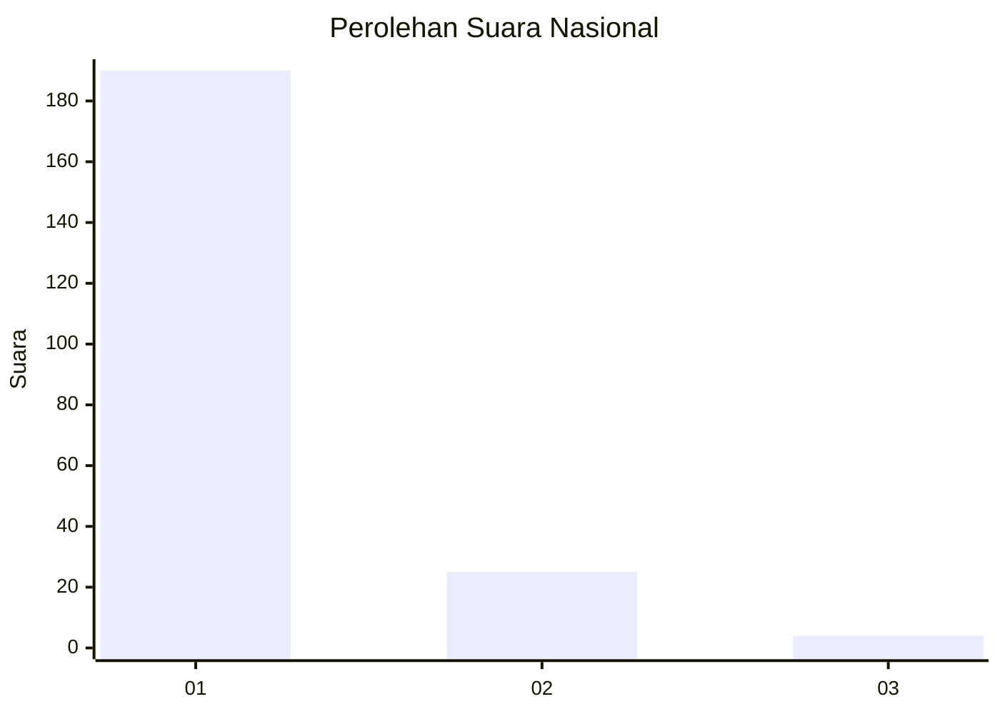
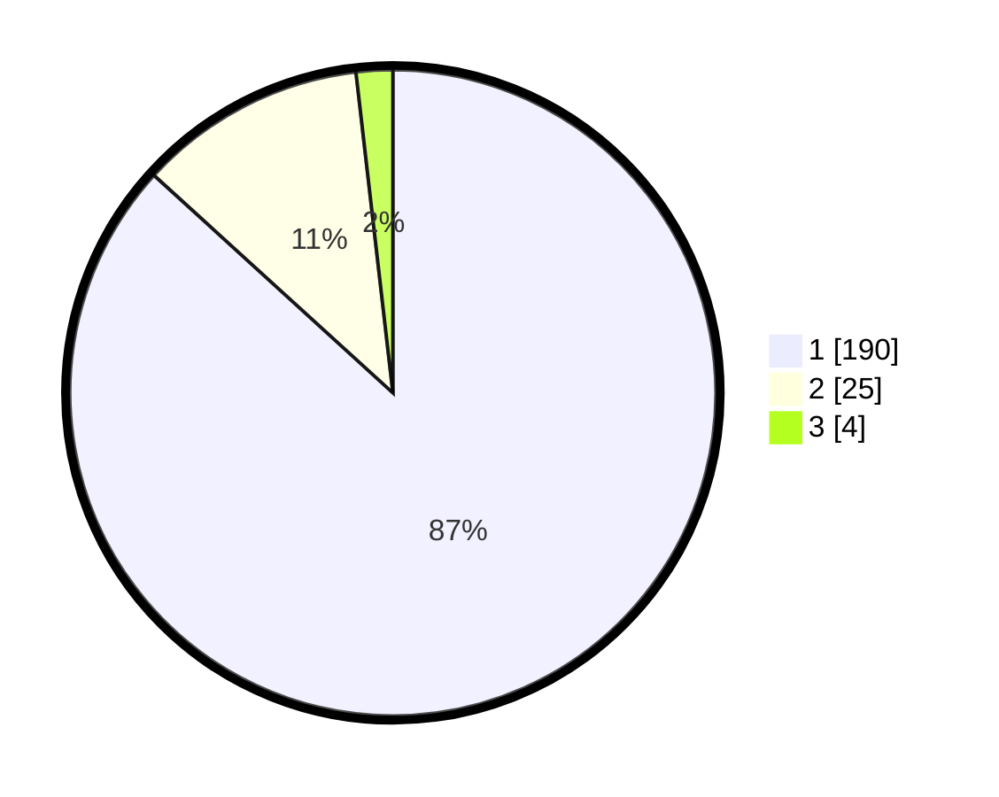

# Hasil

## Grafik

## Tabel

| No. | Nama Paslon    | Suara | Suara (raw) | Persentase |
|:--- |:-------------- | -----:| -----------:| ----------:|
| 1   | ANIES MUHAIMIN | 190   | [190][p-1]  | 86,76      |
| 2   | PRABOWO GIBRAN | 25    | [25][p-2]   | 11,42      |
| 3   | GANJAR MAHFUD  | 4     | [4][p-3]    | 1,83       |

[p-1]: https://github.com/gigit-pemilu/pemilu-2024/blob/main/pilpres/hitung-suara/sub/11-aceh/sub/06-aceh-besar/sub/03-indrapuri/sub/2034-sihom-lhok/sub/001-tps/sub/paslon-1.txt
[p-2]: https://github.com/gigit-pemilu/pemilu-2024/blob/main/pilpres/hitung-suara/sub/11-aceh/sub/06-aceh-besar/sub/03-indrapuri/sub/2034-sihom-lhok/sub/001-tps/sub/paslon-2.txt
[p-3]: https://github.com/gigit-pemilu/pemilu-2024/blob/main/pilpres/hitung-suara/sub/11-aceh/sub/06-aceh-besar/sub/03-indrapuri/sub/2034-sihom-lhok/sub/001-tps/sub/paslon-3.txt

## Foto C Plano

https://sirekap-obj-formc.kpu.go.id/002d/pemilu/ppwp/11/06/03/20/34/1106032034001-20240215-022635--cd46c229-7095-4c5d-84cc-456b4dc7697e.jpg

https://sirekap-obj-formc.kpu.go.id/002d/pemilu/ppwp/11/06/03/20/34/1106032034001-20240215-022857--3946186b-f65d-4bd9-843a-c341780fa2a1.jpg

https://sirekap-obj-formc.kpu.go.id/002d/pemilu/ppwp/11/06/03/20/34/1106032034001-20240215-023137--453f3fa9-5f01-42d2-b2e9-74b169fe0070.jpg

## Metadata

| Key        | Value               |
| ---------- | ------------------- |
| Time Stamp | 2024-02-15 22:00:27 |

