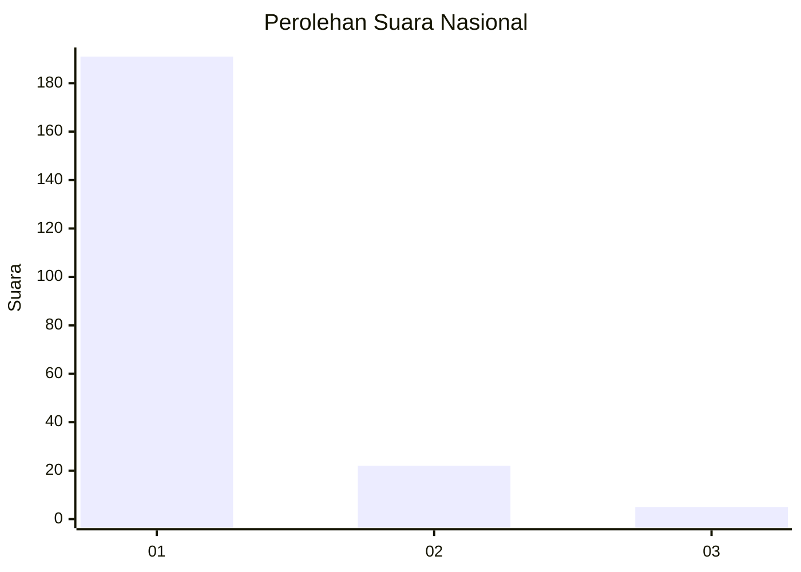
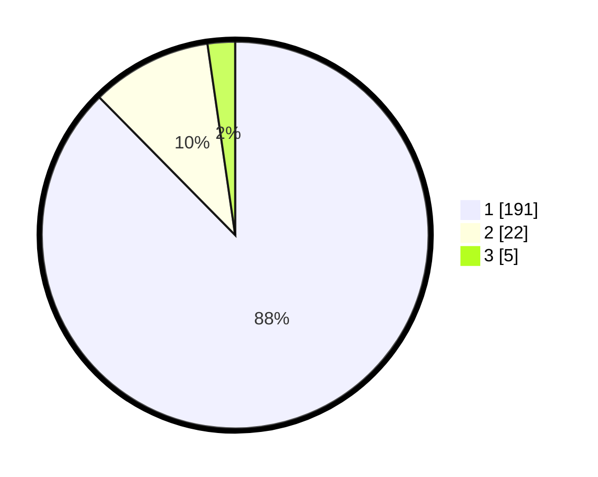

# Hasil

## Grafik

## Tabel

| No. | Nama Paslon    | Suara | Suara (raw) | Persentase |
|:--- |:-------------- | -----:| -----------:| ----------:|
| 1   | ANIES MUHAIMIN | 191   | [191][p-1]  | 87,61      |
| 2   | PRABOWO GIBRAN | 22    | [22][p-2]   | 10,09      |
| 3   | GANJAR MAHFUD  | 5     | [5][p-3]    | 2,29       |

[p-1]: https://github.com/gigit-pemilu/pemilu-2024/blob/main/pilpres/hitung-suara/sub/11-aceh/sub/06-aceh-besar/sub/03-indrapuri/sub/2046-jruek-bak-kreh/sub/001-tps/sub/paslon-1.txt
[p-2]: https://github.com/gigit-pemilu/pemilu-2024/blob/main/pilpres/hitung-suara/sub/11-aceh/sub/06-aceh-besar/sub/03-indrapuri/sub/2046-jruek-bak-kreh/sub/001-tps/sub/paslon-2.txt
[p-3]: https://github.com/gigit-pemilu/pemilu-2024/blob/main/pilpres/hitung-suara/sub/11-aceh/sub/06-aceh-besar/sub/03-indrapuri/sub/2046-jruek-bak-kreh/sub/001-tps/sub/paslon-3.txt

## Foto C Plano

https://sirekap-obj-formc.kpu.go.id/46c8/pemilu/ppwp/11/06/03/20/46/1106032046001-20240215-022542--da486b5c-685c-464c-a65d-64f7238f3739.jpg

https://sirekap-obj-formc.kpu.go.id/46c8/pemilu/ppwp/11/06/03/20/46/1106032046001-20240215-022636--bc4b16ac-7313-4c3f-a790-d597094601ad.jpg

https://sirekap-obj-formc.kpu.go.id/46c8/pemilu/ppwp/11/06/03/20/46/1106032046001-20240215-022901--fece932b-782b-4b76-8f6c-941288fb6737.jpg

## Metadata

| Key        | Value               |
| ---------- | ------------------- |
| Time Stamp | 2024-02-15 15:00:29 |

