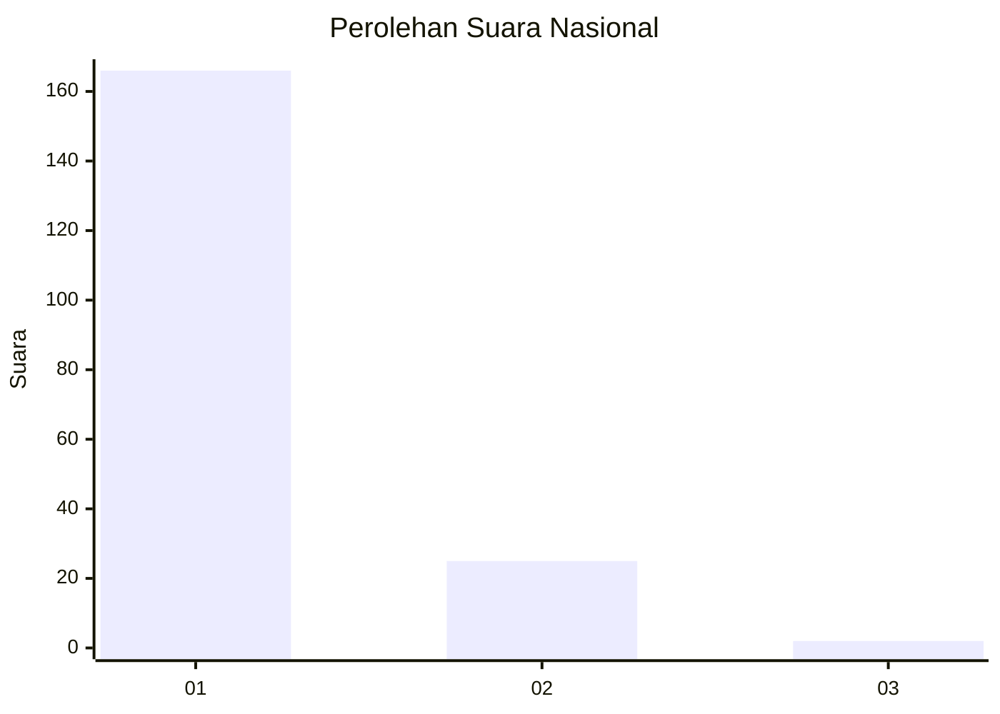
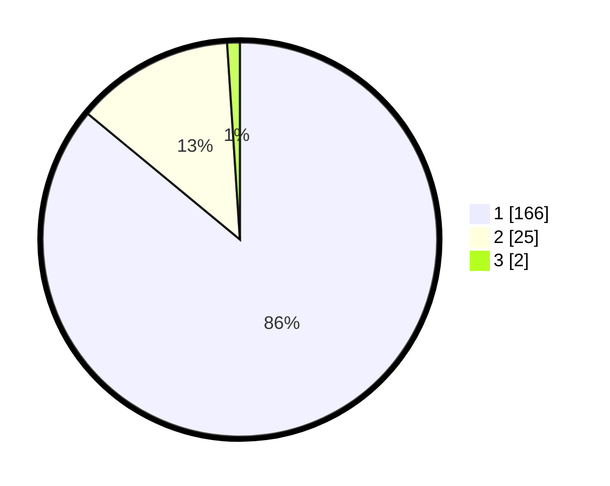

# Hasil

## Grafik

## Tabel

| No. | Nama Paslon    | Suara | Suara (raw) | Persentase |
|:--- |:-------------- | -----:| -----------:| ----------:|
| 1   | ANIES MUHAIMIN | 166   | [166][p-1]  | 86,01      |
| 2   | PRABOWO GIBRAN | 25    | [25][p-2]   | 12,95      |
| 3   | GANJAR MAHFUD  | 2     | [2][p-3]    | 1,04       |

[p-1]: https://github.com/gigit-pemilu/pemilu-2024/blob/main/pilpres/hitung-suara/sub/11-aceh/sub/06-aceh-besar/sub/03-indrapuri/sub/2047-jruek-balee/sub/001-tps/sub/paslon-1.txt
[p-2]: https://github.com/gigit-pemilu/pemilu-2024/blob/main/pilpres/hitung-suara/sub/11-aceh/sub/06-aceh-besar/sub/03-indrapuri/sub/2047-jruek-balee/sub/001-tps/sub/paslon-2.txt
[p-3]: https://github.com/gigit-pemilu/pemilu-2024/blob/main/pilpres/hitung-suara/sub/11-aceh/sub/06-aceh-besar/sub/03-indrapuri/sub/2047-jruek-balee/sub/001-tps/sub/paslon-3.txt

## Foto C Plano

https://sirekap-obj-formc.kpu.go.id/9644/pemilu/ppwp/11/06/03/20/47/1106032047001-20240214-214601--93e116d0-32a1-4ae5-8e6e-e48c01c1f2e4.jpg

https://sirekap-obj-formc.kpu.go.id/9644/pemilu/ppwp/11/06/03/20/47/1106032047001-20240214-215314--dc300608-10c2-4cc3-a731-f210e2f5b69c.jpg

https://sirekap-obj-formc.kpu.go.id/9644/pemilu/ppwp/11/06/03/20/47/1106032047001-20240214-215410--bf5dc518-2280-4276-a5bc-9625d1e0f11e.jpg

## Metadata

| Key        | Value               |
| ---------- | ------------------- |
| Time Stamp | 2024-02-15 22:00:27 |

