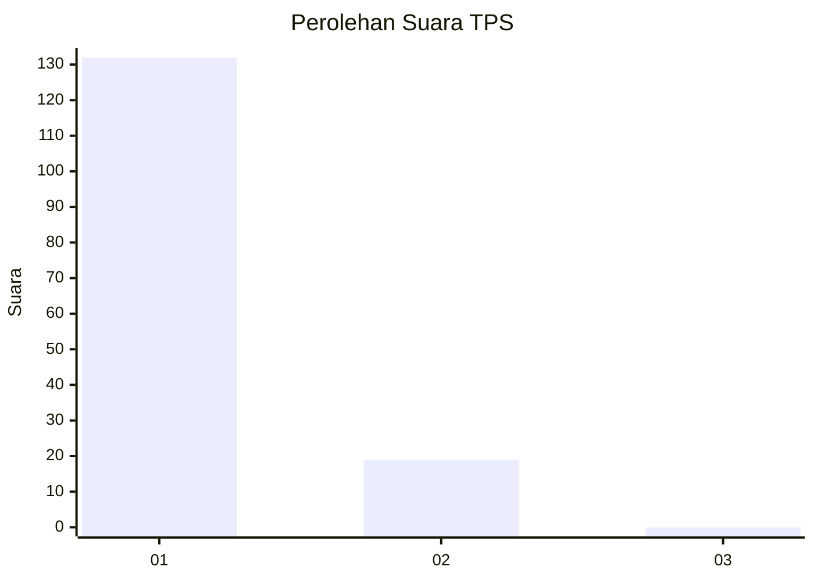
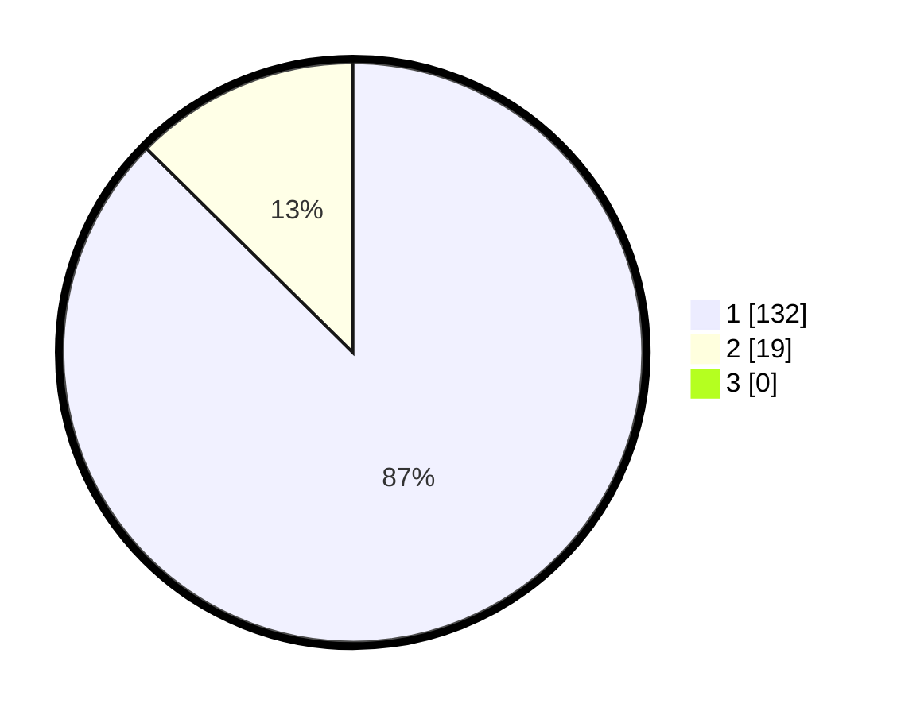

# Hasil

## Grafik

## Tabel

| No. | Nama Paslon    | Suara | Suara (raw) | Persentase |
|:--- |:-------------- | -----:| -----------:| ----------:|
| 1   | ANIES MUHAIMIN | 132   | [132][p-1]  | 87,42      |
| 2   | PRABOWO GIBRAN | 19    | [19][p-2]   | 12,58      |
| 3   | GANJAR MAHFUD  | 0     | [0][p-3]    | 0,00       |

[p-1]: https://github.com/gigit-pemilu/pemilu-2024-11-aceh/blob/main/pilpres/hitung-suara/sub/11-aceh/sub/06-aceh-besar/sub/03-indrapuri/sub/2052-lamsiot/sub/001-tps/sub/paslon-1.txt
[p-2]: https://github.com/gigit-pemilu/pemilu-2024-11-aceh/blob/main/pilpres/hitung-suara/sub/11-aceh/sub/06-aceh-besar/sub/03-indrapuri/sub/2052-lamsiot/sub/001-tps/sub/paslon-2.txt
[p-3]: https://github.com/gigit-pemilu/pemilu-2024-11-aceh/blob/main/pilpres/hitung-suara/sub/11-aceh/sub/06-aceh-besar/sub/03-indrapuri/sub/2052-lamsiot/sub/001-tps/sub/paslon-3.txt

## Foto C Plano

https://sirekap-obj-formc.kpu.go.id/9146/pemilu/ppwp/11/06/03/20/52/1106032052001-20240214-231413--5ce376fa-28b6-4a1d-8142-49d00379e3ed.jpg

https://sirekap-obj-formc.kpu.go.id/9146/pemilu/ppwp/11/06/03/20/52/1106032052001-20240215-030007--01b7916d-5db9-48cd-9dfc-4e92fe36842c.jpg

https://sirekap-obj-formc.kpu.go.id/9146/pemilu/ppwp/11/06/03/20/52/1106032052001-20240214-231845--cdc86167-d4d4-479f-b750-40f0b6778628.jpg

## Metadata

| Key        | Value               |
| ---------- | ------------------- |
| Time Stamp | 2024-02-15 15:00:29 |

