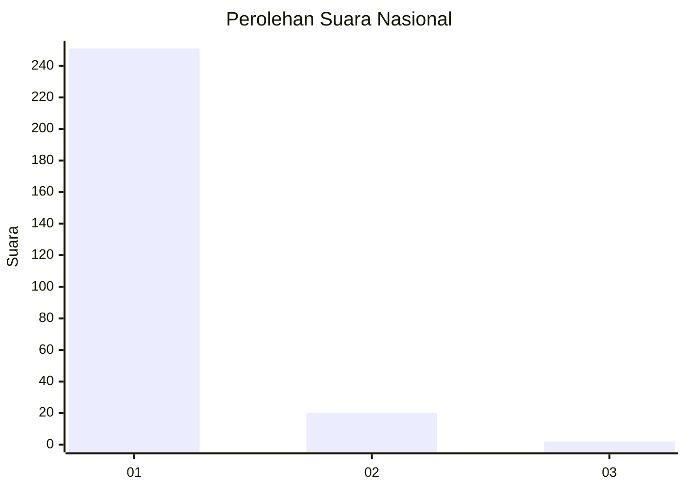
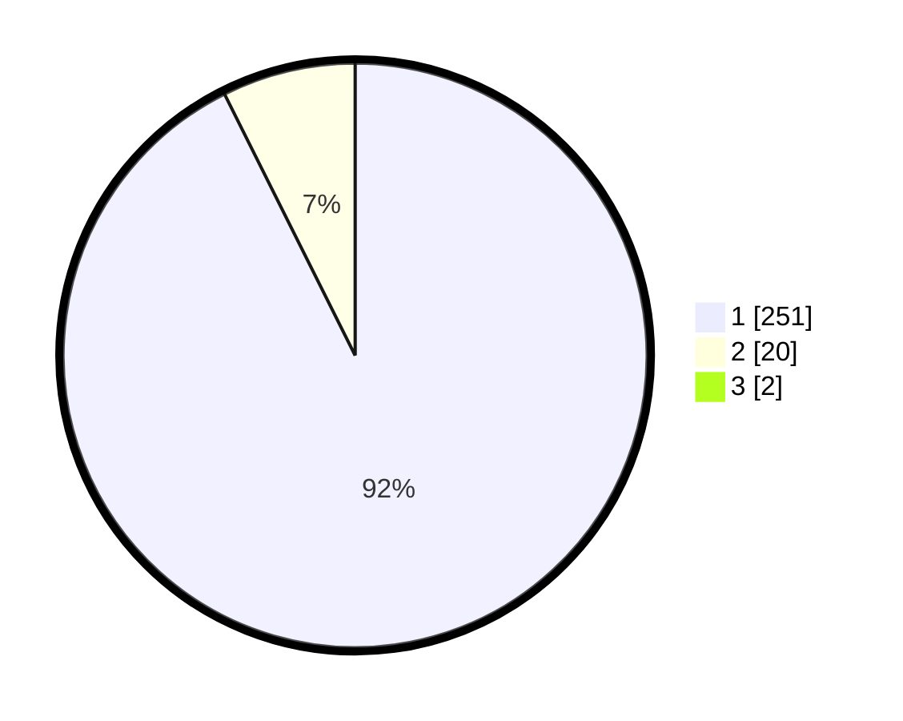

# Hasil

## Grafik

## Tabel

| No. | Nama Paslon    | Suara | Suara (raw) | Persentase |
|:--- |:-------------- | -----:| -----------:| ----------:|
| 1   | ANIES MUHAIMIN | 251   | [251][p-1]  | 91,94      |
| 2   | PRABOWO GIBRAN | 20    | [20][p-2]   | 7,33       |
| 3   | GANJAR MAHFUD  | 2     | [2][p-3]    | 0,73       |

[p-1]: https://github.com/gigit-pemilu/pemilu-2024/blob/main/pilpres/hitung-suara/sub/11-aceh/sub/06-aceh-besar/sub/03-indrapuri/sub/2053-lingom/sub/001-tps/sub/paslon-1.txt
[p-2]: https://github.com/gigit-pemilu/pemilu-2024/blob/main/pilpres/hitung-suara/sub/11-aceh/sub/06-aceh-besar/sub/03-indrapuri/sub/2053-lingom/sub/001-tps/sub/paslon-2.txt
[p-3]: https://github.com/gigit-pemilu/pemilu-2024/blob/main/pilpres/hitung-suara/sub/11-aceh/sub/06-aceh-besar/sub/03-indrapuri/sub/2053-lingom/sub/001-tps/sub/paslon-3.txt

## Foto C Plano

https://sirekap-obj-formc.kpu.go.id/38b1/pemilu/ppwp/11/06/03/20/53/1106032053001-20240215-114613--aae09da7-7a6f-45ed-b57f-93f59d660810.jpg

https://sirekap-obj-formc.kpu.go.id/38b1/pemilu/ppwp/11/06/03/20/53/1106032053001-20240215-114532--d849f72d-d9a1-4142-a931-de8042dd1661.jpg

https://sirekap-obj-formc.kpu.go.id/38b1/pemilu/ppwp/11/06/03/20/53/1106032053001-20240215-114554--57b3d457-1d7a-404e-bd57-e141907c912a.jpg

## Metadata

| Key        | Value               |
| ---------- | ------------------- |
| Time Stamp | 2024-02-15 15:00:29 |

