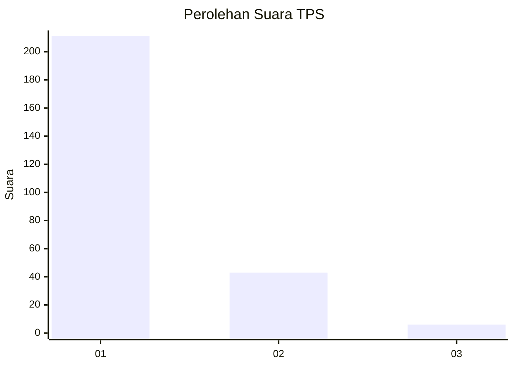
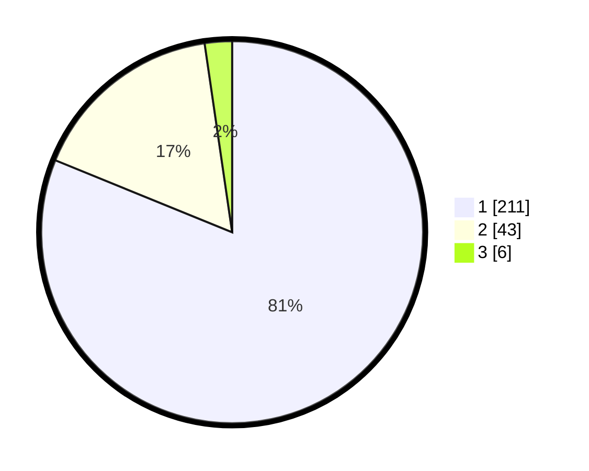

# Hasil

## Grafik

## Tabel

| No. | Nama Paslon    | Suara | Suara (raw) | Persentase |
|:--- |:-------------- | -----:| -----------:| ----------:|
| 1   | ANIES MUHAIMIN | 211   | [211][p-1]  | 81,15      |
| 2   | PRABOWO GIBRAN | 43    | [43][p-2]   | 16,54      |
| 3   | GANJAR MAHFUD  | 6     | [6][p-3]    | 2,31       |

[p-1]: https://github.com/gigit-pemilu/pemilu-2024-11-aceh/blob/main/pilpres/hitung-suara/sub/11-aceh/sub/06-aceh-besar/sub/04-seulimeum/sub/2001-peukan-seulimeum/sub/001-tps/sub/paslon-1.txt
[p-2]: https://github.com/gigit-pemilu/pemilu-2024-11-aceh/blob/main/pilpres/hitung-suara/sub/11-aceh/sub/06-aceh-besar/sub/04-seulimeum/sub/2001-peukan-seulimeum/sub/001-tps/sub/paslon-2.txt
[p-3]: https://github.com/gigit-pemilu/pemilu-2024-11-aceh/blob/main/pilpres/hitung-suara/sub/11-aceh/sub/06-aceh-besar/sub/04-seulimeum/sub/2001-peukan-seulimeum/sub/001-tps/sub/paslon-3.txt

## Foto C Plano

https://sirekap-obj-formc.kpu.go.id/7b9a/pemilu/ppwp/11/06/04/20/01/1106042001001-20240218-115039--9da2f780-7d89-4212-aad6-b7936a712459.jpg

https://sirekap-obj-formc.kpu.go.id/7b9a/pemilu/ppwp/11/06/04/20/01/1106042001001-20240218-115041--bff43f28-10ad-4f7a-8276-b07520a63af4.jpg

https://sirekap-obj-formc.kpu.go.id/7b9a/pemilu/ppwp/11/06/04/20/01/1106042001001-20240218-115040--1c086b82-70e7-4a38-80af-e990d636fdf3.jpg

## Metadata

| Key        | Value               |
| ---------- | ------------------- |
| Time Stamp | 2024-02-19 20:00:00 |

## DATA PEMILIH TETAP

Jumlah pemilih dalam DPT: **296**.
 * L: **134**.
 * P: **162**.

## DATA PENGGUNA HAK PILIH

Jumlah pengguna hak pilih dalam DPT: **247**.
 * L: **107**.
 * P: **140**.

Jumlah pengguna hak pilih dalam DPTb: **13**.
 * L: **13**.
 * P: **0**.

Jumlah pengguna hak pilih dalam DPK: **2**.
 * L: **0**.
 * P: **2**.

Jumlah pengguna hak pilih: **262**.
 * L: **120**.
 * P: **142**.

## JUMLAH SUARA SAH DAN TIDAK SAH

JUMLAH SELURUH SUARA SAH: **260**.

JUMLAH SUARA TIDAK SAH: **2**.

JUMLAH SELURUH SUARA SAH DAN SUARA TIDAK SAH: **262**.

