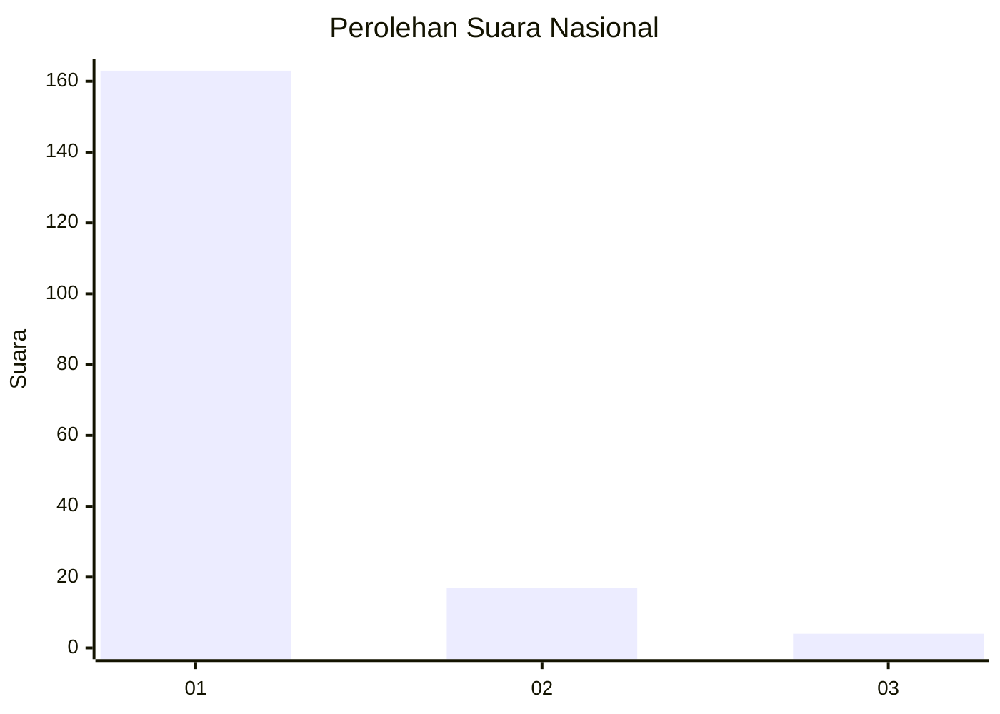
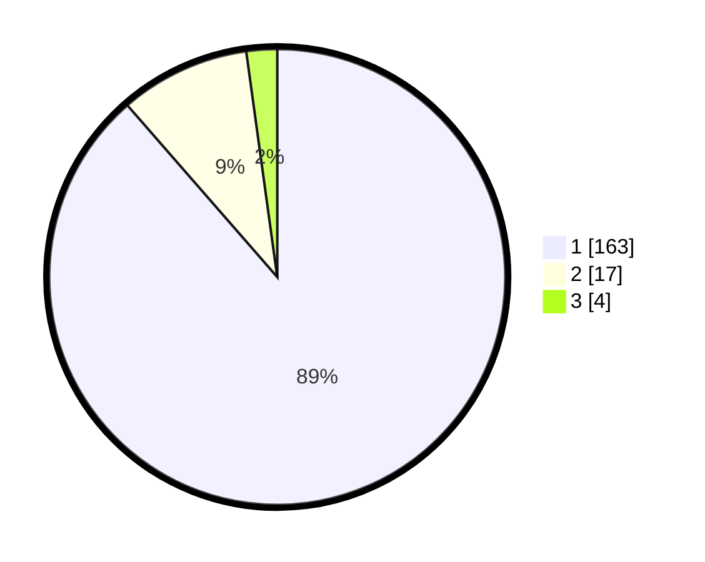

# Hasil

## Grafik

## Tabel

| No. | Nama Paslon    | Suara | Suara (raw) | Persentase |
|:--- |:-------------- | -----:| -----------:| ----------:|
| 1   | ANIES MUHAIMIN | 163   | [163][p-1]  | 88,59      |
| 2   | PRABOWO GIBRAN | 17    | [17][p-2]   | 9,24       |
| 3   | GANJAR MAHFUD  | 4     | [4][p-3]    | 2,17       |

[p-1]: https://github.com/gigit-pemilu/pemilu-2024/blob/main/pilpres/hitung-suara/sub/11-aceh/sub/06-aceh-besar/sub/04-seulimeum/sub/2002-keunaloi/sub/002-tps/sub/paslon-1.txt
[p-2]: https://github.com/gigit-pemilu/pemilu-2024/blob/main/pilpres/hitung-suara/sub/11-aceh/sub/06-aceh-besar/sub/04-seulimeum/sub/2002-keunaloi/sub/002-tps/sub/paslon-2.txt
[p-3]: https://github.com/gigit-pemilu/pemilu-2024/blob/main/pilpres/hitung-suara/sub/11-aceh/sub/06-aceh-besar/sub/04-seulimeum/sub/2002-keunaloi/sub/002-tps/sub/paslon-3.txt

## Foto C Plano

https://sirekap-obj-formc.kpu.go.id/4d6a/pemilu/ppwp/11/06/04/20/02/1106042002002-20240218-223854--98ab6913-bf6e-4305-a75a-2c5095a2bb87.jpg

https://sirekap-obj-formc.kpu.go.id/4d6a/pemilu/ppwp/11/06/04/20/02/1106042002002-20240218-224625--3734ac9e-a6bf-404e-aa28-46a59d8267f7.jpg

https://sirekap-obj-formc.kpu.go.id/4d6a/pemilu/ppwp/11/06/04/20/02/1106042002002-20240218-224853--2b9ce8c0-fdb5-491b-8ae5-bc67fcfd6ab2.jpg

## Metadata

| Key        | Value               |
| ---------- | ------------------- |
| Time Stamp | 2024-02-19 20:00:00 |

## DATA PEMILIH TETAP

Jumlah pemilih dalam DPT: **199**.
 * L: **104**.
 * P: **95**.

## DATA PENGGUNA HAK PILIH

Jumlah pengguna hak pilih dalam DPT: **185**.
 * L: **95**.
 * P: **90**.

Jumlah pengguna hak pilih dalam DPTb: **0**.
 * L: **0**.
 * P: **0**.

Jumlah pengguna hak pilih dalam DPK: **4**.
 * L: **1**.
 * P: **3**.

Jumlah pengguna hak pilih: **189**.
 * L: **96**.
 * P: **93**.

## JUMLAH SUARA SAH DAN TIDAK SAH

JUMLAH SELURUH SUARA SAH: **184**.

JUMLAH SUARA TIDAK SAH: **5**.

JUMLAH SELURUH SUARA SAH DAN SUARA TIDAK SAH: **189**.

