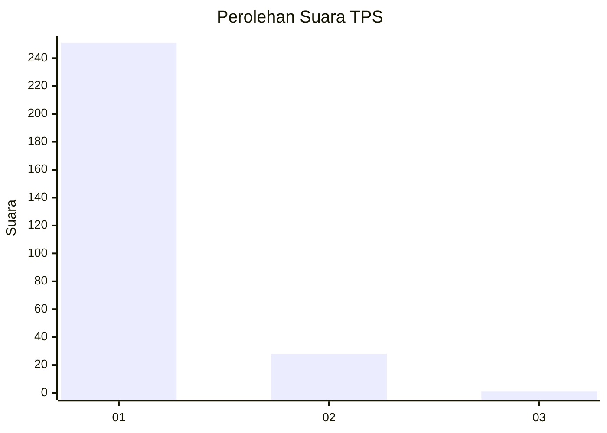
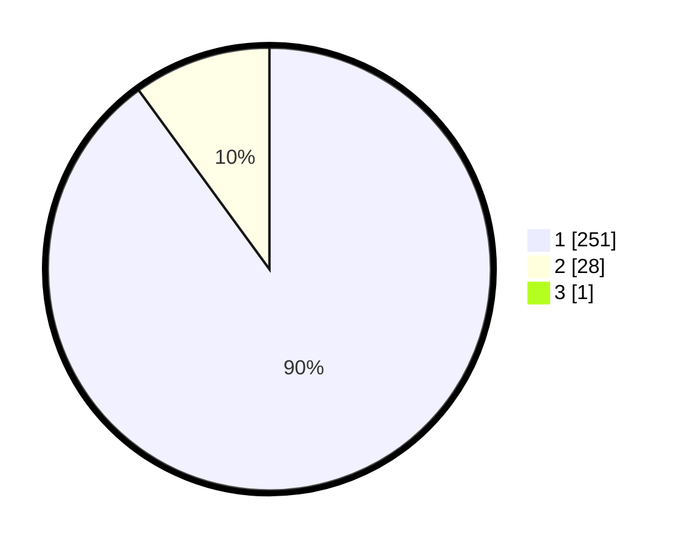

# Hasil

## Grafik

## Tabel

| No. | Nama Paslon    | Suara | Suara (raw) | Persentase |
|:--- |:-------------- | -----:| -----------:| ----------:|
| 1   | ANIES MUHAIMIN | 251   | [251][p-1]  | 89,64      |
| 2   | PRABOWO GIBRAN | 28    | [28][p-2]   | 10,00      |
| 3   | GANJAR MAHFUD  | 1     | [1][p-3]    | 0,36       |

[p-1]: https://github.com/gigit-pemilu/pemilu-2024-11-aceh/blob/main/pilpres/hitung-suara/sub/11-aceh/sub/06-aceh-besar/sub/04-seulimeum/sub/2012-alue-rindang/sub/001-tps/sub/paslon-1.txt
[p-2]: https://github.com/gigit-pemilu/pemilu-2024-11-aceh/blob/main/pilpres/hitung-suara/sub/11-aceh/sub/06-aceh-besar/sub/04-seulimeum/sub/2012-alue-rindang/sub/001-tps/sub/paslon-2.txt
[p-3]: https://github.com/gigit-pemilu/pemilu-2024-11-aceh/blob/main/pilpres/hitung-suara/sub/11-aceh/sub/06-aceh-besar/sub/04-seulimeum/sub/2012-alue-rindang/sub/001-tps/sub/paslon-3.txt

## Foto C Plano

https://sirekap-obj-formc.kpu.go.id/e12e/pemilu/ppwp/11/06/04/20/12/1106042012001-20240215-084200--bf66eb40-ee50-44be-a76a-d937a3387d5c.jpg

https://sirekap-obj-formc.kpu.go.id/e12e/pemilu/ppwp/11/06/04/20/12/1106042012001-20240215-084336--48a77f93-2a8a-4cc7-8038-aa43c33631ed.jpg

https://sirekap-obj-formc.kpu.go.id/e12e/pemilu/ppwp/11/06/04/20/12/1106042012001-20240215-084453--9b3834cd-493f-4242-8a32-b257efcc4f8d.jpg

## Metadata

| Key        | Value               |
| ---------- | ------------------- |
| Time Stamp | 2024-02-20 14:00:00 |

## DATA PEMILIH TETAP

Jumlah pemilih dalam DPT: **281**.
 * L: **123**.
 * P: **158**.

## DATA PENGGUNA HAK PILIH

Jumlah pengguna hak pilih dalam DPT: **271**.
 * L: **118**.
 * P: **153**.

Jumlah pengguna hak pilih dalam DPTb: **10**.
 * L: **10**.
 * P: **0**.

Jumlah pengguna hak pilih dalam DPK: **6**.
 * L: **1**.
 * P: **5**.

Jumlah pengguna hak pilih: **287**.
 * L: **129**.
 * P: **158**.

## JUMLAH SUARA SAH DAN TIDAK SAH

JUMLAH SELURUH SUARA SAH: **280**.

JUMLAH SUARA TIDAK SAH: **7**.

JUMLAH SELURUH SUARA SAH DAN SUARA TIDAK SAH: **287**.

