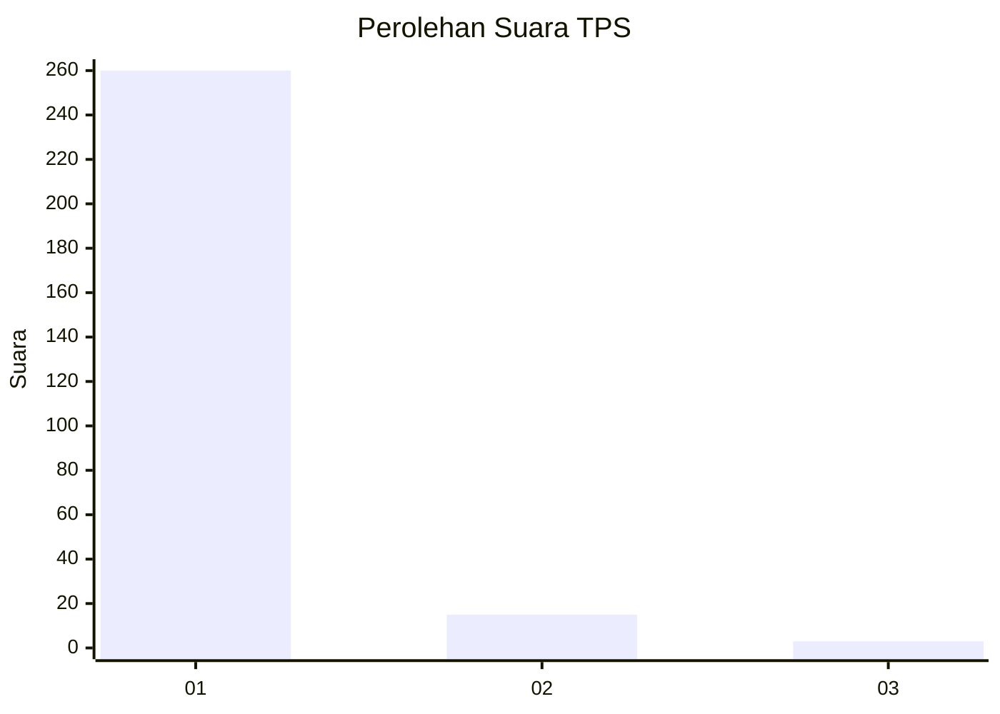
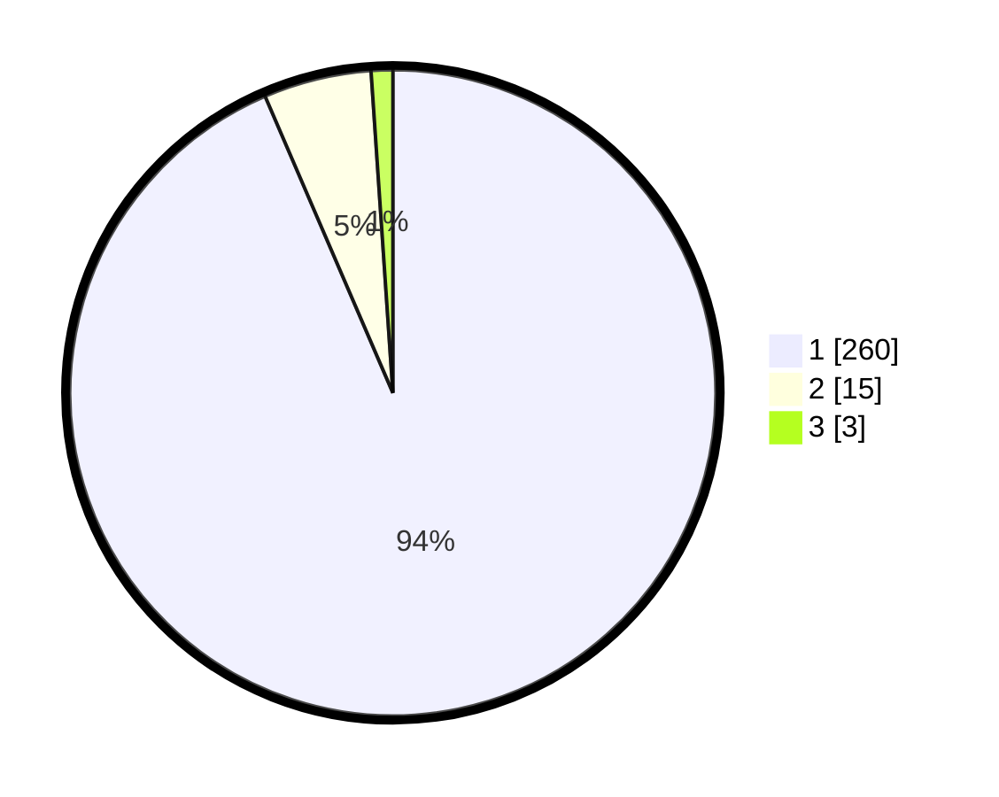

# Hasil

## Grafik

## Tabel

| No. | Nama Paslon    | Suara | Suara (raw) | Persentase |
|:--- |:-------------- | -----:| -----------:| ----------:|
| 1   | ANIES MUHAIMIN | 260   | [260][p-1]  | 93,53      |
| 2   | PRABOWO GIBRAN | 15    | [15][p-2]   | 5,40       |
| 3   | GANJAR MAHFUD  | 3     | [3][p-3]    | 1,08       |

[p-1]: https://github.com/gigit-pemilu/pemilu-2024-11-aceh/blob/main/pilpres/hitung-suara/sub/11-aceh/sub/06-aceh-besar/sub/04-seulimeum/sub/2012-alue-rindang/sub/002-tps/sub/paslon-1.txt
[p-2]: https://github.com/gigit-pemilu/pemilu-2024-11-aceh/blob/main/pilpres/hitung-suara/sub/11-aceh/sub/06-aceh-besar/sub/04-seulimeum/sub/2012-alue-rindang/sub/002-tps/sub/paslon-2.txt
[p-3]: https://github.com/gigit-pemilu/pemilu-2024-11-aceh/blob/main/pilpres/hitung-suara/sub/11-aceh/sub/06-aceh-besar/sub/04-seulimeum/sub/2012-alue-rindang/sub/002-tps/sub/paslon-3.txt

## Foto C Plano

https://sirekap-obj-formc.kpu.go.id/d58e/pemilu/ppwp/11/06/04/20/12/1106042012002-20240215-065010--876a1150-6662-4212-9a39-4772254be960.jpg

https://sirekap-obj-formc.kpu.go.id/d58e/pemilu/ppwp/11/06/04/20/12/1106042012002-20240215-065050--ca312ff6-94f6-4b9a-88e4-270a5644b924.jpg

https://sirekap-obj-formc.kpu.go.id/d58e/pemilu/ppwp/11/06/04/20/12/1106042012002-20240215-065104--668370a6-244b-4a02-bd76-9752c3d6c39b.jpg

## Metadata

| Key        | Value               |
| ---------- | ------------------- |
| Time Stamp | 2024-02-15 22:00:27 |

