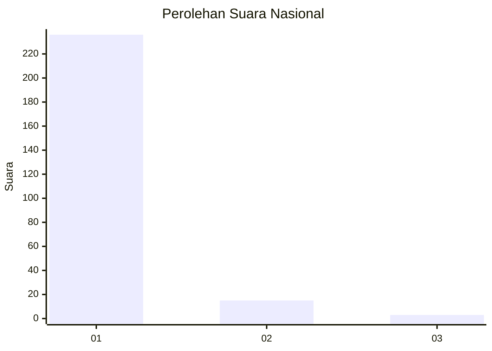
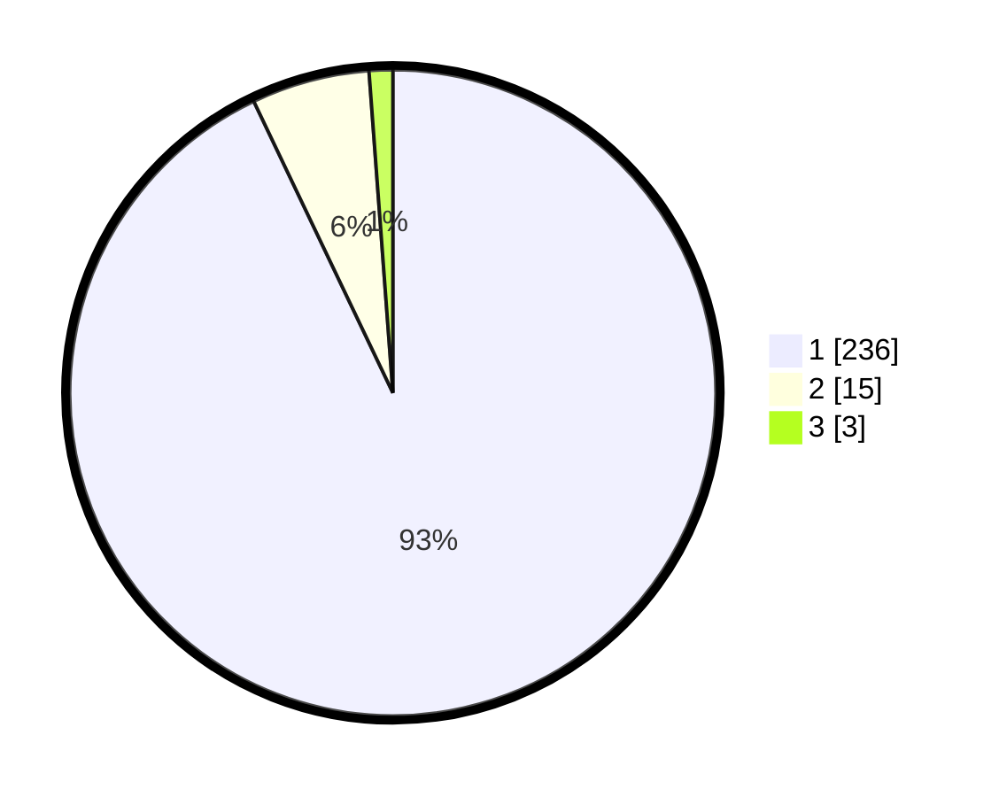

# Hasil

## Grafik

## Tabel

| No. | Nama Paslon    | Suara | Suara (raw) | Persentase |
|:--- |:-------------- | -----:| -----------:| ----------:|
| 1   | ANIES MUHAIMIN | 236   | [236][p-1]  | 92,91      |
| 2   | PRABOWO GIBRAN | 15    | [15][p-2]   | 5,91       |
| 3   | GANJAR MAHFUD  | 3     | [3][p-3]    | 1,18       |

[p-1]: https://github.com/gigit-pemilu/pemilu-2024/blob/main/pilpres/hitung-suara/sub/11-aceh/sub/06-aceh-besar/sub/04-seulimeum/sub/2014-iboh-tanjong/sub/001-tps/sub/paslon-1.txt
[p-2]: https://github.com/gigit-pemilu/pemilu-2024/blob/main/pilpres/hitung-suara/sub/11-aceh/sub/06-aceh-besar/sub/04-seulimeum/sub/2014-iboh-tanjong/sub/001-tps/sub/paslon-2.txt
[p-3]: https://github.com/gigit-pemilu/pemilu-2024/blob/main/pilpres/hitung-suara/sub/11-aceh/sub/06-aceh-besar/sub/04-seulimeum/sub/2014-iboh-tanjong/sub/001-tps/sub/paslon-3.txt

## Foto C Plano

https://sirekap-obj-formc.kpu.go.id/e59c/pemilu/ppwp/11/06/04/20/14/1106042014001-20240215-044300--b21dd341-1bbf-4ebd-b974-9358bb97e756.jpg

https://sirekap-obj-formc.kpu.go.id/e59c/pemilu/ppwp/11/06/04/20/14/1106042014001-20240215-044430--0e1d7f34-37a4-464d-9e89-157c100a3c2e.jpg

https://sirekap-obj-formc.kpu.go.id/e59c/pemilu/ppwp/11/06/04/20/14/1106042014001-20240215-044604--85e2484a-7335-4e2b-8889-a3c6c8ccdc2a.jpg

## Metadata

| Key        | Value               |
| ---------- | ------------------- |
| Time Stamp | 2024-02-15 15:00:29 |

