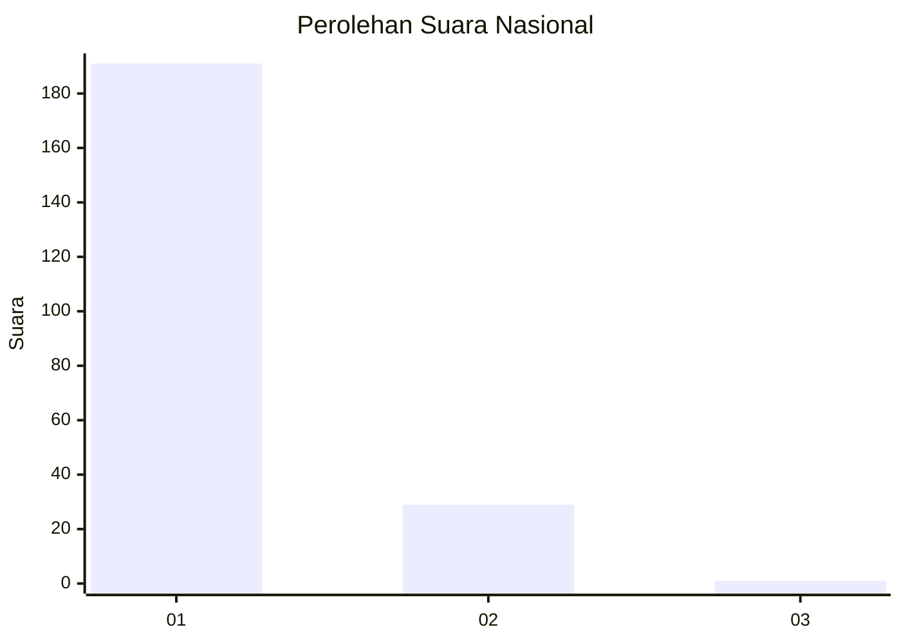
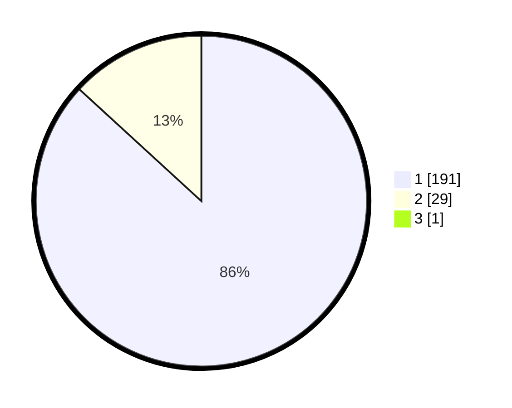

# Hasil

## Grafik

## Tabel

| No. | Nama Paslon    | Suara | Suara (raw) | Persentase |
|:--- |:-------------- | -----:| -----------:| ----------:|
| 1   | ANIES MUHAIMIN | 191   | [191][p-1]  | 86,43      |
| 2   | PRABOWO GIBRAN | 29    | [29][p-2]   | 13,12      |
| 3   | GANJAR MAHFUD  | 1     | [1][p-3]    | 0,45       |

[p-1]: https://github.com/gigit-pemilu/pemilu-2024/blob/main/pilpres/hitung-suara/sub/11-aceh/sub/06-aceh-besar/sub/04-seulimeum/sub/2015-seuneubok/sub/002-tps/sub/paslon-1.txt
[p-2]: https://github.com/gigit-pemilu/pemilu-2024/blob/main/pilpres/hitung-suara/sub/11-aceh/sub/06-aceh-besar/sub/04-seulimeum/sub/2015-seuneubok/sub/002-tps/sub/paslon-2.txt
[p-3]: https://github.com/gigit-pemilu/pemilu-2024/blob/main/pilpres/hitung-suara/sub/11-aceh/sub/06-aceh-besar/sub/04-seulimeum/sub/2015-seuneubok/sub/002-tps/sub/paslon-3.txt

## Foto C Plano

https://sirekap-obj-formc.kpu.go.id/7f1f/pemilu/ppwp/11/06/04/20/15/1106042015002-20240215-182951--fbffc444-42fe-4a61-897b-96da615d532f.jpg

https://sirekap-obj-formc.kpu.go.id/7f1f/pemilu/ppwp/11/06/04/20/15/1106042015002-20240215-183607--c5282046-ee4a-494f-88e0-82a475d08771.jpg

https://sirekap-obj-formc.kpu.go.id/7f1f/pemilu/ppwp/11/06/04/20/15/1106042015002-20240215-183953--faaf09aa-08b7-411f-b67a-5167fd682c23.jpg

## Metadata

| Key        | Value               |
| ---------- | ------------------- |
| Time Stamp | 2024-02-19 06:16:00 |

