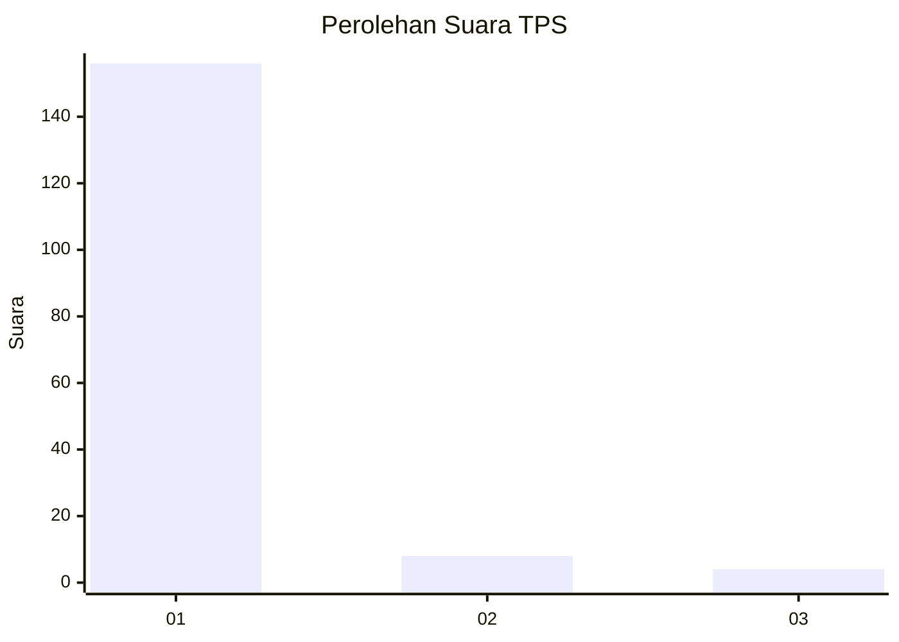
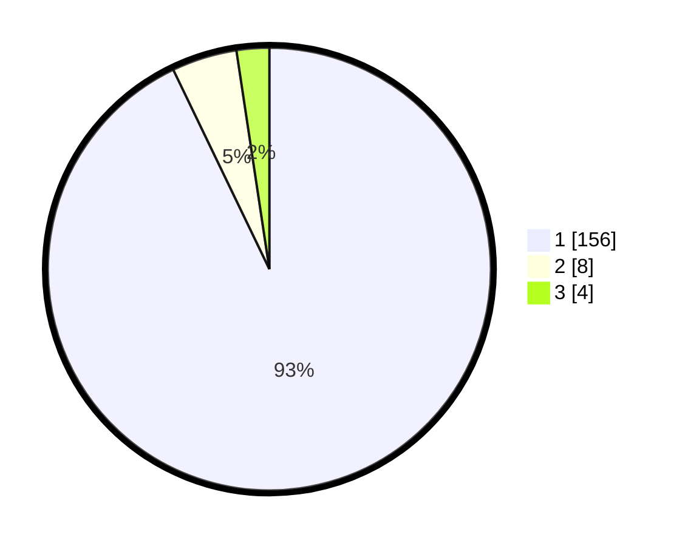

# Hasil

## Grafik

## Tabel

| No. | Nama Paslon    | Suara | Suara (raw) | Persentase |
|:--- |:-------------- | -----:| -----------:| ----------:|
| 1   | ANIES MUHAIMIN | 156   | [156][p-1]  | 92,86      |
| 2   | PRABOWO GIBRAN | 8     | [8][p-2]    | 4,76       |
| 3   | GANJAR MAHFUD  | 4     | [4][p-3]    | 2,38       |

[p-1]: https://github.com/gigit-pemilu/pemilu-2024-11-aceh/blob/main/pilpres/hitung-suara/sub/11-aceh/sub/06-aceh-besar/sub/04-seulimeum/sub/2026-blang-tingkeum/sub/003-tps/sub/paslon-1.txt
[p-2]: https://github.com/gigit-pemilu/pemilu-2024-11-aceh/blob/main/pilpres/hitung-suara/sub/11-aceh/sub/06-aceh-besar/sub/04-seulimeum/sub/2026-blang-tingkeum/sub/003-tps/sub/paslon-2.txt
[p-3]: https://github.com/gigit-pemilu/pemilu-2024-11-aceh/blob/main/pilpres/hitung-suara/sub/11-aceh/sub/06-aceh-besar/sub/04-seulimeum/sub/2026-blang-tingkeum/sub/003-tps/sub/paslon-3.txt

## Foto C Plano

https://sirekap-obj-formc.kpu.go.id/a0c2/pemilu/ppwp/11/06/04/20/26/1106042026003-20240215-080622--491d315b-213c-4c27-8b4f-dfb6a229d3c0.jpg

https://sirekap-obj-formc.kpu.go.id/a0c2/pemilu/ppwp/11/06/04/20/26/1106042026003-20240215-081154--03e3ec56-3304-4758-8644-e1ae642eccc4.jpg

## Metadata

| Key        | Value               |
| ---------- | ------------------- |
| Time Stamp | 2024-02-15 22:00:27 |

