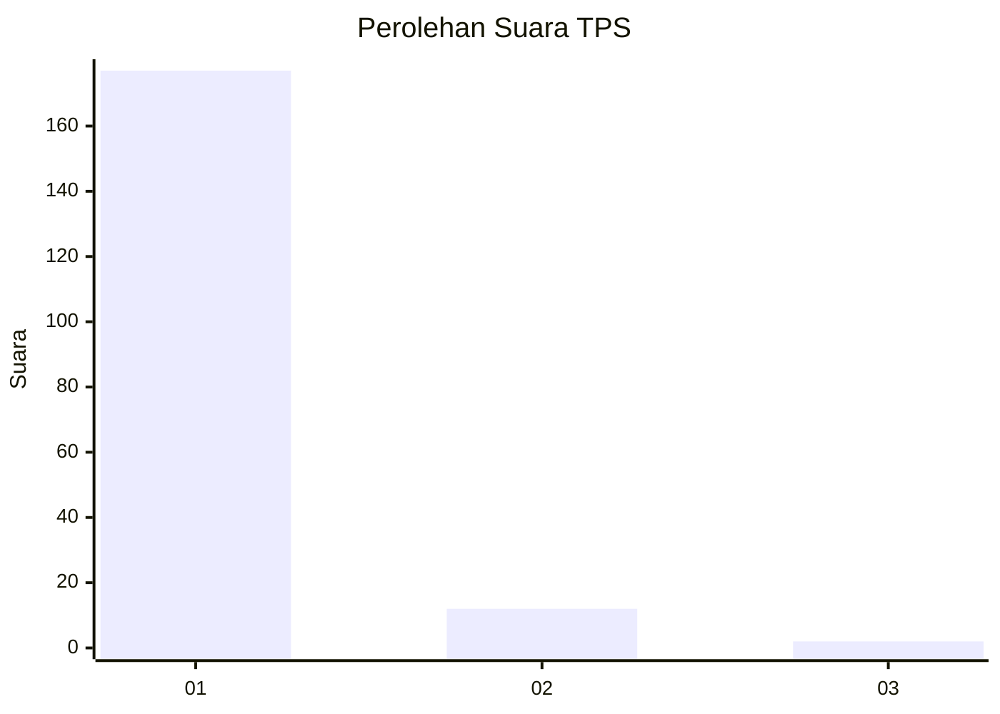
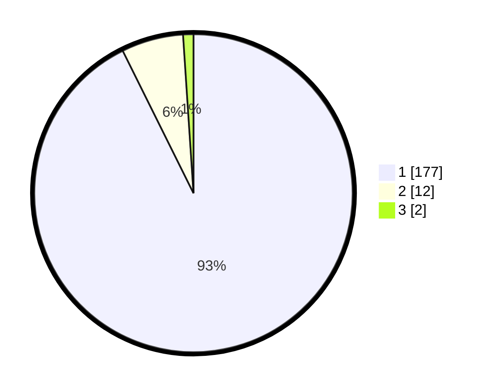

# Hasil

## Grafik

## Tabel

| No. | Nama Paslon    | Suara | Suara (raw) | Persentase |
|:--- |:-------------- | -----:| -----------:| ----------:|
| 1   | ANIES MUHAIMIN | 177   | [177][p-1]  | 92,67      |
| 2   | PRABOWO GIBRAN | 12    | [12][p-2]   | 6,28       |
| 3   | GANJAR MAHFUD  | 2     | [2][p-3]    | 1,05       |

[p-1]: https://github.com/gigit-pemilu/pemilu-2024-11-aceh/blob/main/pilpres/hitung-suara/sub/11-aceh/sub/06-aceh-besar/sub/04-seulimeum/sub/2031-ujong-mesjid-lampanah/sub/001-tps/sub/paslon-1.txt
[p-2]: https://github.com/gigit-pemilu/pemilu-2024-11-aceh/blob/main/pilpres/hitung-suara/sub/11-aceh/sub/06-aceh-besar/sub/04-seulimeum/sub/2031-ujong-mesjid-lampanah/sub/001-tps/sub/paslon-2.txt
[p-3]: https://github.com/gigit-pemilu/pemilu-2024-11-aceh/blob/main/pilpres/hitung-suara/sub/11-aceh/sub/06-aceh-besar/sub/04-seulimeum/sub/2031-ujong-mesjid-lampanah/sub/001-tps/sub/paslon-3.txt

## Foto C Plano

https://sirekap-obj-formc.kpu.go.id/4ac9/pemilu/ppwp/11/06/04/20/31/1106042031001-20240215-142725--dc4ec893-92a0-49a8-a3a9-3c9c00933e83.jpg

https://sirekap-obj-formc.kpu.go.id/4ac9/pemilu/ppwp/11/06/04/20/31/1106042031001-20240215-142819--7b9185ac-e3ac-4e93-a5ca-cf135998a45a.jpg

https://sirekap-obj-formc.kpu.go.id/4ac9/pemilu/ppwp/11/06/04/20/31/1106042031001-20240215-142922--0f239321-aa01-46f4-ad52-394b2a924332.jpg

## Metadata

| Key        | Value               |
| ---------- | ------------------- |
| Time Stamp | 2024-02-15 20:00:44 |

