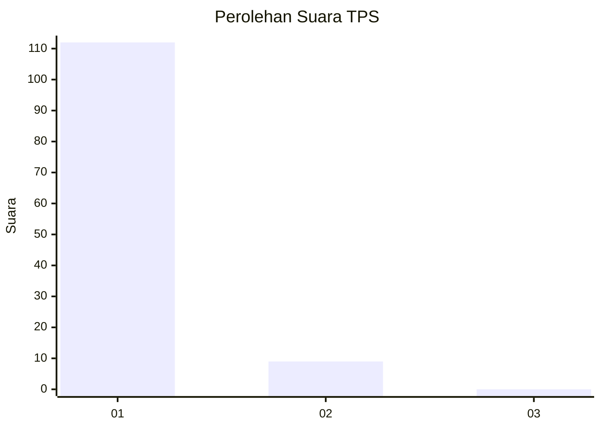
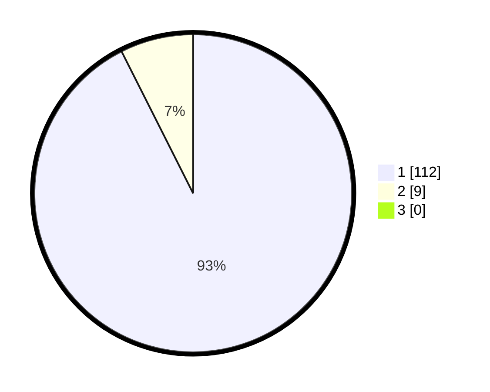

# Hasil

## Grafik

## Tabel

| No. | Nama Paslon    | Suara | Suara (raw) | Persentase |
|:--- |:-------------- | -----:| -----------:| ----------:|
| 1   | ANIES MUHAIMIN | 112   | [112][p-1]  | 92,56      |
| 2   | PRABOWO GIBRAN | 9     | [9][p-2]    | 7,44       |
| 3   | GANJAR MAHFUD  | 0     | [0][p-3]    | 0,00       |

[p-1]: https://github.com/gigit-pemilu/pemilu-2024-11-aceh/blob/main/pilpres/hitung-suara/sub/11-aceh/sub/06-aceh-besar/sub/04-seulimeum/sub/2035-meunasah-jeumpa/sub/001-tps/sub/paslon-1.txt
[p-2]: https://github.com/gigit-pemilu/pemilu-2024-11-aceh/blob/main/pilpres/hitung-suara/sub/11-aceh/sub/06-aceh-besar/sub/04-seulimeum/sub/2035-meunasah-jeumpa/sub/001-tps/sub/paslon-2.txt
[p-3]: https://github.com/gigit-pemilu/pemilu-2024-11-aceh/blob/main/pilpres/hitung-suara/sub/11-aceh/sub/06-aceh-besar/sub/04-seulimeum/sub/2035-meunasah-jeumpa/sub/001-tps/sub/paslon-3.txt

## Foto C Plano

https://sirekap-obj-formc.kpu.go.id/bd56/pemilu/ppwp/11/06/04/20/35/1106042035001-20240215-095304--7991c9a6-b132-41f1-b9c2-3dd369312b28.jpg

https://sirekap-obj-formc.kpu.go.id/bd56/pemilu/ppwp/11/06/04/20/35/1106042035001-20240214-235522--4fc59d33-330b-4dbe-b928-8d33d2f94e44.jpg

https://sirekap-obj-formc.kpu.go.id/bd56/pemilu/ppwp/11/06/04/20/35/1106042035001-20240214-235545--72265cd0-d840-4905-8d0c-e34877a5686b.jpg

## Metadata

| Key        | Value               |
| ---------- | ------------------- |
| Time Stamp | 2024-02-15 19:00:26 |

