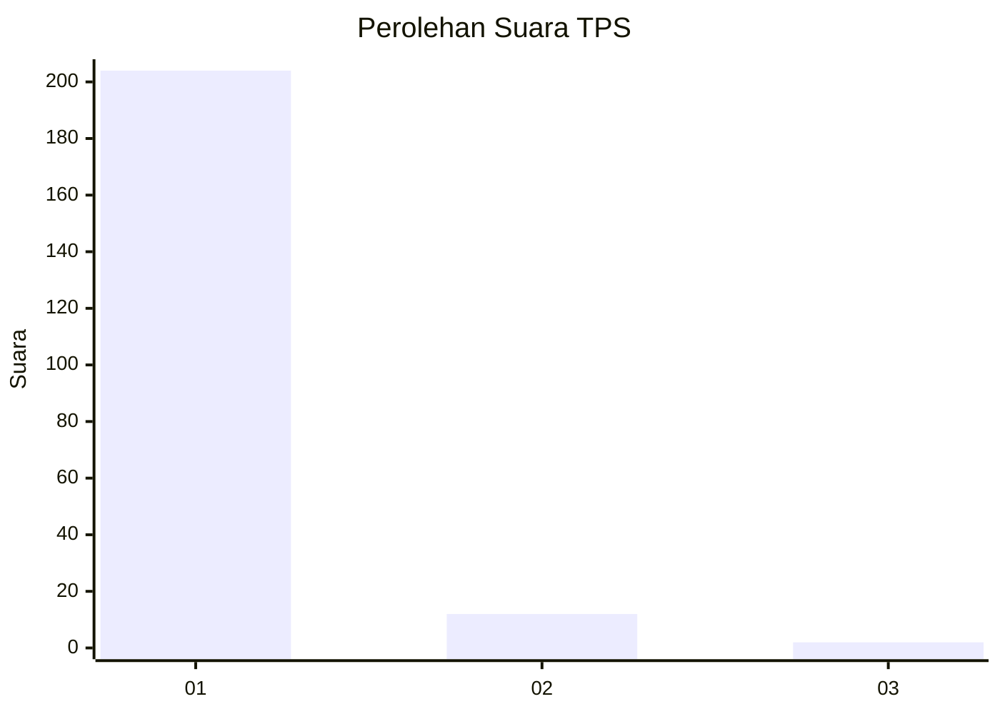
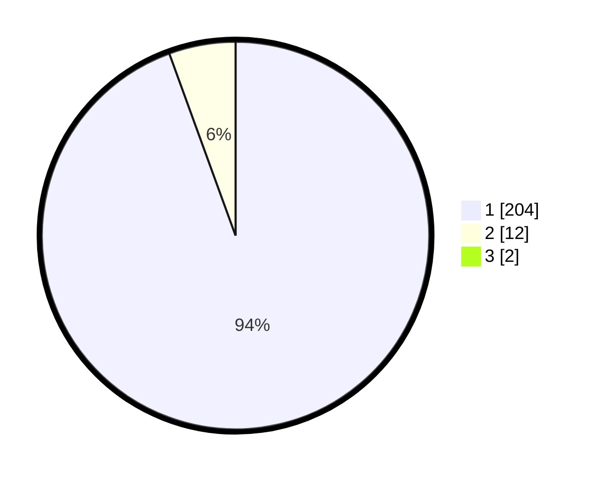

# Hasil

## Grafik

## Tabel

| No. | Nama Paslon    | Suara | Suara (raw) | Persentase |
|:--- |:-------------- | -----:| -----------:| ----------:|
| 1   | ANIES MUHAIMIN | 204   | [204][p-1]  | 93,58      |
| 2   | PRABOWO GIBRAN | 12    | [12][p-2]   | 5,50       |
| 3   | GANJAR MAHFUD  | 2     | [2][p-3]    | 0,92       |

[p-1]: https://github.com/gigit-pemilu/pemilu-2024-11-aceh/blob/main/pilpres/hitung-suara/sub/11-aceh/sub/06-aceh-besar/sub/04-seulimeum/sub/2039-kayee-adang/sub/001-tps/sub/paslon-1.txt
[p-2]: https://github.com/gigit-pemilu/pemilu-2024-11-aceh/blob/main/pilpres/hitung-suara/sub/11-aceh/sub/06-aceh-besar/sub/04-seulimeum/sub/2039-kayee-adang/sub/001-tps/sub/paslon-2.txt
[p-3]: https://github.com/gigit-pemilu/pemilu-2024-11-aceh/blob/main/pilpres/hitung-suara/sub/11-aceh/sub/06-aceh-besar/sub/04-seulimeum/sub/2039-kayee-adang/sub/001-tps/sub/paslon-3.txt

## Foto C Plano

https://sirekap-obj-formc.kpu.go.id/6702/pemilu/ppwp/11/06/04/20/39/1106042039001-20240215-001654--5a0af000-09cc-450e-a429-39c76e2e9b39.jpg

https://sirekap-obj-formc.kpu.go.id/6702/pemilu/ppwp/11/06/04/20/39/1106042039001-20240215-001839--48575f5d-04eb-4d34-b9d6-594a400a1828.jpg

https://sirekap-obj-formc.kpu.go.id/6702/pemilu/ppwp/11/06/04/20/39/1106042039001-20240215-001942--27e5e3e9-4b83-4ed9-a11e-4a4b595ac554.jpg

## Metadata

| Key        | Value               |
| ---------- | ------------------- |
| Time Stamp | 2024-02-15 15:00:29 |

