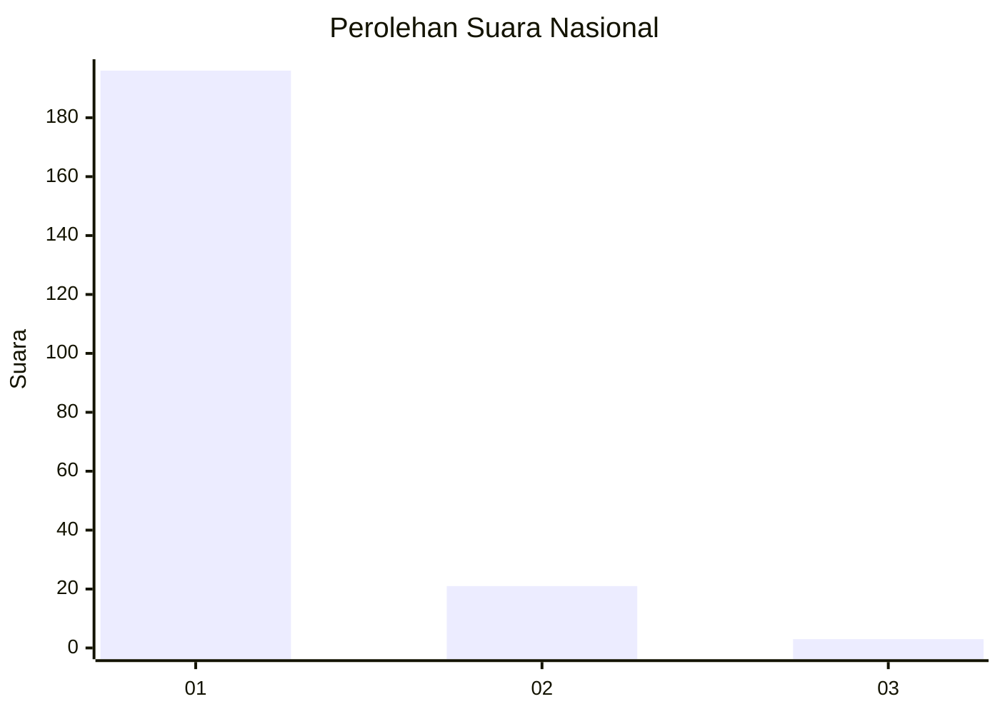
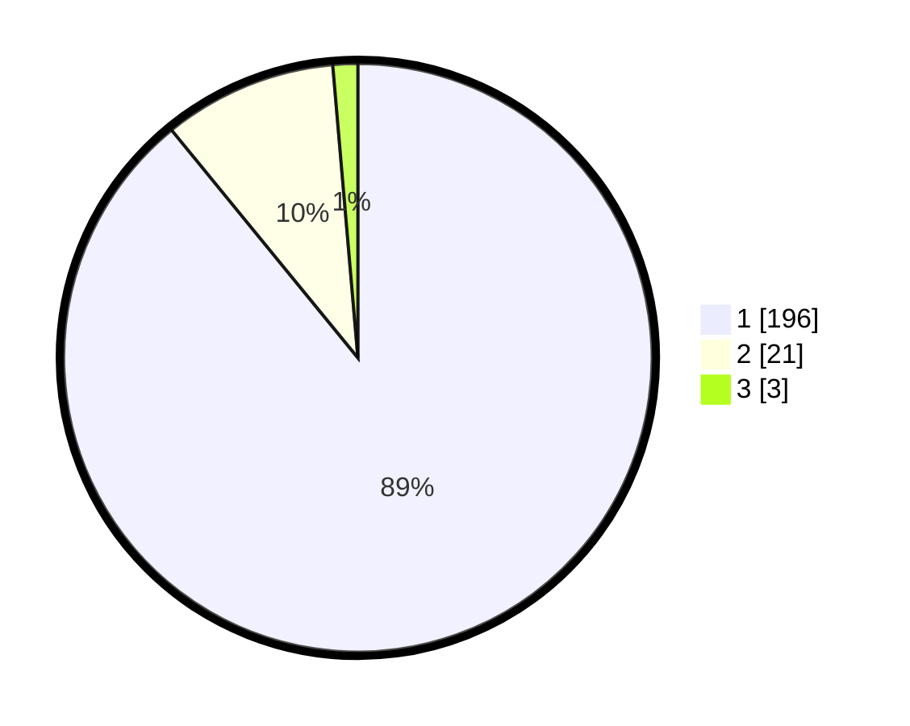

# Hasil

## Grafik

## Tabel

| No. | Nama Paslon    | Suara | Suara (raw) | Persentase |
|:--- |:-------------- | -----:| -----------:| ----------:|
| 1   | ANIES MUHAIMIN | 196   | [196][p-1]  | 89,09      |
| 2   | PRABOWO GIBRAN | 21    | [21][p-2]   | 9,55       |
| 3   | GANJAR MAHFUD  | 3     | [3][p-3]    | 1,36       |

[p-1]: https://github.com/gigit-pemilu/pemilu-2024/blob/main/pilpres/hitung-suara/sub/11-aceh/sub/06-aceh-besar/sub/04-seulimeum/sub/2041-ujong-mesjid-tanoh-abee/sub/001-tps/sub/paslon-1.txt
[p-2]: https://github.com/gigit-pemilu/pemilu-2024/blob/main/pilpres/hitung-suara/sub/11-aceh/sub/06-aceh-besar/sub/04-seulimeum/sub/2041-ujong-mesjid-tanoh-abee/sub/001-tps/sub/paslon-2.txt
[p-3]: https://github.com/gigit-pemilu/pemilu-2024/blob/main/pilpres/hitung-suara/sub/11-aceh/sub/06-aceh-besar/sub/04-seulimeum/sub/2041-ujong-mesjid-tanoh-abee/sub/001-tps/sub/paslon-3.txt

## Foto C Plano

https://sirekap-obj-formc.kpu.go.id/45e3/pemilu/ppwp/11/06/04/20/41/1106042041001-20240214-220227--2743e068-554a-4f5c-ae03-d3e5f430669f.jpg

https://sirekap-obj-formc.kpu.go.id/45e3/pemilu/ppwp/11/06/04/20/41/1106042041001-20240214-220416--845abc2b-fb9c-4780-9e69-6b3e5fe99dc6.jpg

https://sirekap-obj-formc.kpu.go.id/45e3/pemilu/ppwp/11/06/04/20/41/1106042041001-20240214-220603--b205896e-acdb-454b-b3bc-c3194e1c52ab.jpg

## Metadata

| Key        | Value               |
| ---------- | ------------------- |
| Time Stamp | 2024-02-15 15:00:29 |

