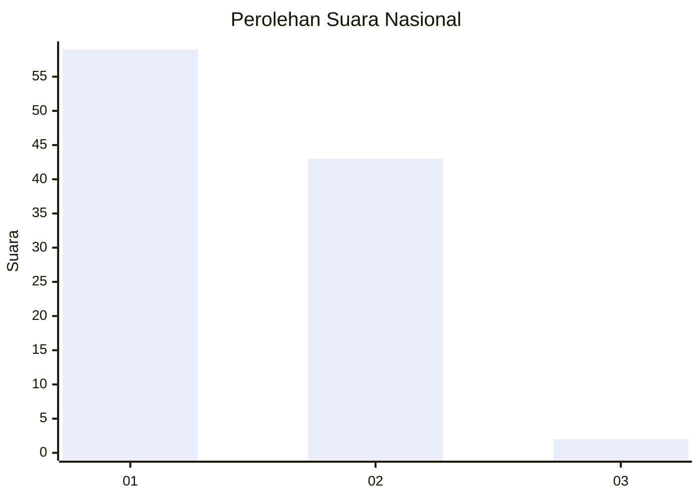
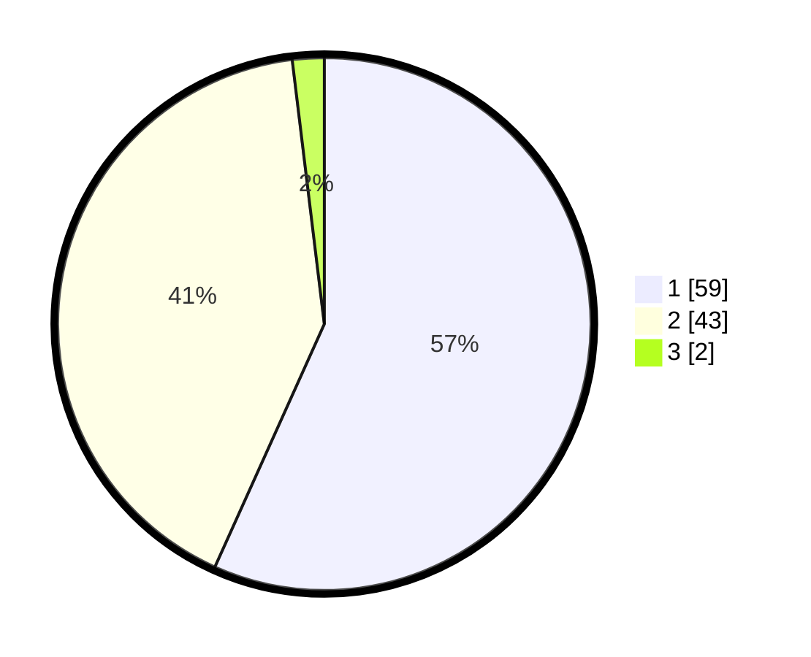

# Hasil

## Grafik

## Tabel

| No. | Nama Paslon    | Suara | Suara (raw) | Persentase |
|:--- |:-------------- | -----:| -----------:| ----------:|
| 1   | ANIES MUHAIMIN | 59    | [59][p-1]   | 56,73      |
| 2   | PRABOWO GIBRAN | 43    | [43][p-2]   | 41,35      |
| 3   | GANJAR MAHFUD  | 2     | [2][p-3]    | 1,92       |

[p-1]: https://github.com/gigit-pemilu/pemilu-2024/blob/main/pilpres/hitung-suara/sub/11-aceh/sub/06-aceh-besar/sub/04-seulimeum/sub/2042-lamcarak/sub/001-tps/sub/paslon-1.txt
[p-2]: https://github.com/gigit-pemilu/pemilu-2024/blob/main/pilpres/hitung-suara/sub/11-aceh/sub/06-aceh-besar/sub/04-seulimeum/sub/2042-lamcarak/sub/001-tps/sub/paslon-2.txt
[p-3]: https://github.com/gigit-pemilu/pemilu-2024/blob/main/pilpres/hitung-suara/sub/11-aceh/sub/06-aceh-besar/sub/04-seulimeum/sub/2042-lamcarak/sub/001-tps/sub/paslon-3.txt

## Foto C Plano

https://sirekap-obj-formc.kpu.go.id/b9fa/pemilu/ppwp/11/06/04/20/42/1106042042001-20240220-211140--0314c34f-e3b8-44e3-9967-9f9f77582fb0.jpg

https://sirekap-obj-formc.kpu.go.id/b9fa/pemilu/ppwp/11/06/04/20/42/1106042042001-20240220-211247--3ee2d1ec-5044-4703-b50c-fd4644b0affe.jpg

https://sirekap-obj-formc.kpu.go.id/b9fa/pemilu/ppwp/11/06/04/20/42/1106042042001-20240220-211337--bfce8139-9fac-4a36-895a-eabe5ebfca11.jpg

## Metadata

| Key        | Value               |
| ---------- | ------------------- |
| Time Stamp | 2024-02-20 22:00:00 |

## DATA PEMILIH TETAP

Jumlah pemilih dalam DPT: **247**.
 * L: **500**.
 * P: **517**.

## DATA PENGGUNA HAK PILIH

Jumlah pengguna hak pilih dalam DPT: **206**.
 * L: **95**.
 * P: **116**.

Jumlah pengguna hak pilih dalam DPTb: **803**.
 * L: **1**.
 * P: **2**.

Jumlah pengguna hak pilih dalam DPK: **0**.
 * L: **0**.
 * P: **0**.

Jumlah pengguna hak pilih: **209**.
 * L: **96**.
 * P: **113**.

## JUMLAH SUARA SAH DAN TIDAK SAH

JUMLAH SELURUH SUARA SAH: **205**.

JUMLAH SUARA TIDAK SAH: **80**.

JUMLAH SELURUH SUARA SAH DAN SUARA TIDAK SAH: **212**.

