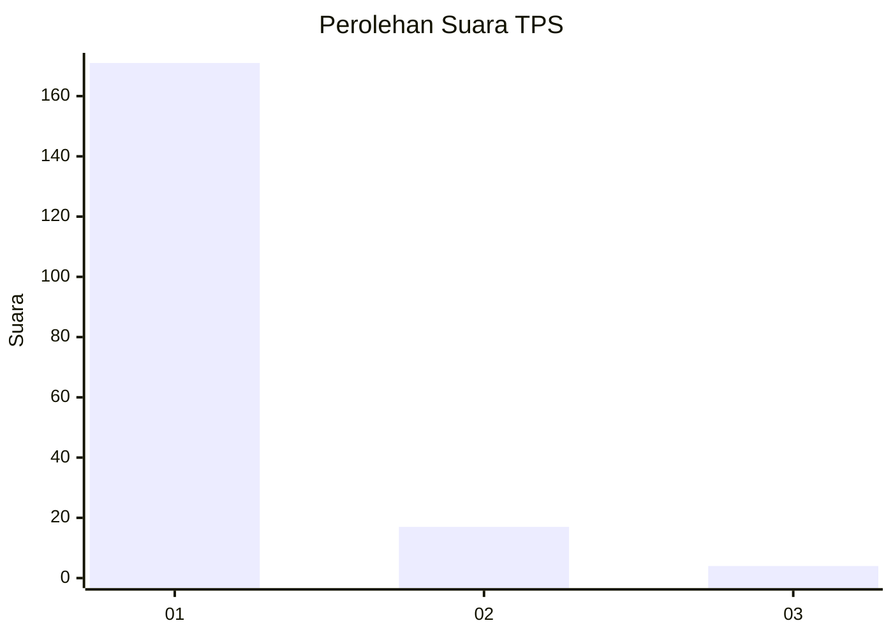
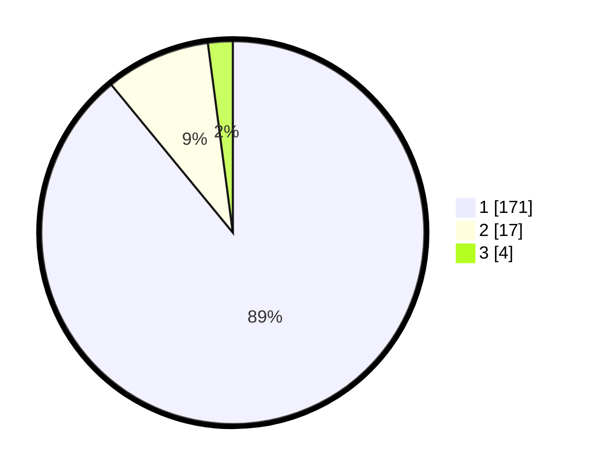

# Hasil

## Grafik

## Tabel

| No. | Nama Paslon    | Suara | Suara (raw) | Persentase |
|:--- |:-------------- | -----:| -----------:| ----------:|
| 1   | ANIES MUHAIMIN | 171   | [171][p-1]  | 89,06      |
| 2   | PRABOWO GIBRAN | 17    | [17][p-2]   | 8,85       |
| 3   | GANJAR MAHFUD  | 4     | [4][p-3]    | 2,08       |

[p-1]: https://github.com/gigit-pemilu/pemilu-2024-11-aceh/blob/main/pilpres/hitung-suara/sub/11-aceh/sub/06-aceh-besar/sub/04-seulimeum/sub/2045-lampisang-dayah/sub/002-tps/sub/paslon-1.txt
[p-2]: https://github.com/gigit-pemilu/pemilu-2024-11-aceh/blob/main/pilpres/hitung-suara/sub/11-aceh/sub/06-aceh-besar/sub/04-seulimeum/sub/2045-lampisang-dayah/sub/002-tps/sub/paslon-2.txt
[p-3]: https://github.com/gigit-pemilu/pemilu-2024-11-aceh/blob/main/pilpres/hitung-suara/sub/11-aceh/sub/06-aceh-besar/sub/04-seulimeum/sub/2045-lampisang-dayah/sub/002-tps/sub/paslon-3.txt

## Foto C Plano

https://sirekap-obj-formc.kpu.go.id/f153/pemilu/ppwp/11/06/04/20/45/1106042045002-20240214-204546--e1f80871-4b30-4e33-83aa-059b55c87c10.jpg

https://sirekap-obj-formc.kpu.go.id/f153/pemilu/ppwp/11/06/04/20/45/1106042045002-20240214-204803--570d56ea-5db5-4911-b15c-45d651a0654a.jpg

https://sirekap-obj-formc.kpu.go.id/f153/pemilu/ppwp/11/06/04/20/45/1106042045002-20240214-232140--99e4c9fa-abd1-43d7-b310-9161524fc6d6.jpg

## Metadata

| Key        | Value               |
| ---------- | ------------------- |
| Time Stamp | 2024-02-15 05:00:24 |

## DATA PEMILIH TETAP

Jumlah pemilih dalam DPT: **208**.
 * L: **104**.
 * P: **104**.

## DATA PENGGUNA HAK PILIH

Jumlah pengguna hak pilih dalam DPT: **189**.
 * L: **88**.
 * P: **101**.

Jumlah pengguna hak pilih dalam DPTb: **88**.
 * L: **0**.
 * P: **0**.

Jumlah pengguna hak pilih dalam DPK: **0**.
 * L: **0**.
 * P: **0**.

Jumlah pengguna hak pilih: **189**.
 * L: **88**.
 * P: **101**.

## JUMLAH SUARA SAH DAN TIDAK SAH

JUMLAH SELURUH SUARA SAH: **188**.

JUMLAH SUARA TIDAK SAH: **1**.

JUMLAH SELURUH SUARA SAH DAN SUARA TIDAK SAH: **183**.

