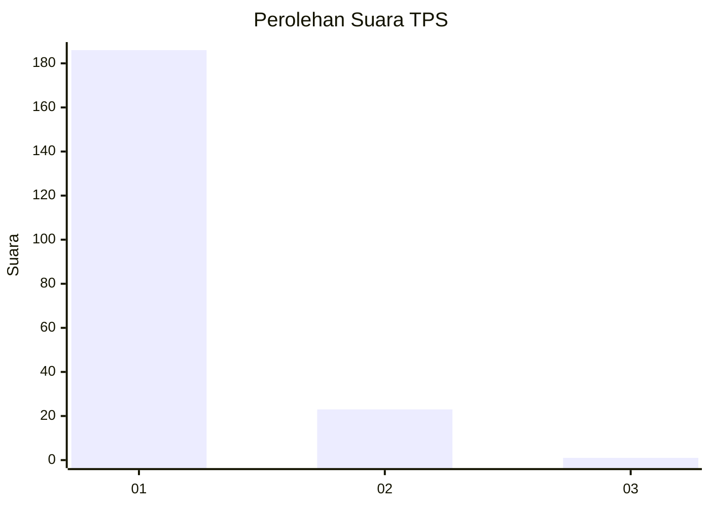
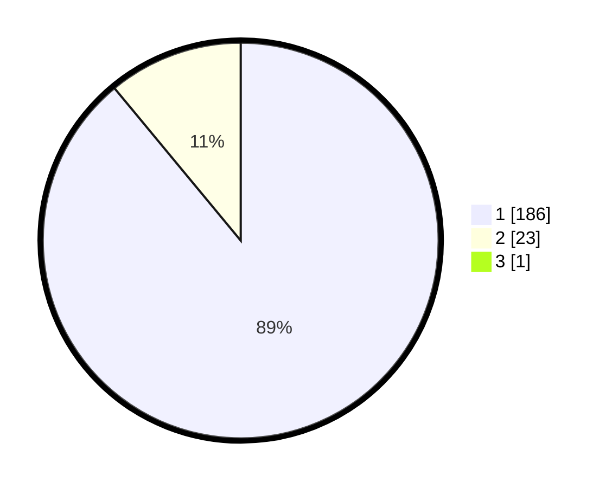

# Hasil

## Grafik

## Tabel

| No. | Nama Paslon    | Suara | Suara (raw) | Persentase |
|:--- |:-------------- | -----:| -----------:| ----------:|
| 1   | ANIES MUHAIMIN | 186   | [186][p-1]  | 88,57      |
| 2   | PRABOWO GIBRAN | 23    | [23][p-2]   | 10,95      |
| 3   | GANJAR MAHFUD  | 1     | [1][p-3]    | 0,48       |

[p-1]: https://github.com/gigit-pemilu/pemilu-2024-11-aceh/blob/main/pilpres/hitung-suara/sub/11-aceh/sub/06-aceh-besar/sub/05-montasik/sub/2002-gampong-baroh/sub/001-tps/sub/paslon-1.txt
[p-2]: https://github.com/gigit-pemilu/pemilu-2024-11-aceh/blob/main/pilpres/hitung-suara/sub/11-aceh/sub/06-aceh-besar/sub/05-montasik/sub/2002-gampong-baroh/sub/001-tps/sub/paslon-2.txt
[p-3]: https://github.com/gigit-pemilu/pemilu-2024-11-aceh/blob/main/pilpres/hitung-suara/sub/11-aceh/sub/06-aceh-besar/sub/05-montasik/sub/2002-gampong-baroh/sub/001-tps/sub/paslon-3.txt

## Foto C Plano

https://sirekap-obj-formc.kpu.go.id/5aee/pemilu/ppwp/11/06/05/20/02/1106052002001-20240215-033329--6daaf979-e2bd-4de2-821d-9aad192c6c32.jpg

https://sirekap-obj-formc.kpu.go.id/5aee/pemilu/ppwp/11/06/05/20/02/1106052002001-20240215-033438--ee544dec-acd3-474d-83ab-7fdb1b2e1028.jpg

https://sirekap-obj-formc.kpu.go.id/5aee/pemilu/ppwp/11/06/05/20/02/1106052002001-20240215-033551--b77ac2c5-520f-428b-b77e-5c7de2a34c34.jpg

## Metadata

| Key        | Value               |
| ---------- | ------------------- |
| Time Stamp | 2024-02-15 12:00:28 |

