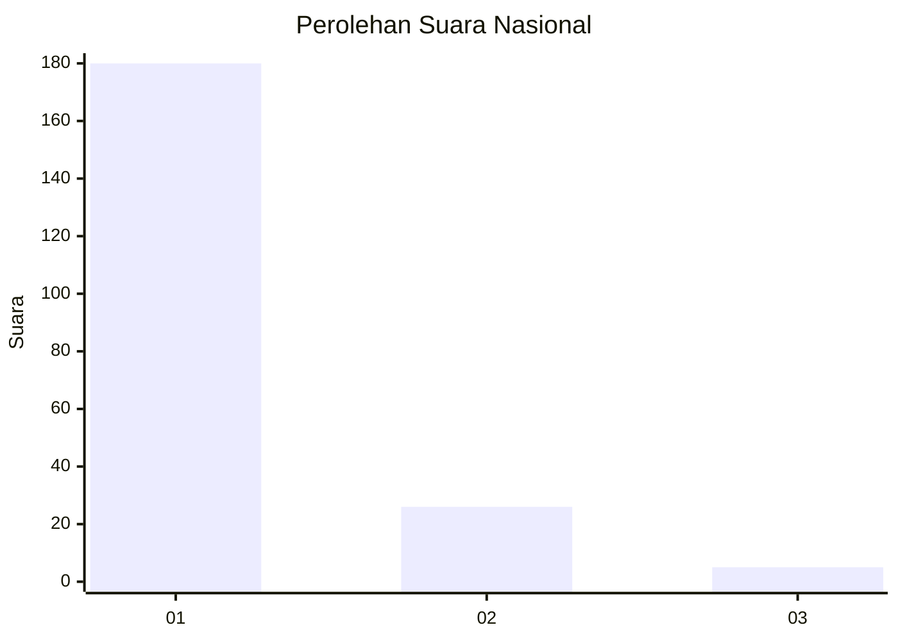
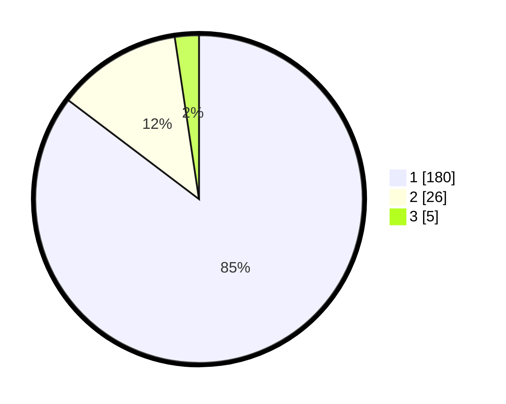

# Hasil

## Grafik

## Tabel

| No. | Nama Paslon    | Suara | Suara (raw) | Persentase |
|:--- |:-------------- | -----:| -----------:| ----------:|
| 1   | ANIES MUHAIMIN | 180   | [180][p-1]  | 85,31      |
| 2   | PRABOWO GIBRAN | 26    | [26][p-2]   | 12,32      |
| 3   | GANJAR MAHFUD  | 5     | [5][p-3]    | 2,37       |

[p-1]: https://github.com/gigit-pemilu/pemilu-2024/blob/main/pilpres/hitung-suara/sub/11-aceh/sub/06-aceh-besar/sub/05-montasik/sub/2002-gampong-baroh/sub/002-tps/sub/paslon-1.txt
[p-2]: https://github.com/gigit-pemilu/pemilu-2024/blob/main/pilpres/hitung-suara/sub/11-aceh/sub/06-aceh-besar/sub/05-montasik/sub/2002-gampong-baroh/sub/002-tps/sub/paslon-2.txt
[p-3]: https://github.com/gigit-pemilu/pemilu-2024/blob/main/pilpres/hitung-suara/sub/11-aceh/sub/06-aceh-besar/sub/05-montasik/sub/2002-gampong-baroh/sub/002-tps/sub/paslon-3.txt

## Foto C Plano

https://sirekap-obj-formc.kpu.go.id/d19d/pemilu/ppwp/11/06/05/20/02/1106052002002-20240215-025800--c4329ac0-da14-45a3-bac3-c26f705d5f9e.jpg

https://sirekap-obj-formc.kpu.go.id/d19d/pemilu/ppwp/11/06/05/20/02/1106052002002-20240215-030010--7ebbeac1-1a9e-48ee-8ee9-a3b7ea386013.jpg

https://sirekap-obj-formc.kpu.go.id/d19d/pemilu/ppwp/11/06/05/20/02/1106052002002-20240215-030642--9c34e163-e020-464c-98e3-bdf3c2401907.jpg

## Metadata

| Key        | Value               |
| ---------- | ------------------- |
| Time Stamp | 2024-02-20 15:00:00 |

## DATA PEMILIH TETAP

Jumlah pemilih dalam DPT: **234**.
 * L: **122**.
 * P: **112**.

## DATA PENGGUNA HAK PILIH

Jumlah pengguna hak pilih dalam DPT: **208**.
 * L: **105**.
 * P: **103**.

Jumlah pengguna hak pilih dalam DPTb: **7**.
 * L: **7**.
 * P: **0**.

Jumlah pengguna hak pilih dalam DPK: **0**.
 * L: **0**.
 * P: **0**.

Jumlah pengguna hak pilih: **215**.
 * L: **112**.
 * P: **103**.

## JUMLAH SUARA SAH DAN TIDAK SAH

JUMLAH SELURUH SUARA SAH: **211**.

JUMLAH SUARA TIDAK SAH: **4**.

JUMLAH SELURUH SUARA SAH DAN SUARA TIDAK SAH: **215**.

