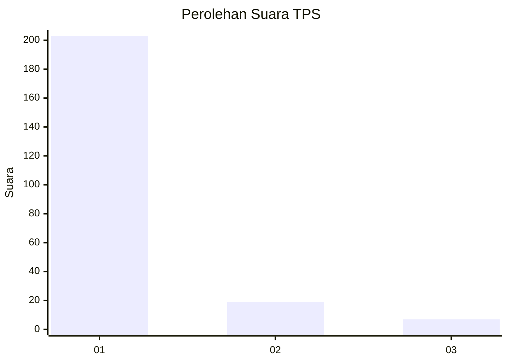
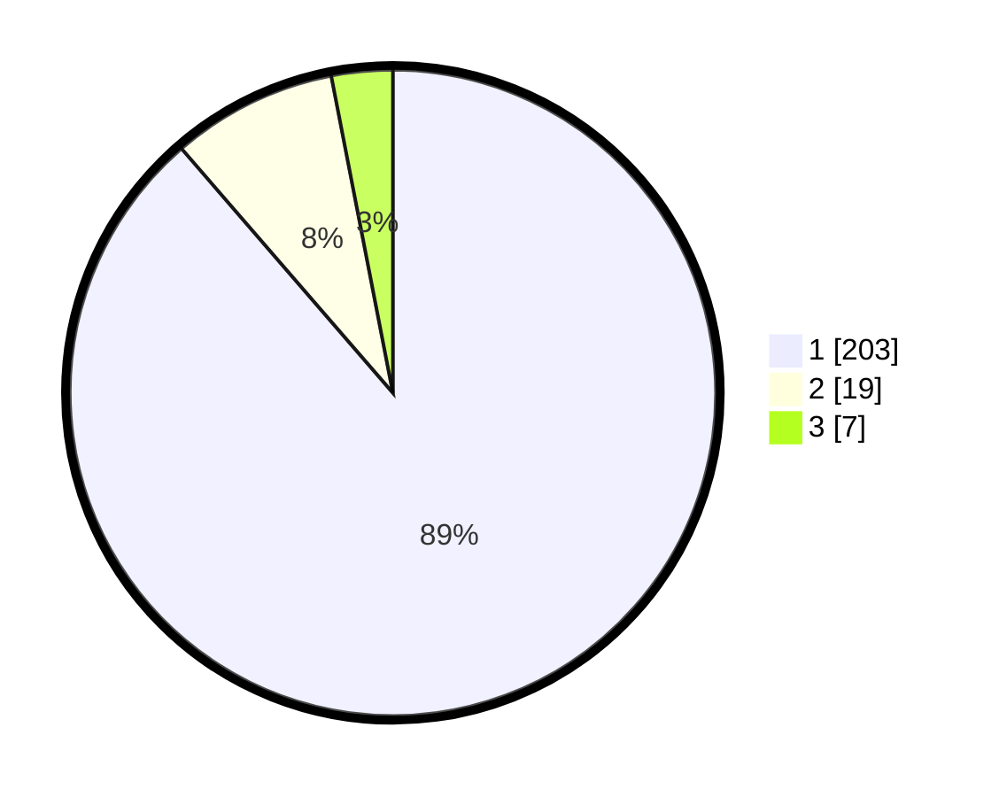

# Hasil

## Grafik

## Tabel

| No. | Nama Paslon    | Suara | Suara (raw) | Persentase |
|:--- |:-------------- | -----:| -----------:| ----------:|
| 1   | ANIES MUHAIMIN | 203   | [203][p-1]  | 88,65      |
| 2   | PRABOWO GIBRAN | 19    | [19][p-2]   | 8,30       |
| 3   | GANJAR MAHFUD  | 7     | [7][p-3]    | 3,06       |

[p-1]: https://github.com/gigit-pemilu/pemilu-2024-11-aceh/blob/main/pilpres/hitung-suara/sub/11-aceh/sub/06-aceh-besar/sub/05-montasik/sub/2009-weu-krueng/sub/001-tps/sub/paslon-1.txt
[p-2]: https://github.com/gigit-pemilu/pemilu-2024-11-aceh/blob/main/pilpres/hitung-suara/sub/11-aceh/sub/06-aceh-besar/sub/05-montasik/sub/2009-weu-krueng/sub/001-tps/sub/paslon-2.txt
[p-3]: https://github.com/gigit-pemilu/pemilu-2024-11-aceh/blob/main/pilpres/hitung-suara/sub/11-aceh/sub/06-aceh-besar/sub/05-montasik/sub/2009-weu-krueng/sub/001-tps/sub/paslon-3.txt

## Foto C Plano

https://sirekap-obj-formc.kpu.go.id/a689/pemilu/ppwp/11/06/05/20/09/1106052009001-20240215-220945--bc744a49-d704-42f6-847f-236d9895c978.jpg

https://sirekap-obj-formc.kpu.go.id/a689/pemilu/ppwp/11/06/05/20/09/1106052009001-20240215-220911--1bb49c86-08c1-4fea-ad84-98532076df60.jpg

## Metadata

| Key        | Value               |
| ---------- | ------------------- |
| Time Stamp | 2024-02-15 22:30:27 |

