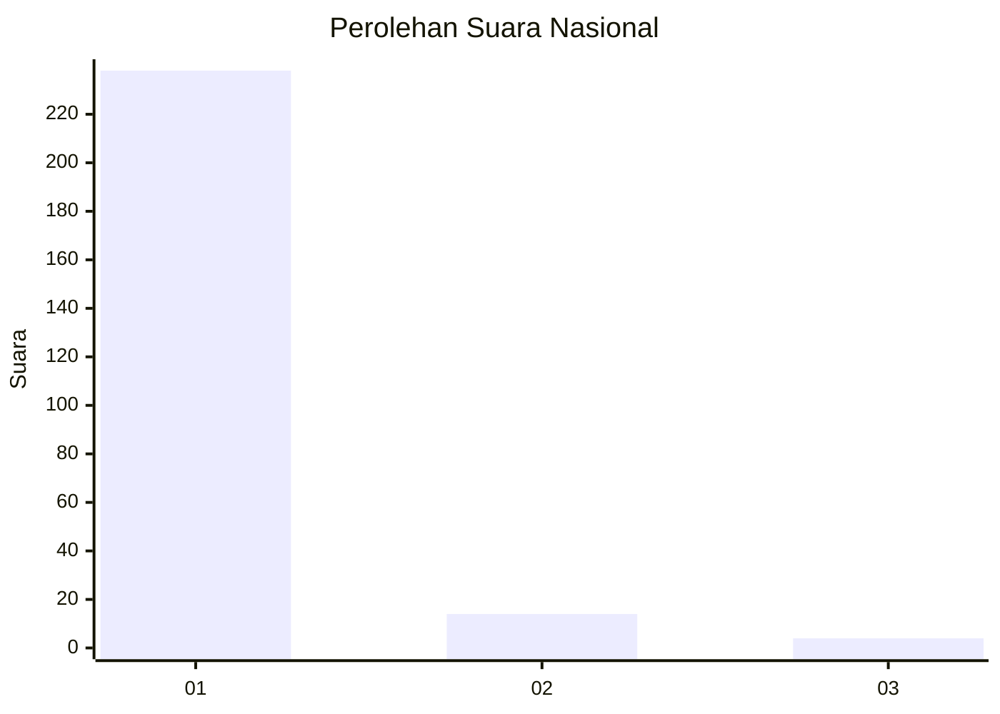
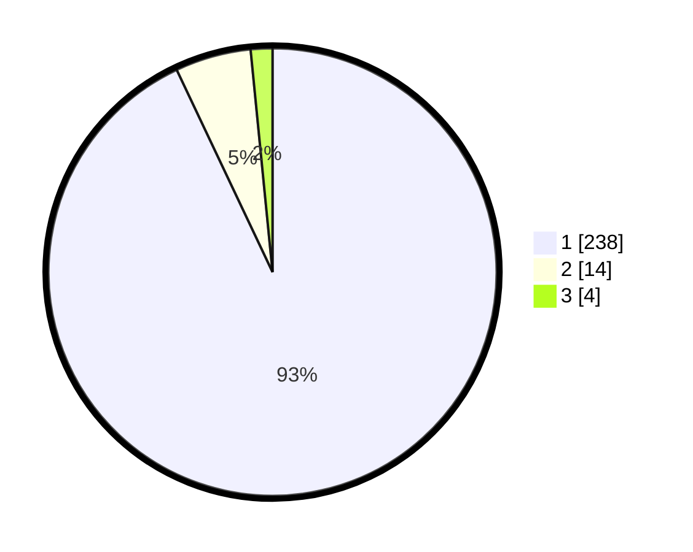

# Hasil

## Grafik

## Tabel

| No. | Nama Paslon    | Suara | Suara (raw) | Persentase |
|:--- |:-------------- | -----:| -----------:| ----------:|
| 1   | ANIES MUHAIMIN | 238   | [238][p-1]  | 92,97      |
| 2   | PRABOWO GIBRAN | 14    | [14][p-2]   | 5,47       |
| 3   | GANJAR MAHFUD  | 4     | [4][p-3]    | 1,56       |

[p-1]: https://github.com/gigit-pemilu/pemilu-2024/blob/main/pilpres/hitung-suara/sub/11-aceh/sub/06-aceh-besar/sub/05-montasik/sub/2011-bak-dilip/sub/001-tps/sub/paslon-1.txt
[p-2]: https://github.com/gigit-pemilu/pemilu-2024/blob/main/pilpres/hitung-suara/sub/11-aceh/sub/06-aceh-besar/sub/05-montasik/sub/2011-bak-dilip/sub/001-tps/sub/paslon-2.txt
[p-3]: https://github.com/gigit-pemilu/pemilu-2024/blob/main/pilpres/hitung-suara/sub/11-aceh/sub/06-aceh-besar/sub/05-montasik/sub/2011-bak-dilip/sub/001-tps/sub/paslon-3.txt

## Foto C Plano

https://sirekap-obj-formc.kpu.go.id/1bf6/pemilu/ppwp/11/06/05/20/11/1106052011001-20240214-184815--3c51a9a6-79d0-44f2-89ea-5280cd99cb90.jpg

https://sirekap-obj-formc.kpu.go.id/1bf6/pemilu/ppwp/11/06/05/20/11/1106052011001-20240214-184541--ffdfbceb-5255-4caf-bd48-ea7cffd4f082.jpg

https://sirekap-obj-formc.kpu.go.id/1bf6/pemilu/ppwp/11/06/05/20/11/1106052011001-20240214-185514--3a18c940-bd0b-43b2-8c0b-ca7605e8650a.jpg

## Metadata

| Key        | Value               |
| ---------- | ------------------- |
| Time Stamp | 2024-02-14 21:46:01 |

