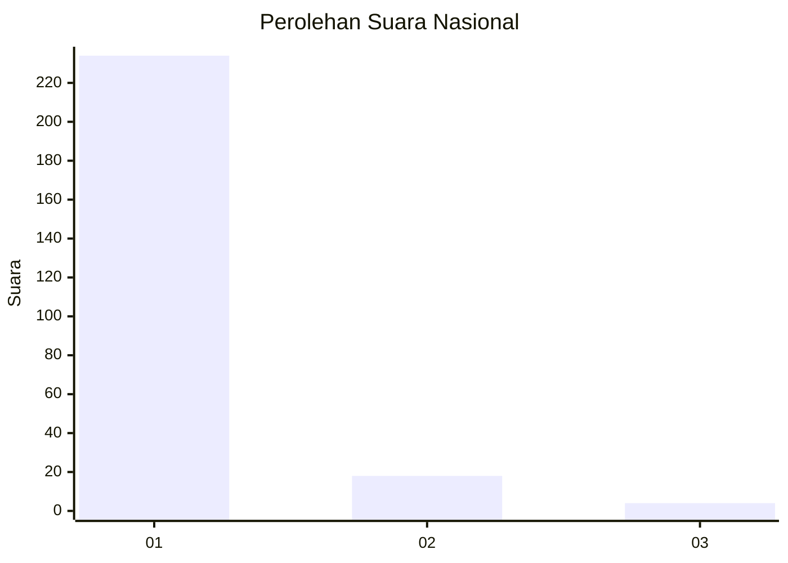
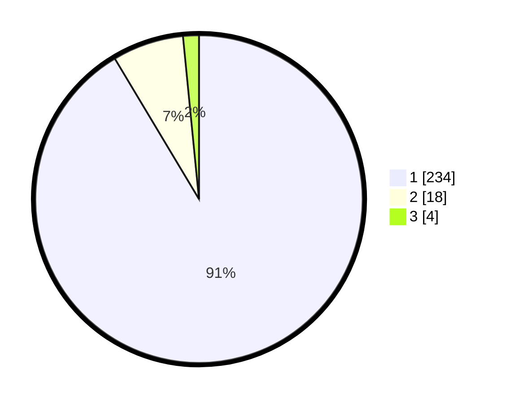

# Hasil

## Grafik

## Tabel

| No. | Nama Paslon    | Suara | Suara (raw) | Persentase |
|:--- |:-------------- | -----:| -----------:| ----------:|
| 1   | ANIES MUHAIMIN | 234   | [234][p-1]  | 91,41      |
| 2   | PRABOWO GIBRAN | 18    | [18][p-2]   | 7,03       |
| 3   | GANJAR MAHFUD  | 4     | [4][p-3]    | 1,56       |

[p-1]: https://github.com/gigit-pemilu/pemilu-2024/blob/main/pilpres/hitung-suara/sub/11-aceh/sub/06-aceh-besar/sub/05-montasik/sub/2011-bak-dilip/sub/002-tps/sub/paslon-1.txt
[p-2]: https://github.com/gigit-pemilu/pemilu-2024/blob/main/pilpres/hitung-suara/sub/11-aceh/sub/06-aceh-besar/sub/05-montasik/sub/2011-bak-dilip/sub/002-tps/sub/paslon-2.txt
[p-3]: https://github.com/gigit-pemilu/pemilu-2024/blob/main/pilpres/hitung-suara/sub/11-aceh/sub/06-aceh-besar/sub/05-montasik/sub/2011-bak-dilip/sub/002-tps/sub/paslon-3.txt

## Foto C Plano

https://sirekap-obj-formc.kpu.go.id/9d1f/pemilu/ppwp/11/06/05/20/11/1106052011002-20240214-213037--cbaebd77-6019-4b55-9f33-8d3f8bb644db.jpg

https://sirekap-obj-formc.kpu.go.id/9d1f/pemilu/ppwp/11/06/05/20/11/1106052011002-20240214-213141--99655493-f9e0-4339-82f1-3b3dd9ae2710.jpg

https://sirekap-obj-formc.kpu.go.id/9d1f/pemilu/ppwp/11/06/05/20/11/1106052011002-20240214-213259--b6dd5148-5631-46c2-afe7-09afb2f9aaf1.jpg

## Metadata

| Key        | Value               |
| ---------- | ------------------- |
| Time Stamp | 2024-02-20 17:00:00 |

