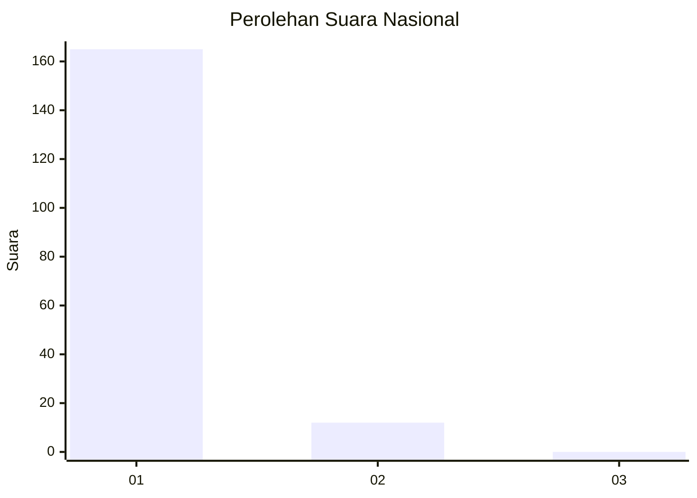
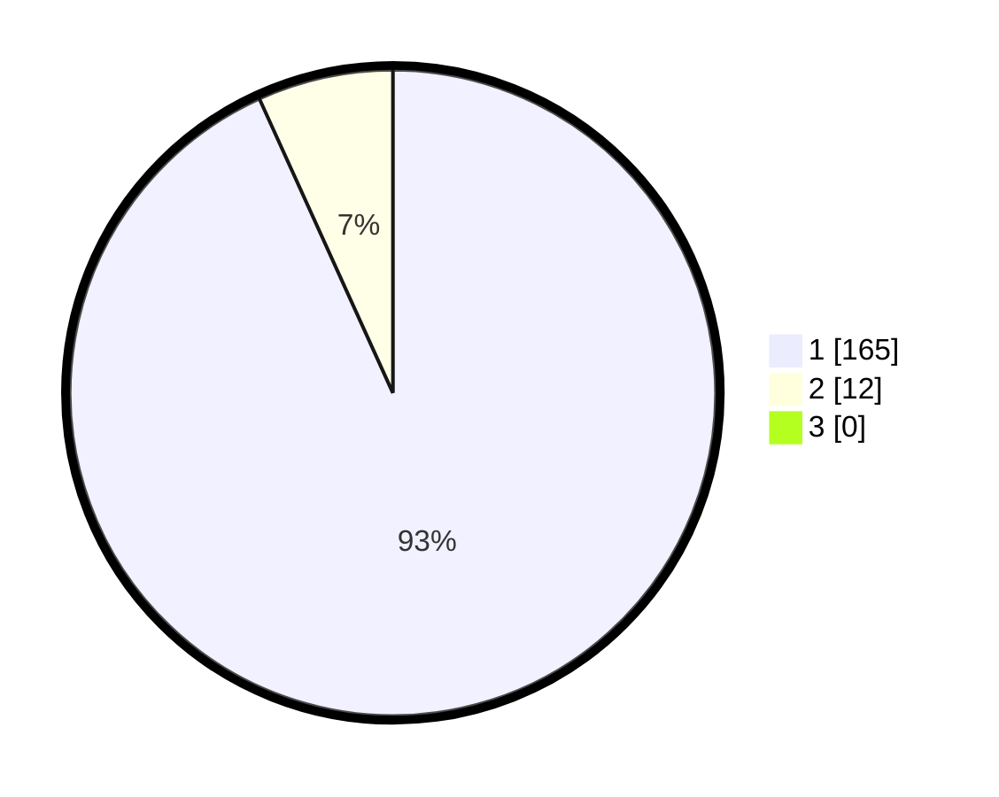

# Hasil

## Grafik

## Tabel

| No. | Nama Paslon    | Suara | Suara (raw) | Persentase |
|:--- |:-------------- | -----:| -----------:| ----------:|
| 1   | ANIES MUHAIMIN | 165   | [165][p-1]  | 93,22      |
| 2   | PRABOWO GIBRAN | 12    | [12][p-2]   | 6,78       |
| 3   | GANJAR MAHFUD  | 0     | [0][p-3]    | 0,00       |

[p-1]: https://github.com/gigit-pemilu/pemilu-2024/blob/main/pilpres/hitung-suara/sub/11-aceh/sub/06-aceh-besar/sub/05-montasik/sub/2017-weu-bada/sub/002-tps/sub/paslon-1.txt
[p-2]: https://github.com/gigit-pemilu/pemilu-2024/blob/main/pilpres/hitung-suara/sub/11-aceh/sub/06-aceh-besar/sub/05-montasik/sub/2017-weu-bada/sub/002-tps/sub/paslon-2.txt
[p-3]: https://github.com/gigit-pemilu/pemilu-2024/blob/main/pilpres/hitung-suara/sub/11-aceh/sub/06-aceh-besar/sub/05-montasik/sub/2017-weu-bada/sub/002-tps/sub/paslon-3.txt

## Foto C Plano

https://sirekap-obj-formc.kpu.go.id/e103/pemilu/ppwp/11/06/05/20/17/1106052017002-20240214-220515--a4b6979f-0e68-4fa0-abfb-7f3299cfd404.jpg

https://sirekap-obj-formc.kpu.go.id/e103/pemilu/ppwp/11/06/05/20/17/1106052017002-20240214-220713--4ac67100-c09e-4c22-b093-4bfa59785797.jpg

https://sirekap-obj-formc.kpu.go.id/e103/pemilu/ppwp/11/06/05/20/17/1106052017002-20240214-220835--648bf7bc-1726-4774-9ecf-556b64b41111.jpg

## Metadata

| Key        | Value               |
| ---------- | ------------------- |
| Time Stamp | 2024-02-15 16:00:26 |

