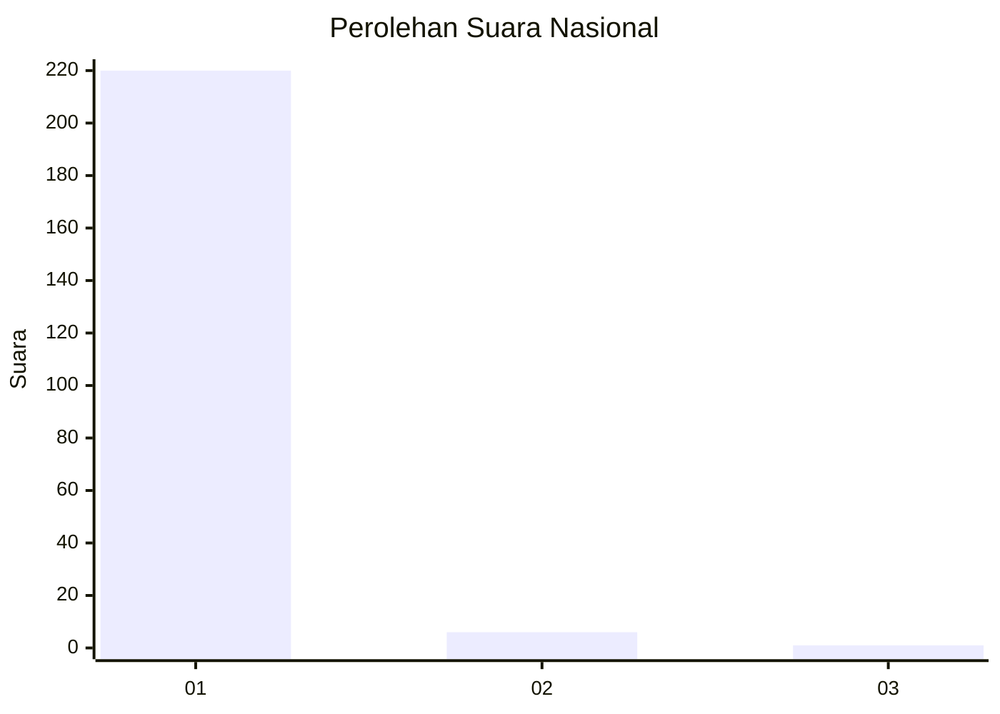
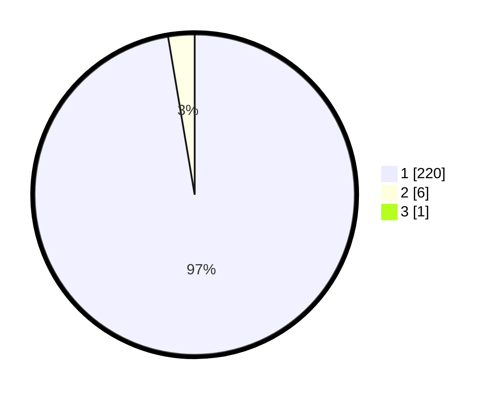

# Hasil

## Grafik

## Tabel

| No. | Nama Paslon    | Suara | Suara (raw) | Persentase |
|:--- |:-------------- | -----:| -----------:| ----------:|
| 1   | ANIES MUHAIMIN | 220   | [220][p-1]  | 96,92      |
| 2   | PRABOWO GIBRAN | 6     | [6][p-2]    | 2,64       |
| 3   | GANJAR MAHFUD  | 1     | [1][p-3]    | 0,44       |

[p-1]: https://github.com/gigit-pemilu/pemilu-2024/blob/main/pilpres/hitung-suara/sub/11-aceh/sub/06-aceh-besar/sub/05-montasik/sub/2021-warabo/sub/001-tps/sub/paslon-1.txt
[p-2]: https://github.com/gigit-pemilu/pemilu-2024/blob/main/pilpres/hitung-suara/sub/11-aceh/sub/06-aceh-besar/sub/05-montasik/sub/2021-warabo/sub/001-tps/sub/paslon-2.txt
[p-3]: https://github.com/gigit-pemilu/pemilu-2024/blob/main/pilpres/hitung-suara/sub/11-aceh/sub/06-aceh-besar/sub/05-montasik/sub/2021-warabo/sub/001-tps/sub/paslon-3.txt

## Foto C Plano

https://sirekap-obj-formc.kpu.go.id/d729/pemilu/ppwp/11/06/05/20/21/1106052021001-20240214-214459--c40aaba0-b911-458e-b97c-eee550766abc.jpg

https://sirekap-obj-formc.kpu.go.id/d729/pemilu/ppwp/11/06/05/20/21/1106052021001-20240214-223246--9cd1f762-89e6-4083-b1ac-1da2b2261993.jpg

https://sirekap-obj-formc.kpu.go.id/d729/pemilu/ppwp/11/06/05/20/21/1106052021001-20240214-221817--638958bd-158d-4245-bc71-e73580142adf.jpg

## Metadata

| Key        | Value               |
| ---------- | ------------------- |
| Time Stamp | 2024-02-15 12:00:28 |

