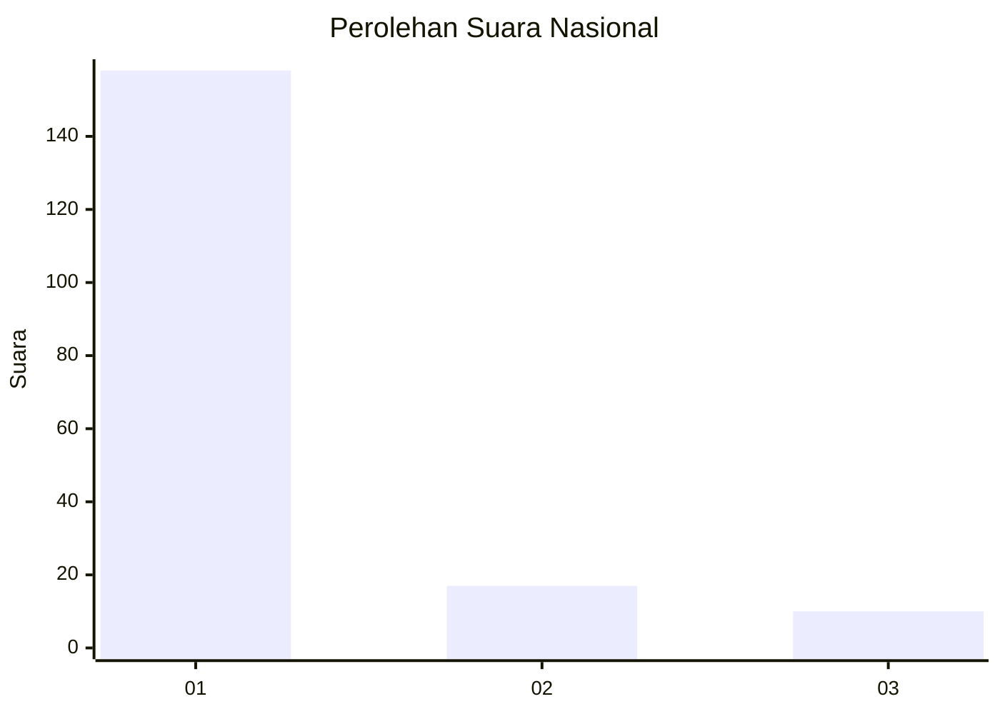
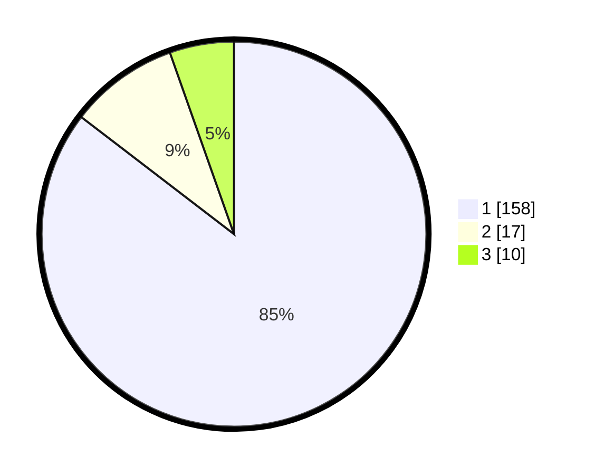

# Hasil

## Grafik

## Tabel

| No. | Nama Paslon    | Suara | Suara (raw) | Persentase |
|:--- |:-------------- | -----:| -----------:| ----------:|
| 1   | ANIES MUHAIMIN | 158   | [158][p-1]  | 85,41      |
| 2   | PRABOWO GIBRAN | 17    | [17][p-2]   | 9,19       |
| 3   | GANJAR MAHFUD  | 10    | [10][p-3]   | 5,41       |

[p-1]: https://github.com/gigit-pemilu/pemilu-2024/blob/main/pilpres/hitung-suara/sub/11-aceh/sub/06-aceh-besar/sub/05-montasik/sub/2022-teubang-phui-mesjid/sub/001-tps/sub/paslon-1.txt
[p-2]: https://github.com/gigit-pemilu/pemilu-2024/blob/main/pilpres/hitung-suara/sub/11-aceh/sub/06-aceh-besar/sub/05-montasik/sub/2022-teubang-phui-mesjid/sub/001-tps/sub/paslon-2.txt
[p-3]: https://github.com/gigit-pemilu/pemilu-2024/blob/main/pilpres/hitung-suara/sub/11-aceh/sub/06-aceh-besar/sub/05-montasik/sub/2022-teubang-phui-mesjid/sub/001-tps/sub/paslon-3.txt

## Foto C Plano

https://sirekap-obj-formc.kpu.go.id/0f1e/pemilu/ppwp/11/06/05/20/22/1106052022001-20240215-022820--44d90c56-c303-4844-be86-28b64444ce21.jpg

https://sirekap-obj-formc.kpu.go.id/0f1e/pemilu/ppwp/11/06/05/20/22/1106052022001-20240215-023152--42edc112-0709-4d36-b886-3bacf2217cfd.jpg

https://sirekap-obj-formc.kpu.go.id/0f1e/pemilu/ppwp/11/06/05/20/22/1106052022001-20240215-023337--3ad3bc18-a80a-4f42-97c1-92d051f73ca7.jpg

## Metadata

| Key        | Value               |
| ---------- | ------------------- |
| Time Stamp | 2024-02-15 21:30:27 |

