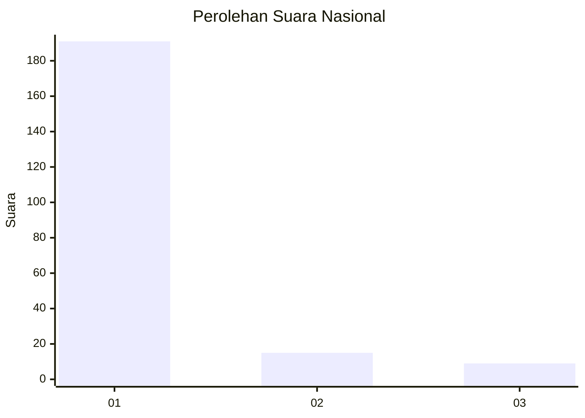
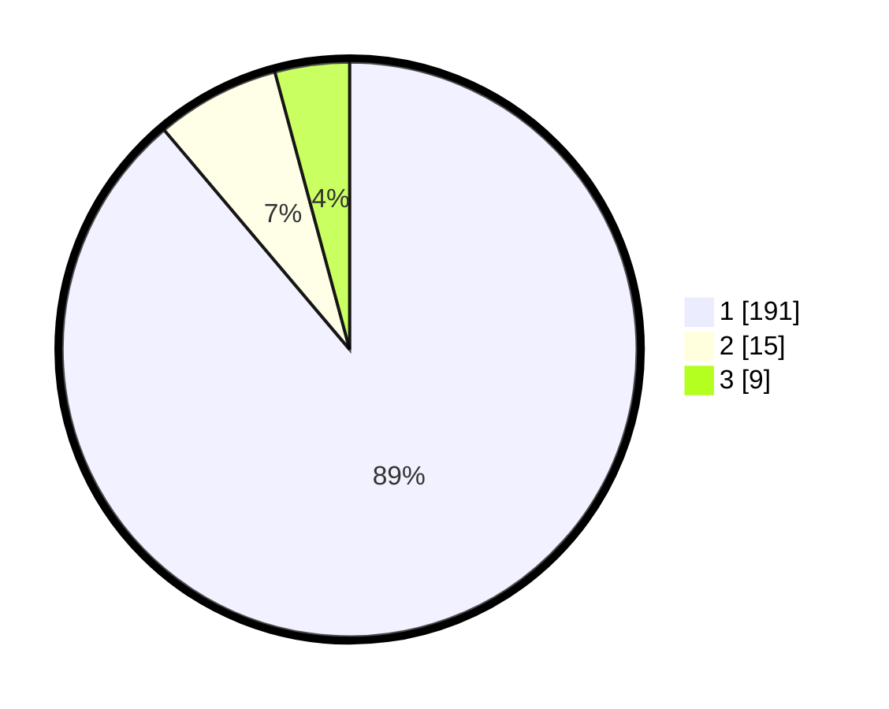

# Hasil

## Grafik

## Tabel

| No. | Nama Paslon    | Suara | Suara (raw) | Persentase |
|:--- |:-------------- | -----:| -----------:| ----------:|
| 1   | ANIES MUHAIMIN | 191   | [191][p-1]  | 88,84      |
| 2   | PRABOWO GIBRAN | 15    | [15][p-2]   | 6,98       |
| 3   | GANJAR MAHFUD  | 9     | [9][p-3]    | 4,19       |

[p-1]: https://github.com/gigit-pemilu/pemilu-2024/blob/main/pilpres/hitung-suara/sub/11-aceh/sub/06-aceh-besar/sub/05-montasik/sub/2023-teubang-phui-baro/sub/002-tps/sub/paslon-1.txt
[p-2]: https://github.com/gigit-pemilu/pemilu-2024/blob/main/pilpres/hitung-suara/sub/11-aceh/sub/06-aceh-besar/sub/05-montasik/sub/2023-teubang-phui-baro/sub/002-tps/sub/paslon-2.txt
[p-3]: https://github.com/gigit-pemilu/pemilu-2024/blob/main/pilpres/hitung-suara/sub/11-aceh/sub/06-aceh-besar/sub/05-montasik/sub/2023-teubang-phui-baro/sub/002-tps/sub/paslon-3.txt

## Foto C Plano

https://sirekap-obj-formc.kpu.go.id/af4f/pemilu/ppwp/11/06/05/20/23/1106052023002-20240214-211819--3d0928d3-18cf-4e20-8934-7b6d6aa886a7.jpg

https://sirekap-obj-formc.kpu.go.id/af4f/pemilu/ppwp/11/06/05/20/23/1106052023002-20240214-211914--706e2839-421d-4156-af7c-c77e8fe76925.jpg

https://sirekap-obj-formc.kpu.go.id/af4f/pemilu/ppwp/11/06/05/20/23/1106052023002-20240214-212018--10013474-24f5-4e50-bb56-ae3e4b4e9963.jpg

## Metadata

| Key        | Value               |
| ---------- | ------------------- |
| Time Stamp | 2024-02-15 01:47:43 |

