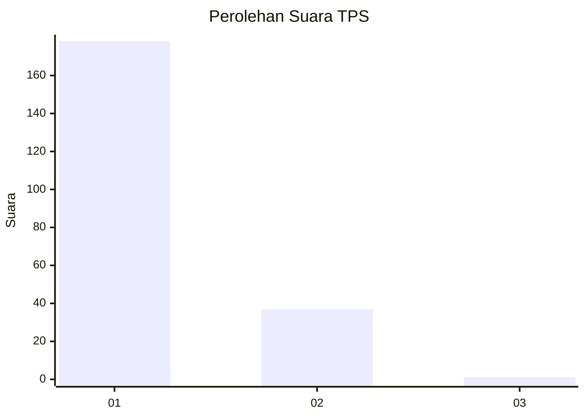
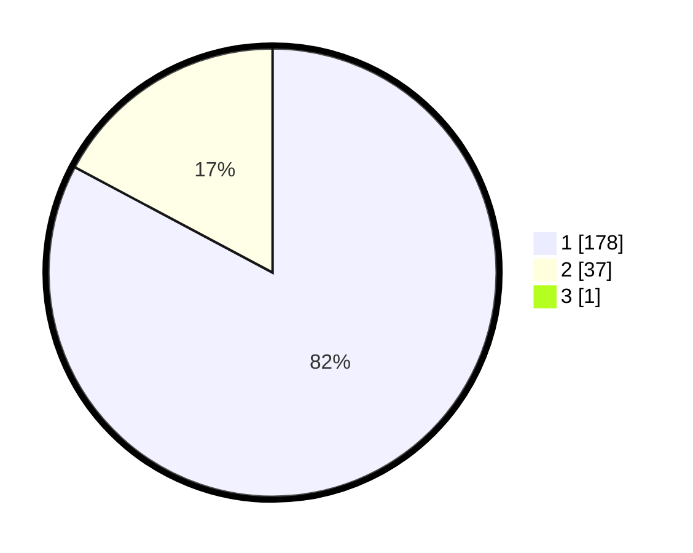

# Hasil

## Grafik

## Tabel

| No. | Nama Paslon    | Suara | Suara (raw) | Persentase |
|:--- |:-------------- | -----:| -----------:| ----------:|
| 1   | ANIES MUHAIMIN | 178   | [178][p-1]  | 82,41      |
| 2   | PRABOWO GIBRAN | 37    | [37][p-2]   | 17,13      |
| 3   | GANJAR MAHFUD  | 1     | [1][p-3]    | 0,46       |

[p-1]: https://github.com/gigit-pemilu/pemilu-2024-11-aceh/blob/main/pilpres/hitung-suara/sub/11-aceh/sub/06-aceh-besar/sub/05-montasik/sub/2027-peurumping/sub/001-tps/sub/paslon-1.txt
[p-2]: https://github.com/gigit-pemilu/pemilu-2024-11-aceh/blob/main/pilpres/hitung-suara/sub/11-aceh/sub/06-aceh-besar/sub/05-montasik/sub/2027-peurumping/sub/001-tps/sub/paslon-2.txt
[p-3]: https://github.com/gigit-pemilu/pemilu-2024-11-aceh/blob/main/pilpres/hitung-suara/sub/11-aceh/sub/06-aceh-besar/sub/05-montasik/sub/2027-peurumping/sub/001-tps/sub/paslon-3.txt

## Foto C Plano

https://sirekap-obj-formc.kpu.go.id/912c/pemilu/ppwp/11/06/05/20/27/1106052027001-20240215-010023--1f3aa3fb-f51f-4012-9af9-add62e82a72e.jpg

https://sirekap-obj-formc.kpu.go.id/912c/pemilu/ppwp/11/06/05/20/27/1106052027001-20240214-221756--28def2ce-c9cd-4c51-bc0d-fdfd66e2fc99.jpg

https://sirekap-obj-formc.kpu.go.id/912c/pemilu/ppwp/11/06/05/20/27/1106052027001-20240214-210633--a4dc2a51-c60c-4e41-b8e0-cf64d9634706.jpg

## Metadata

| Key        | Value               |
| ---------- | ------------------- |
| Time Stamp | 2024-02-15 22:00:27 |

