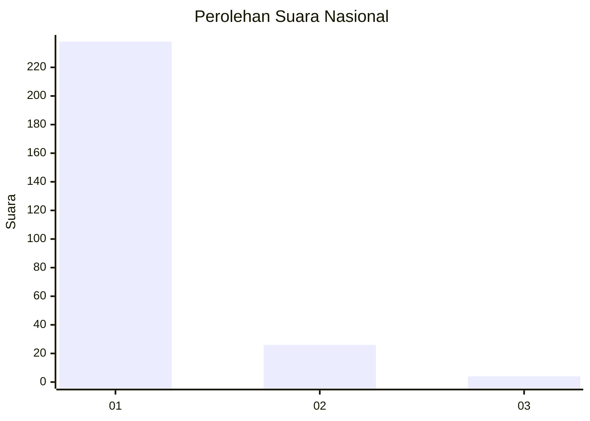
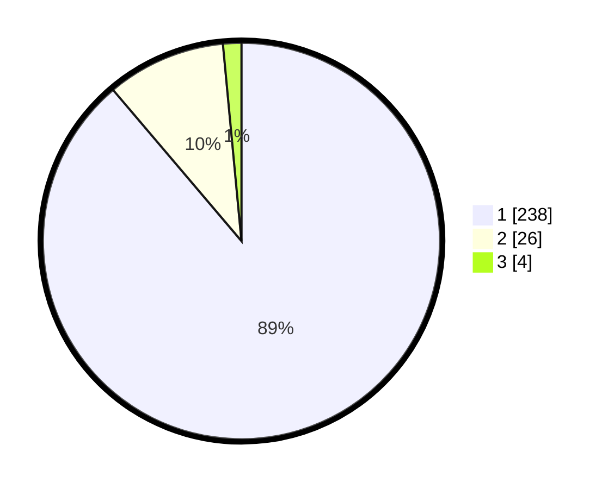

# Hasil

## Grafik

## Tabel

| No. | Nama Paslon    | Suara | Suara (raw) | Persentase |
|:--- |:-------------- | -----:| -----------:| ----------:|
| 1   | ANIES MUHAIMIN | 238   | [238][p-1]  | 88,81      |
| 2   | PRABOWO GIBRAN | 26    | [26][p-2]   | 9,70       |
| 3   | GANJAR MAHFUD  | 4     | [4][p-3]    | 1,49       |

[p-1]: https://github.com/gigit-pemilu/pemilu-2024/blob/main/pilpres/hitung-suara/sub/11-aceh/sub/06-aceh-besar/sub/05-montasik/sub/2028-atong/sub/001-tps/sub/paslon-1.txt
[p-2]: https://github.com/gigit-pemilu/pemilu-2024/blob/main/pilpres/hitung-suara/sub/11-aceh/sub/06-aceh-besar/sub/05-montasik/sub/2028-atong/sub/001-tps/sub/paslon-2.txt
[p-3]: https://github.com/gigit-pemilu/pemilu-2024/blob/main/pilpres/hitung-suara/sub/11-aceh/sub/06-aceh-besar/sub/05-montasik/sub/2028-atong/sub/001-tps/sub/paslon-3.txt

## Foto C Plano

https://sirekap-obj-formc.kpu.go.id/2f21/pemilu/ppwp/11/06/05/20/28/1106052028001-20240222-104937--ff003d00-ed15-4481-996e-4831e7a159ec.jpg

https://sirekap-obj-formc.kpu.go.id/2f21/pemilu/ppwp/11/06/05/20/28/1106052028001-20240222-105454--7e73f0b1-dd60-49a6-a3f7-25bcf3d7fbd1.jpg

https://sirekap-obj-formc.kpu.go.id/2f21/pemilu/ppwp/11/06/05/20/28/1106052028001-20240222-105611--bf903da9-6ffc-4633-9056-fbebac01ebee.jpg

## Metadata

| Key        | Value               |
| ---------- | ------------------- |
| Time Stamp | 2024-02-22 16:00:00 |

