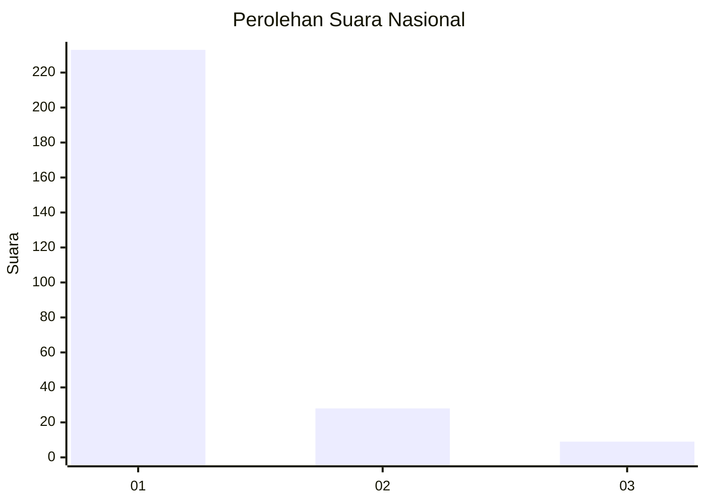
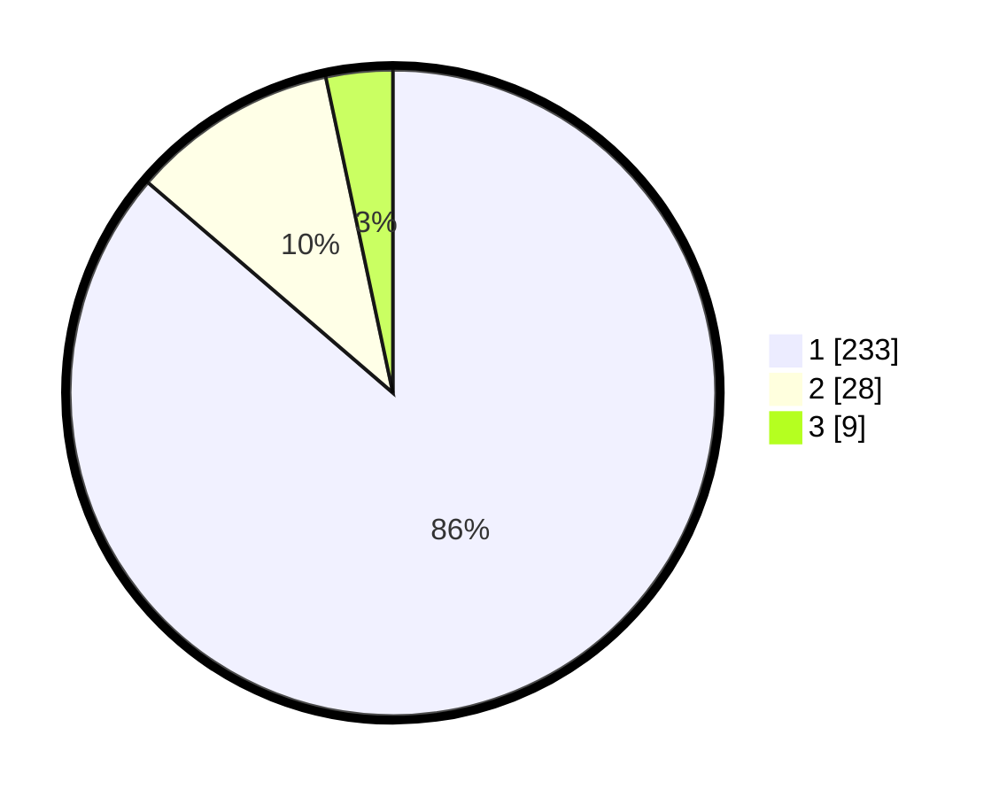

# Hasil

## Grafik

## Tabel

| No. | Nama Paslon    | Suara | Suara (raw) | Persentase |
|:--- |:-------------- | -----:| -----------:| ----------:|
| 1   | ANIES MUHAIMIN | 233   | [233][p-1]  | 86,30      |
| 2   | PRABOWO GIBRAN | 28    | [28][p-2]   | 10,37      |
| 3   | GANJAR MAHFUD  | 9     | [9][p-3]    | 3,33       |

[p-1]: https://github.com/gigit-pemilu/pemilu-2024/blob/main/pilpres/hitung-suara/sub/11-aceh/sub/06-aceh-besar/sub/05-montasik/sub/2028-atong/sub/003-tps/sub/paslon-1.txt
[p-2]: https://github.com/gigit-pemilu/pemilu-2024/blob/main/pilpres/hitung-suara/sub/11-aceh/sub/06-aceh-besar/sub/05-montasik/sub/2028-atong/sub/003-tps/sub/paslon-2.txt
[p-3]: https://github.com/gigit-pemilu/pemilu-2024/blob/main/pilpres/hitung-suara/sub/11-aceh/sub/06-aceh-besar/sub/05-montasik/sub/2028-atong/sub/003-tps/sub/paslon-3.txt

## Foto C Plano

https://sirekap-obj-formc.kpu.go.id/59ad/pemilu/ppwp/11/06/05/20/28/1106052028003-20240214-202442--7e331b72-2830-49d9-a23d-0937394dc806.jpg

https://sirekap-obj-formc.kpu.go.id/59ad/pemilu/ppwp/11/06/05/20/28/1106052028003-20240214-202515--ed9b55b4-e6ca-4b3e-8be9-3b9f454ae24e.jpg

https://sirekap-obj-formc.kpu.go.id/59ad/pemilu/ppwp/11/06/05/20/28/1106052028003-20240214-220911--ed74e8d8-271e-4751-b76d-ae161bbd4828.jpg

## Metadata

| Key        | Value               |
| ---------- | ------------------- |
| Time Stamp | 2024-02-15 00:41:44 |

