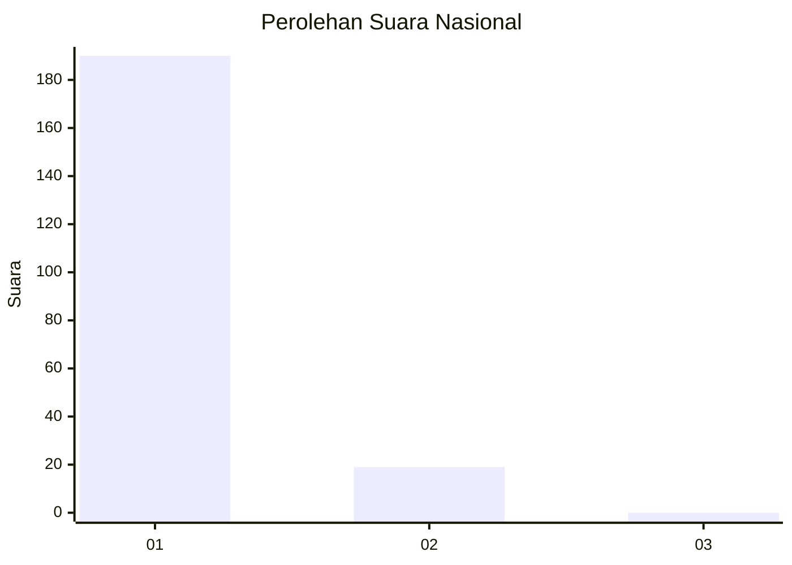
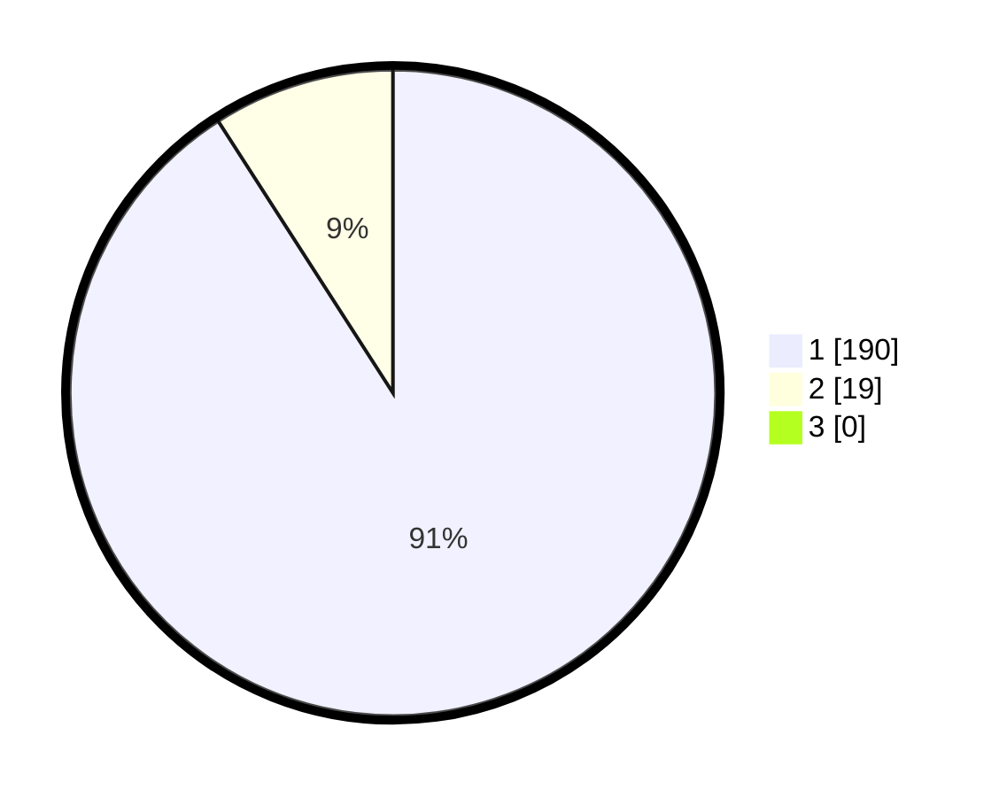

# Hasil

## Grafik

## Tabel

| No. | Nama Paslon    | Suara | Suara (raw) | Persentase |
|:--- |:-------------- | -----:| -----------:| ----------:|
| 1   | ANIES MUHAIMIN | 190   | [190][p-1]  | 90,91      |
| 2   | PRABOWO GIBRAN | 19    | [19][p-2]   | 9,09       |
| 3   | GANJAR MAHFUD  | 0     | [0][p-3]    | 0,00       |

[p-1]: https://github.com/gigit-pemilu/pemilu-2024/blob/main/pilpres/hitung-suara/sub/11-aceh/sub/06-aceh-besar/sub/05-montasik/sub/2029-reudeup/sub/001-tps/sub/paslon-1.txt
[p-2]: https://github.com/gigit-pemilu/pemilu-2024/blob/main/pilpres/hitung-suara/sub/11-aceh/sub/06-aceh-besar/sub/05-montasik/sub/2029-reudeup/sub/001-tps/sub/paslon-2.txt
[p-3]: https://github.com/gigit-pemilu/pemilu-2024/blob/main/pilpres/hitung-suara/sub/11-aceh/sub/06-aceh-besar/sub/05-montasik/sub/2029-reudeup/sub/001-tps/sub/paslon-3.txt

## Foto C Plano

https://sirekap-obj-formc.kpu.go.id/e0fe/pemilu/ppwp/11/06/05/20/29/1106052029001-20240215-144729--66b8723f-c9f8-44ec-b179-6dc66dff3c12.jpg

https://sirekap-obj-formc.kpu.go.id/e0fe/pemilu/ppwp/11/06/05/20/29/1106052029001-20240215-034832--67c47398-699b-4a57-80f2-31cb4799b667.jpg

https://sirekap-obj-formc.kpu.go.id/e0fe/pemilu/ppwp/11/06/05/20/29/1106052029001-20240215-035024--719d3761-c791-44c9-9415-50a46c984d47.jpg

## Metadata

| Key        | Value               |
| ---------- | ------------------- |
| Time Stamp | 2024-02-15 18:00:26 |

