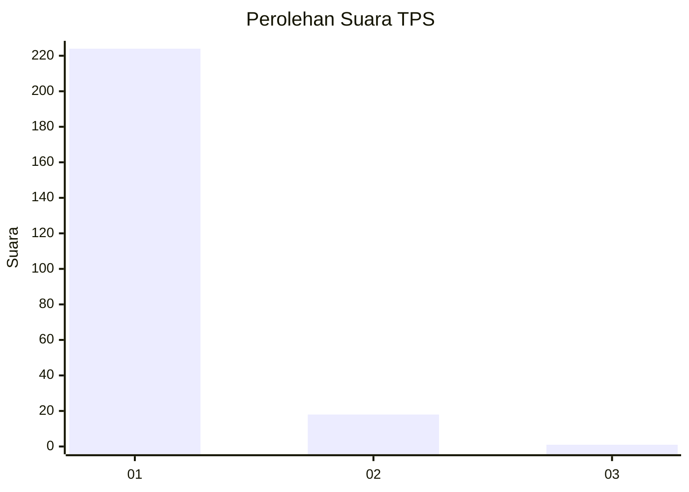
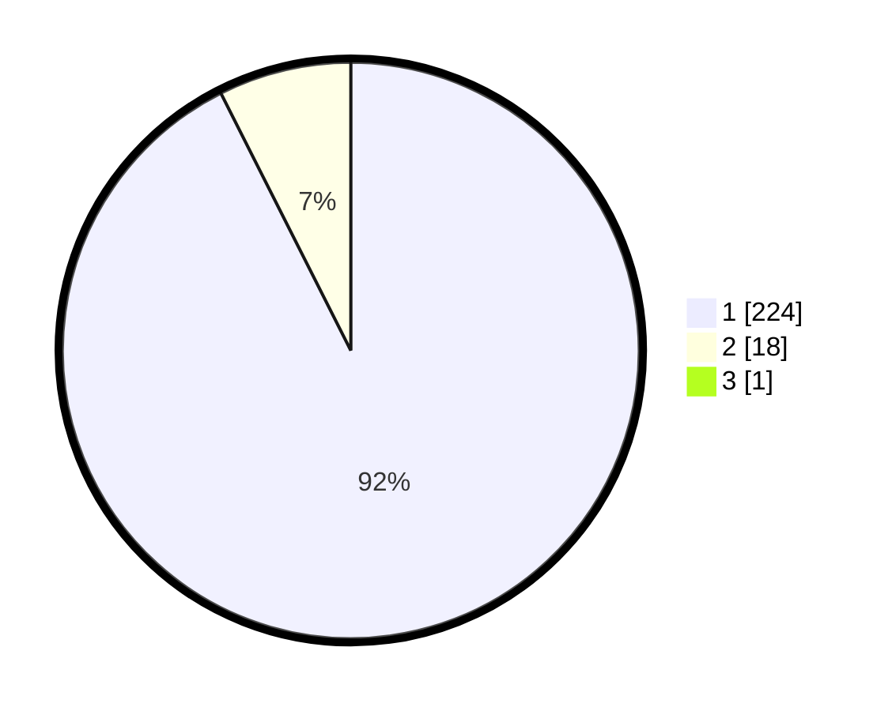

# Hasil

## Grafik

## Tabel

| No. | Nama Paslon    | Suara | Suara (raw) | Persentase |
|:--- |:-------------- | -----:| -----------:| ----------:|
| 1   | ANIES MUHAIMIN | 224   | [224][p-1]  | 92,18      |
| 2   | PRABOWO GIBRAN | 18    | [18][p-2]   | 7,41       |
| 3   | GANJAR MAHFUD  | 1     | [1][p-3]    | 0,41       |

[p-1]: https://github.com/gigit-pemilu/pemilu-2024-11-aceh/blob/main/pilpres/hitung-suara/sub/11-aceh/sub/06-aceh-besar/sub/05-montasik/sub/2042-seubam-lhok/sub/001-tps/sub/paslon-1.txt
[p-2]: https://github.com/gigit-pemilu/pemilu-2024-11-aceh/blob/main/pilpres/hitung-suara/sub/11-aceh/sub/06-aceh-besar/sub/05-montasik/sub/2042-seubam-lhok/sub/001-tps/sub/paslon-2.txt
[p-3]: https://github.com/gigit-pemilu/pemilu-2024-11-aceh/blob/main/pilpres/hitung-suara/sub/11-aceh/sub/06-aceh-besar/sub/05-montasik/sub/2042-seubam-lhok/sub/001-tps/sub/paslon-3.txt

## Foto C Plano

https://sirekap-obj-formc.kpu.go.id/cb1e/pemilu/ppwp/11/06/05/20/42/1106052042001-20240217-110618--35e8c575-f8c9-48ba-8073-dc7080727ab2.jpg

https://sirekap-obj-formc.kpu.go.id/cb1e/pemilu/ppwp/11/06/05/20/42/1106052042001-20240217-101838--16dd86c4-5e58-455a-8298-9b73fcde2506.jpg

https://sirekap-obj-formc.kpu.go.id/cb1e/pemilu/ppwp/11/06/05/20/42/1106052042001-20240217-102345--e134984b-1f3b-4d7e-853f-06e8be8e34e0.jpg

## Metadata

| Key        | Value               |
| ---------- | ------------------- |
| Time Stamp | 2024-02-24 22:31:28 |

