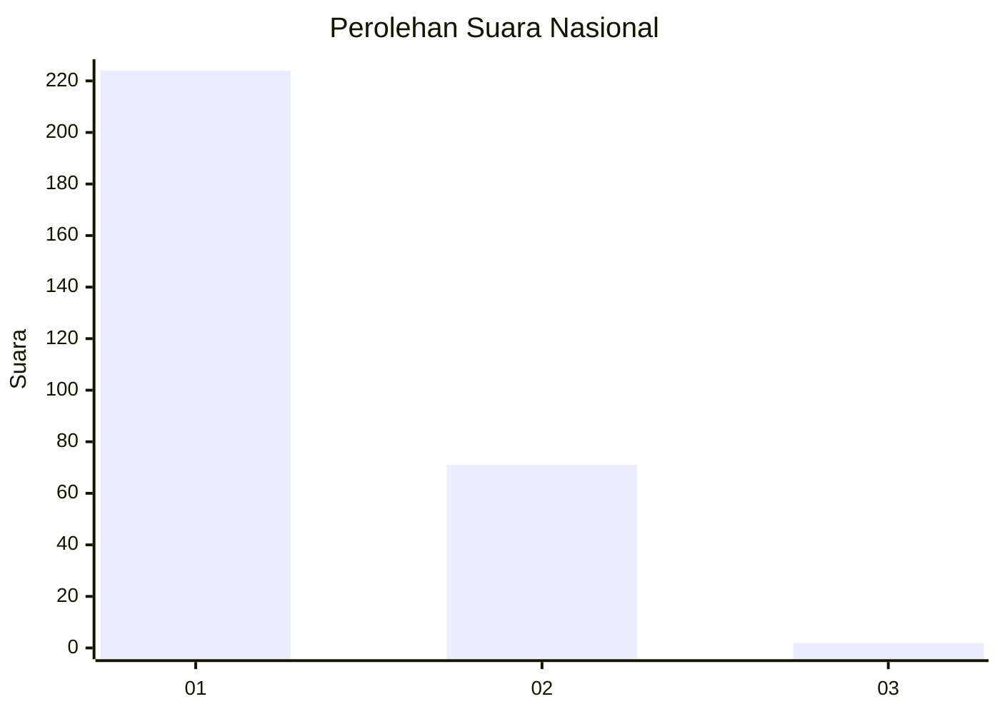
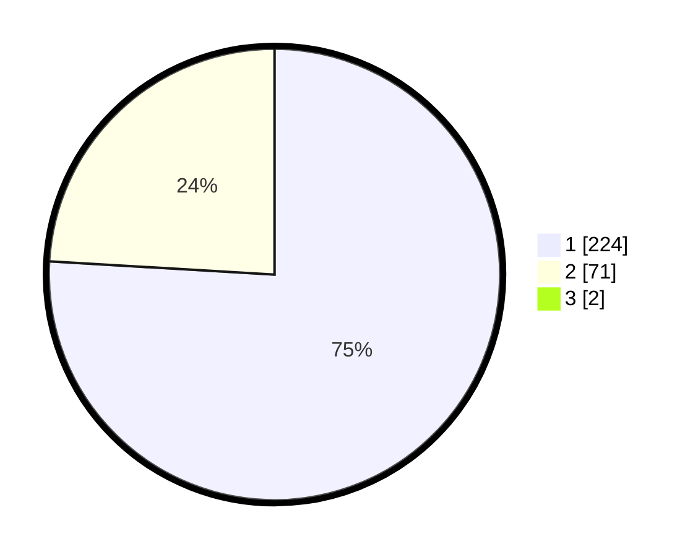

# Hasil

## Grafik

## Tabel

| No. | Nama Paslon    | Suara | Suara (raw) | Persentase |
|:--- |:-------------- | -----:| -----------:| ----------:|
| 1   | ANIES MUHAIMIN | 224   | [224][p-1]  | 75,42      |
| 2   | PRABOWO GIBRAN | 71    | [71][p-2]   | 23,91      |
| 3   | GANJAR MAHFUD  | 2     | [2][p-3]    | 0,67       |

[p-1]: https://github.com/gigit-pemilu/pemilu-2024/blob/main/pilpres/hitung-suara/sub/11-aceh/sub/06-aceh-besar/sub/05-montasik/sub/2045-mon-ara/sub/001-tps/sub/paslon-1.txt
[p-2]: https://github.com/gigit-pemilu/pemilu-2024/blob/main/pilpres/hitung-suara/sub/11-aceh/sub/06-aceh-besar/sub/05-montasik/sub/2045-mon-ara/sub/001-tps/sub/paslon-2.txt
[p-3]: https://github.com/gigit-pemilu/pemilu-2024/blob/main/pilpres/hitung-suara/sub/11-aceh/sub/06-aceh-besar/sub/05-montasik/sub/2045-mon-ara/sub/001-tps/sub/paslon-3.txt

## Foto C Plano

https://sirekap-obj-formc.kpu.go.id/1052/pemilu/ppwp/11/06/05/20/45/1106052045001-20240214-224503--421b3615-aab8-464f-a7a5-56f76b586be4.jpg

https://sirekap-obj-formc.kpu.go.id/1052/pemilu/ppwp/11/06/05/20/45/1106052045001-20240214-224758--4c5fa0e4-95dd-4f91-9430-a47415158ba1.jpg

https://sirekap-obj-formc.kpu.go.id/1052/pemilu/ppwp/11/06/05/20/45/1106052045001-20240215-071848--3c366fbd-e71c-4b11-81fb-78df0771e7d8.jpg

## Metadata

| Key        | Value               |
| ---------- | ------------------- |
| Time Stamp | 2024-02-15 09:00:24 |

