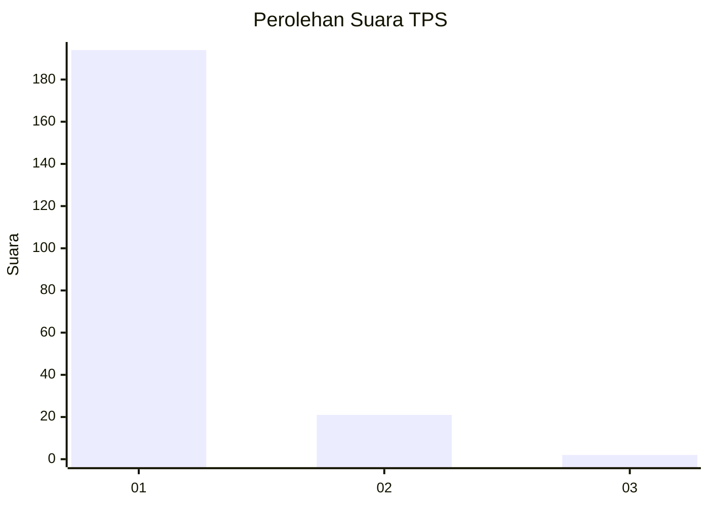
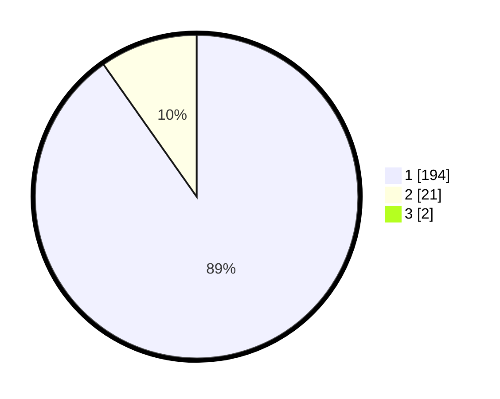

# Hasil

## Grafik

## Tabel

| No. | Nama Paslon    | Suara | Suara (raw) | Persentase |
|:--- |:-------------- | -----:| -----------:| ----------:|
| 1   | ANIES MUHAIMIN | 194   | [194][p-1]  | 89,40      |
| 2   | PRABOWO GIBRAN | 21    | [21][p-2]   | 9,68       |
| 3   | GANJAR MAHFUD  | 2     | [2][p-3]    | 0,92       |

[p-1]: https://github.com/gigit-pemilu/pemilu-2024-11-aceh/blob/main/pilpres/hitung-suara/sub/11-aceh/sub/06-aceh-besar/sub/05-montasik/sub/2048-bueng-raya/sub/001-tps/sub/paslon-1.txt
[p-2]: https://github.com/gigit-pemilu/pemilu-2024-11-aceh/blob/main/pilpres/hitung-suara/sub/11-aceh/sub/06-aceh-besar/sub/05-montasik/sub/2048-bueng-raya/sub/001-tps/sub/paslon-2.txt
[p-3]: https://github.com/gigit-pemilu/pemilu-2024-11-aceh/blob/main/pilpres/hitung-suara/sub/11-aceh/sub/06-aceh-besar/sub/05-montasik/sub/2048-bueng-raya/sub/001-tps/sub/paslon-3.txt

## Foto C Plano

https://sirekap-obj-formc.kpu.go.id/a87c/pemilu/ppwp/11/06/05/20/48/1106052048001-20240214-215815--be21517c-209f-4eb9-a3bc-1521f2008911.jpg

https://sirekap-obj-formc.kpu.go.id/a87c/pemilu/ppwp/11/06/05/20/48/1106052048001-20240214-215911--7038ab08-e36f-47f3-91d9-f42e6d6833a3.jpg

https://sirekap-obj-formc.kpu.go.id/a87c/pemilu/ppwp/11/06/05/20/48/1106052048001-20240214-220004--ecb08292-db5e-4f0d-b4e4-08b5cba1cb91.jpg

## Metadata

| Key        | Value               |
| ---------- | ------------------- |
| Time Stamp | 2024-02-15 16:00:26 |

