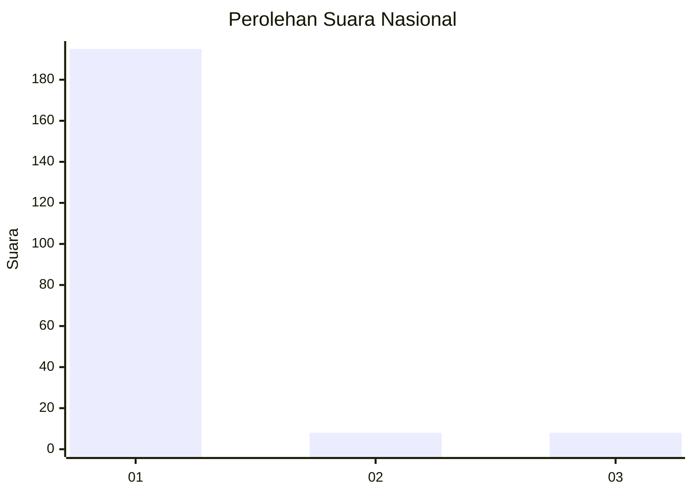
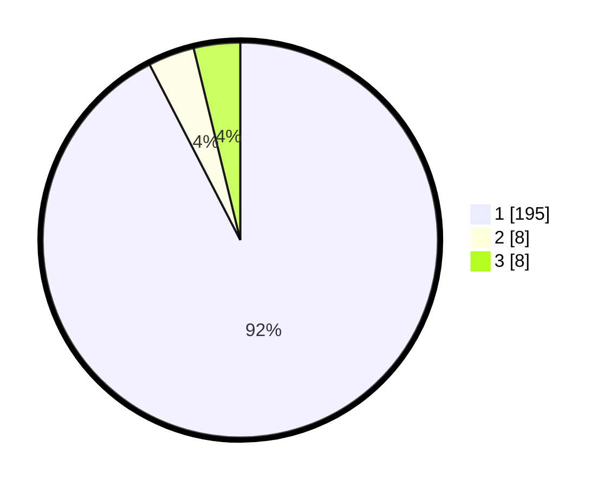

# Hasil

## Grafik

## Tabel

| No. | Nama Paslon    | Suara | Suara (raw) | Persentase |
|:--- |:-------------- | -----:| -----------:| ----------:|
| 1   | ANIES MUHAIMIN | 195   | [195][p-1]  | 92,42      |
| 2   | PRABOWO GIBRAN | 8     | [8][p-2]    | 3,79       |
| 3   | GANJAR MAHFUD  | 8     | [8][p-3]    | 3,79       |

[p-1]: https://github.com/gigit-pemilu/pemilu-2024/blob/main/pilpres/hitung-suara/sub/11-aceh/sub/06-aceh-besar/sub/05-montasik/sub/2048-bueng-raya/sub/002-tps/sub/paslon-1.txt
[p-2]: https://github.com/gigit-pemilu/pemilu-2024/blob/main/pilpres/hitung-suara/sub/11-aceh/sub/06-aceh-besar/sub/05-montasik/sub/2048-bueng-raya/sub/002-tps/sub/paslon-2.txt
[p-3]: https://github.com/gigit-pemilu/pemilu-2024/blob/main/pilpres/hitung-suara/sub/11-aceh/sub/06-aceh-besar/sub/05-montasik/sub/2048-bueng-raya/sub/002-tps/sub/paslon-3.txt

## Foto C Plano

https://sirekap-obj-formc.kpu.go.id/e9a4/pemilu/ppwp/11/06/05/20/48/1106052048002-20240214-221236--9647f456-6421-4f21-9529-e8c30a878d59.jpg

https://sirekap-obj-formc.kpu.go.id/e9a4/pemilu/ppwp/11/06/05/20/48/1106052048002-20240214-221422--ccd7223f-a9b0-4fd5-a72a-67f22111e35a.jpg

https://sirekap-obj-formc.kpu.go.id/e9a4/pemilu/ppwp/11/06/05/20/48/1106052048002-20240214-221529--dff96671-9251-4aee-a839-586c0992ec19.jpg

## Metadata

| Key        | Value               |
| ---------- | ------------------- |
| Time Stamp | 2024-02-15 16:00:26 |

