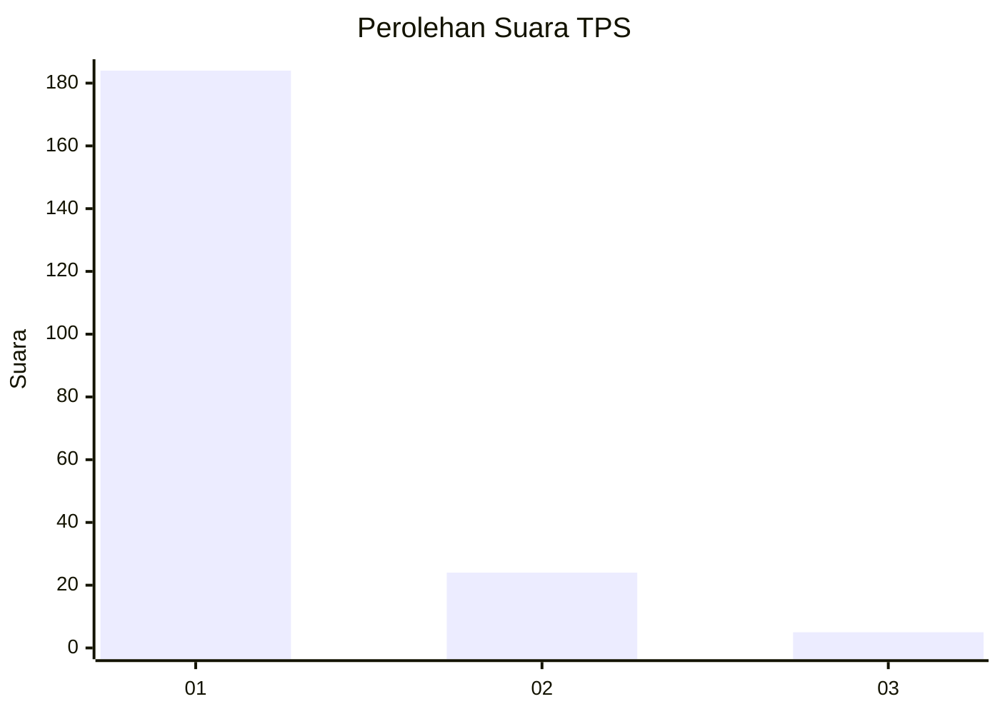
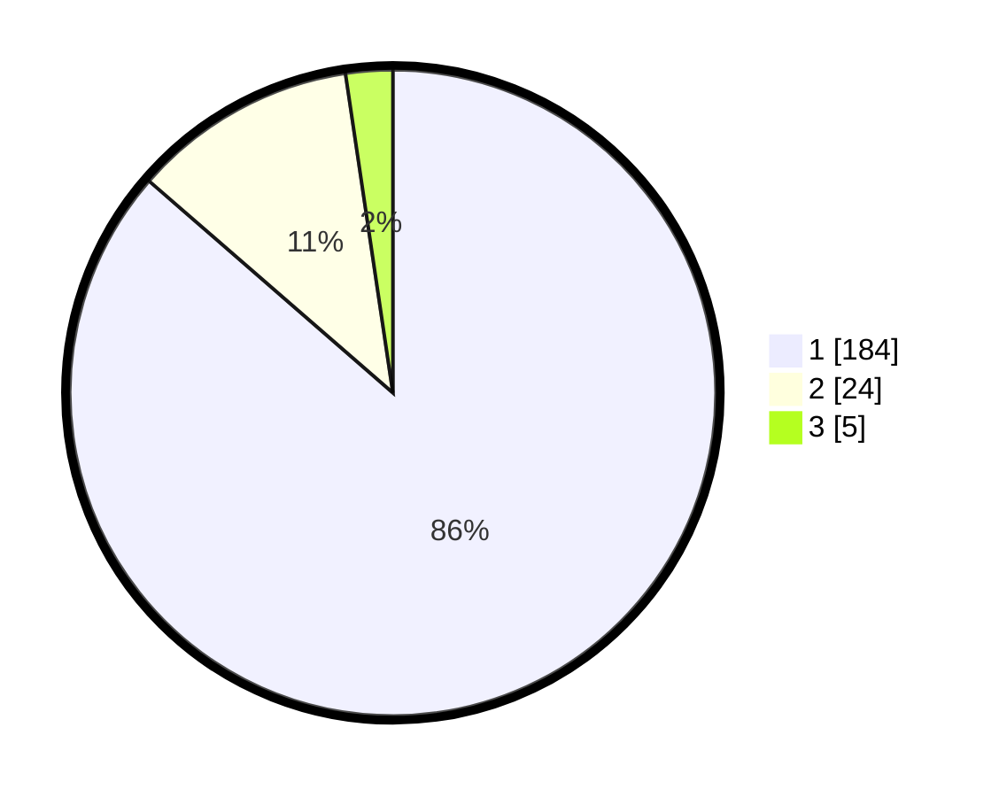

# Hasil

## Grafik

## Tabel

| No. | Nama Paslon    | Suara | Suara (raw) | Persentase |
|:--- |:-------------- | -----:| -----------:| ----------:|
| 1   | ANIES MUHAIMIN | 184   | [184][p-1]  | 86,38      |
| 2   | PRABOWO GIBRAN | 24    | [24][p-2]   | 11,27      |
| 3   | GANJAR MAHFUD  | 5     | [5][p-3]    | 2,35       |

[p-1]: https://github.com/gigit-pemilu/pemilu-2024-11-aceh/blob/main/pilpres/hitung-suara/sub/11-aceh/sub/06-aceh-besar/sub/05-montasik/sub/2049-piyeung-lhang/sub/001-tps/sub/paslon-1.txt
[p-2]: https://github.com/gigit-pemilu/pemilu-2024-11-aceh/blob/main/pilpres/hitung-suara/sub/11-aceh/sub/06-aceh-besar/sub/05-montasik/sub/2049-piyeung-lhang/sub/001-tps/sub/paslon-2.txt
[p-3]: https://github.com/gigit-pemilu/pemilu-2024-11-aceh/blob/main/pilpres/hitung-suara/sub/11-aceh/sub/06-aceh-besar/sub/05-montasik/sub/2049-piyeung-lhang/sub/001-tps/sub/paslon-3.txt

## Foto C Plano

https://sirekap-obj-formc.kpu.go.id/c2a0/pemilu/ppwp/11/06/05/20/49/1106052049001-20240215-021738--1cf6de5f-5d90-4b18-8e0a-495f1b1feb6a.jpg

https://sirekap-obj-formc.kpu.go.id/c2a0/pemilu/ppwp/11/06/05/20/49/1106052049001-20240215-022512--498889d9-a0ed-491c-9afa-6fdfa08ab496.jpg

https://sirekap-obj-formc.kpu.go.id/c2a0/pemilu/ppwp/11/06/05/20/49/1106052049001-20240215-022618--975d08f5-3a4a-47e5-9ed7-18e08b1b9d26.jpg

## Metadata

| Key        | Value               |
| ---------- | ------------------- |
| Time Stamp | 2024-02-15 12:00:28 |

