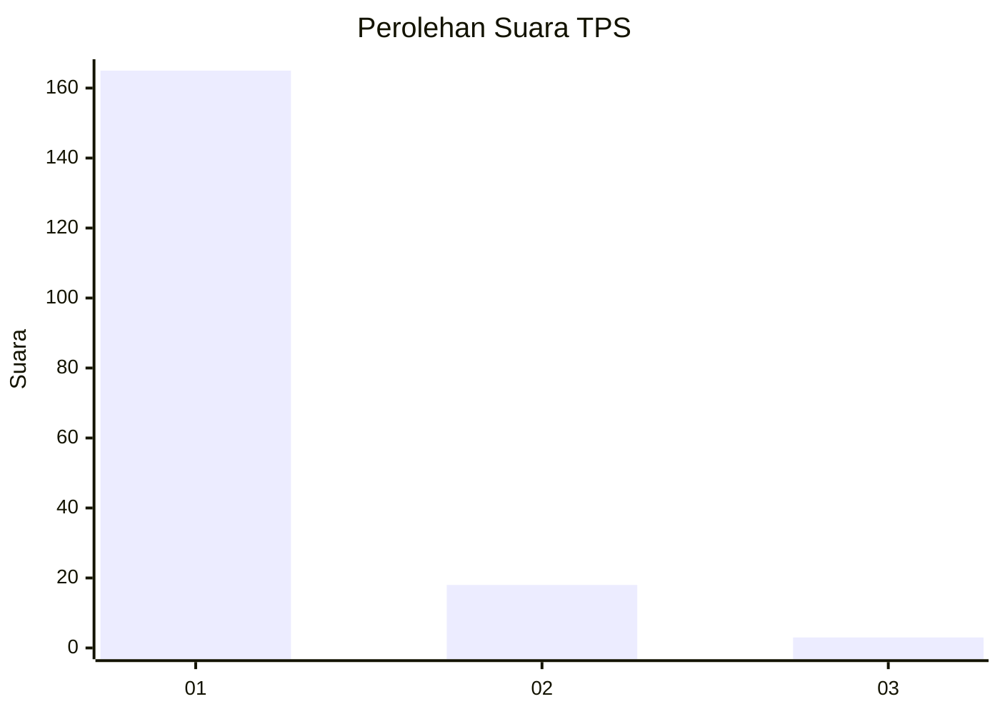
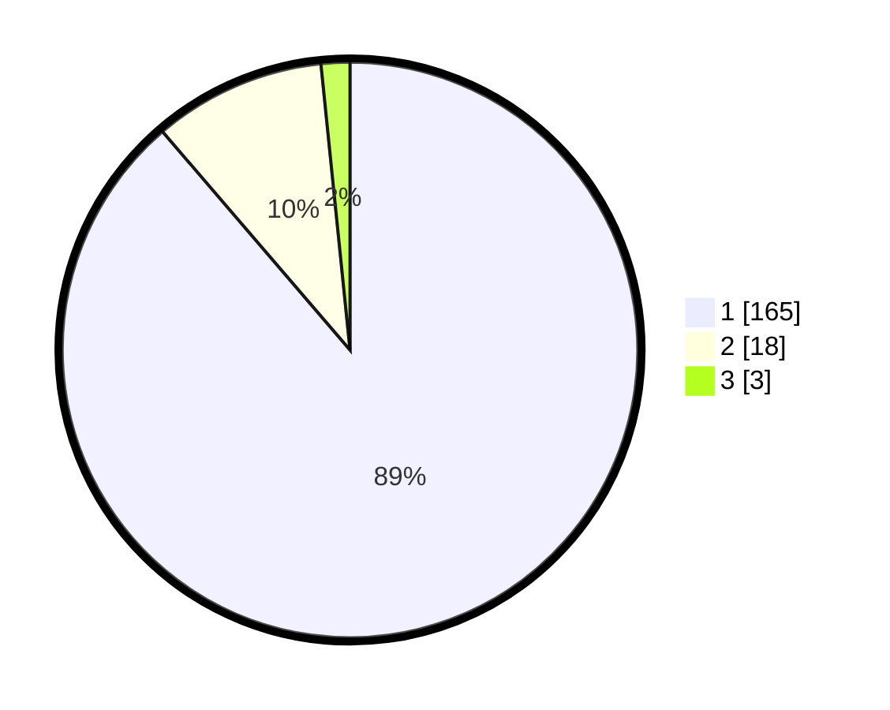

# Hasil

## Grafik

## Tabel

| No. | Nama Paslon    | Suara | Suara (raw) | Persentase |
|:--- |:-------------- | -----:| -----------:| ----------:|
| 1   | ANIES MUHAIMIN | 165   | [165][p-1]  | 88,71      |
| 2   | PRABOWO GIBRAN | 18    | [18][p-2]   | 9,68       |
| 3   | GANJAR MAHFUD  | 3     | [3][p-3]    | 1,61       |

[p-1]: https://github.com/gigit-pemilu/pemilu-2024-11-aceh/blob/main/pilpres/hitung-suara/sub/11-aceh/sub/06-aceh-besar/sub/05-montasik/sub/2053-piyeung-datu/sub/001-tps/sub/paslon-1.txt
[p-2]: https://github.com/gigit-pemilu/pemilu-2024-11-aceh/blob/main/pilpres/hitung-suara/sub/11-aceh/sub/06-aceh-besar/sub/05-montasik/sub/2053-piyeung-datu/sub/001-tps/sub/paslon-2.txt
[p-3]: https://github.com/gigit-pemilu/pemilu-2024-11-aceh/blob/main/pilpres/hitung-suara/sub/11-aceh/sub/06-aceh-besar/sub/05-montasik/sub/2053-piyeung-datu/sub/001-tps/sub/paslon-3.txt

## Foto C Plano

https://sirekap-obj-formc.kpu.go.id/58cc/pemilu/ppwp/11/06/05/20/53/1106052053001-20240214-204753--92c3fc4c-741d-41a9-8623-9636abd6ff8a.jpg

https://sirekap-obj-formc.kpu.go.id/58cc/pemilu/ppwp/11/06/05/20/53/1106052053001-20240214-204314--a1b44f10-ce55-4da0-bf36-5deccaecdeea.jpg

https://sirekap-obj-formc.kpu.go.id/58cc/pemilu/ppwp/11/06/05/20/53/1106052053001-20240214-204608--f15f384e-4b06-43bb-8fd8-9a48308cb8e2.jpg

## Metadata

| Key        | Value               |
| ---------- | ------------------- |
| Time Stamp | 2024-02-15 00:41:44 |

