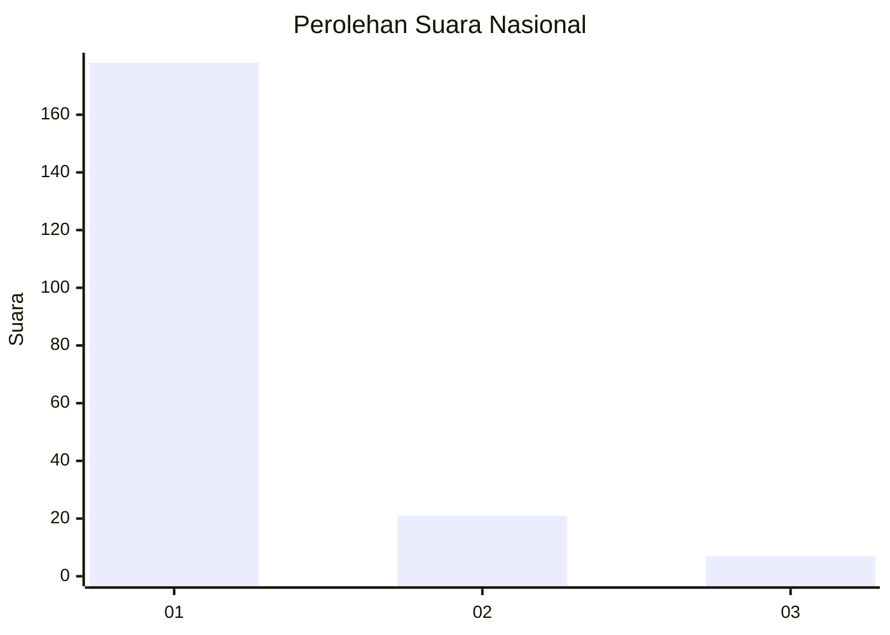
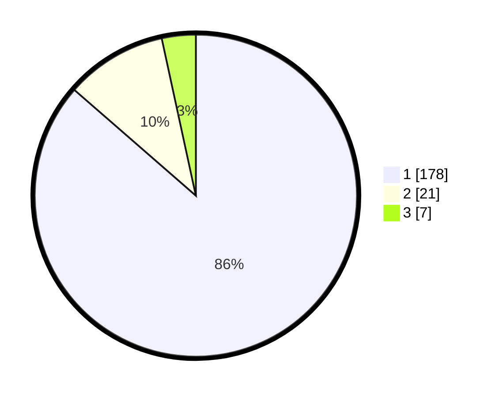

# Hasil

## Grafik

## Tabel

| No. | Nama Paslon    | Suara | Suara (raw) | Persentase |
|:--- |:-------------- | -----:| -----------:| ----------:|
| 1   | ANIES MUHAIMIN | 178   | [178][p-1]  | 86,41      |
| 2   | PRABOWO GIBRAN | 21    | [21][p-2]   | 10,19      |
| 3   | GANJAR MAHFUD  | 7     | [7][p-3]    | 3,40       |

[p-1]: https://github.com/gigit-pemilu/pemilu-2024/blob/main/pilpres/hitung-suara/sub/11-aceh/sub/06-aceh-besar/sub/06-sukamakmur/sub/2001-reuhat-tuha/sub/001-tps/sub/paslon-1.txt
[p-2]: https://github.com/gigit-pemilu/pemilu-2024/blob/main/pilpres/hitung-suara/sub/11-aceh/sub/06-aceh-besar/sub/06-sukamakmur/sub/2001-reuhat-tuha/sub/001-tps/sub/paslon-2.txt
[p-3]: https://github.com/gigit-pemilu/pemilu-2024/blob/main/pilpres/hitung-suara/sub/11-aceh/sub/06-aceh-besar/sub/06-sukamakmur/sub/2001-reuhat-tuha/sub/001-tps/sub/paslon-3.txt

## Foto C Plano

https://sirekap-obj-formc.kpu.go.id/19c0/pemilu/ppwp/11/06/06/20/01/1106062001001-20240216-232114--0f72f26a-8267-4c33-85c8-6cdab6f74cab.jpg

https://sirekap-obj-formc.kpu.go.id/19c0/pemilu/ppwp/11/06/06/20/01/1106062001001-20240216-232115--e78e50c7-0f89-4076-8501-0131986267cd.jpg

https://sirekap-obj-formc.kpu.go.id/19c0/pemilu/ppwp/11/06/06/20/01/1106062001001-20240216-232114--2664ee3f-bde8-4116-8eeb-67c4290ad50c.jpg

## Metadata

| Key        | Value               |
| ---------- | ------------------- |
| Time Stamp | 2024-02-17 01:07:28 |

## DATA PEMILIH TETAP

Jumlah pemilih dalam DPT: **243**.
 * L: **117**.
 * P: **126**.

## DATA PENGGUNA HAK PILIH

Jumlah pengguna hak pilih dalam DPT: **206**.
 * L: **94**.
 * P: **112**.

Jumlah pengguna hak pilih dalam DPTb: **0**.
 * L: **0**.
 * P: **0**.

Jumlah pengguna hak pilih dalam DPK: **1**.
 * L: **1**.
 * P: **0**.

Jumlah pengguna hak pilih: **207**.
 * L: **95**.
 * P: **112**.

## JUMLAH SUARA SAH DAN TIDAK SAH

JUMLAH SELURUH SUARA SAH: **206**.

JUMLAH SUARA TIDAK SAH: **1**.

JUMLAH SELURUH SUARA SAH DAN SUARA TIDAK SAH: **207**.

