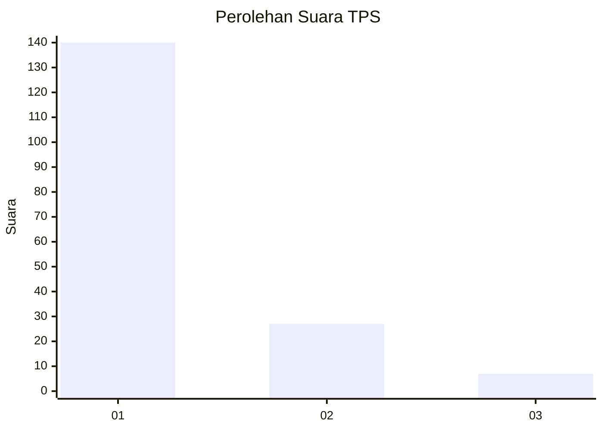
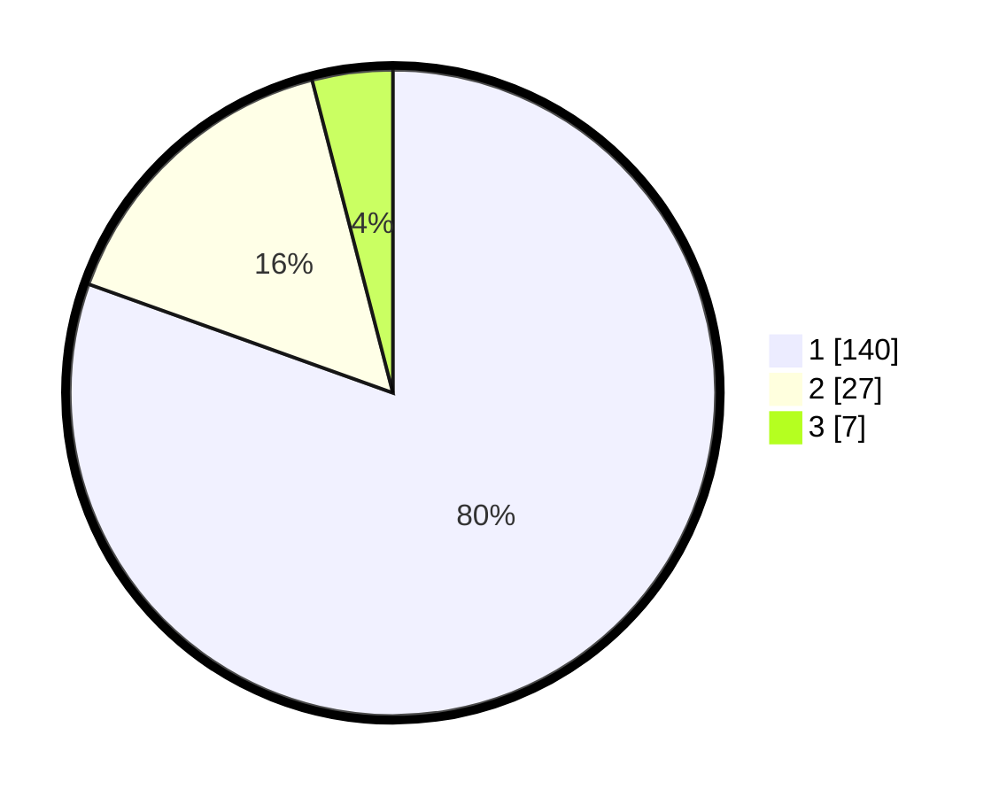

# Hasil

## Grafik

## Tabel

| No. | Nama Paslon    | Suara | Suara (raw) | Persentase |
|:--- |:-------------- | -----:| -----------:| ----------:|
| 1   | ANIES MUHAIMIN | 140   | [140][p-1]  | 80,46      |
| 2   | PRABOWO GIBRAN | 27    | [27][p-2]   | 15,52      |
| 3   | GANJAR MAHFUD  | 7     | [7][p-3]    | 4,02       |

[p-1]: https://github.com/gigit-pemilu/pemilu-2024-11-aceh/blob/main/pilpres/hitung-suara/sub/11-aceh/sub/06-aceh-besar/sub/06-sukamakmur/sub/2003-dilib-lamteungoh/sub/001-tps/sub/paslon-1.txt
[p-2]: https://github.com/gigit-pemilu/pemilu-2024-11-aceh/blob/main/pilpres/hitung-suara/sub/11-aceh/sub/06-aceh-besar/sub/06-sukamakmur/sub/2003-dilib-lamteungoh/sub/001-tps/sub/paslon-2.txt
[p-3]: https://github.com/gigit-pemilu/pemilu-2024-11-aceh/blob/main/pilpres/hitung-suara/sub/11-aceh/sub/06-aceh-besar/sub/06-sukamakmur/sub/2003-dilib-lamteungoh/sub/001-tps/sub/paslon-3.txt

## Foto C Plano

https://sirekap-obj-formc.kpu.go.id/a3b6/pemilu/ppwp/11/06/06/20/03/1106062003001-20240214-155152--9eaa3149-6ded-4fb5-83e0-ba3d4ba82a96.jpg

https://sirekap-obj-formc.kpu.go.id/a3b6/pemilu/ppwp/11/06/06/20/03/1106062003001-20240214-155523--f3ea490a-ec88-4d7e-9c92-b57d8ed85010.jpg

https://sirekap-obj-formc.kpu.go.id/a3b6/pemilu/ppwp/11/06/06/20/03/1106062003001-20240216-150123--b5a9ebd4-5f28-4575-abf5-dbe6bec9d6f2.jpg

## Metadata

| Key        | Value               |
| ---------- | ------------------- |
| Time Stamp | 2024-02-16 16:25:10 |

## DATA PEMILIH TETAP

Jumlah pemilih dalam DPT: **197**.
 * L: **95**.
 * P: **102**.

## DATA PENGGUNA HAK PILIH

Jumlah pengguna hak pilih dalam DPT: **178**.
 * L: **83**.
 * P: **95**.

Jumlah pengguna hak pilih dalam DPTb: **1**.
 * L: **1**.
 * P: **0**.

Jumlah pengguna hak pilih dalam DPK: **1**.
 * L: **1**.
 * P: **0**.

Jumlah pengguna hak pilih: **180**.
 * L: **85**.
 * P: **95**.

## JUMLAH SUARA SAH DAN TIDAK SAH

JUMLAH SELURUH SUARA SAH: **174**.

JUMLAH SUARA TIDAK SAH: **6**.

JUMLAH SELURUH SUARA SAH DAN SUARA TIDAK SAH: **180**.

