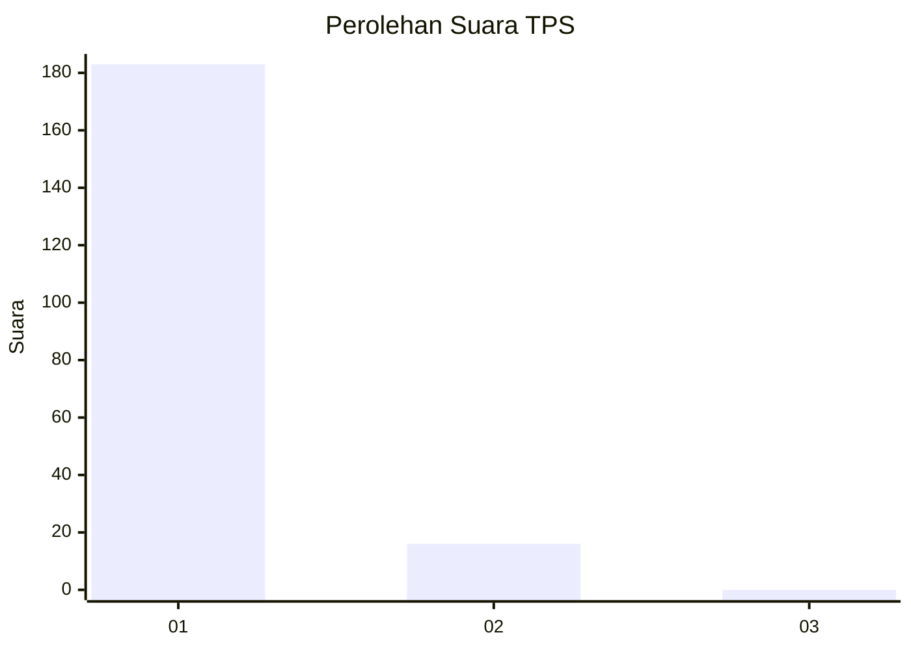
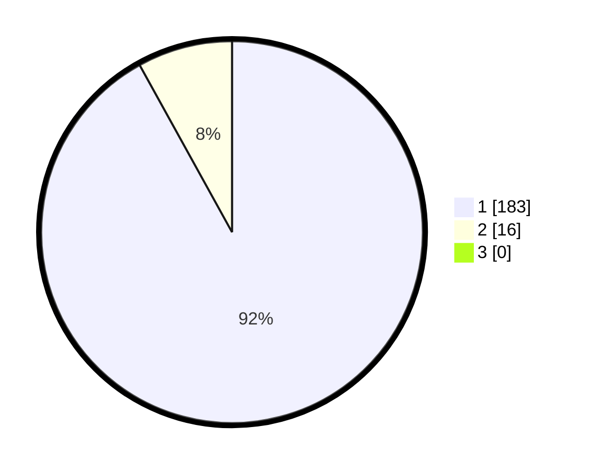

# Hasil

## Grafik

## Tabel

| No. | Nama Paslon    | Suara | Suara (raw) | Persentase |
|:--- |:-------------- | -----:| -----------:| ----------:|
| 1   | ANIES MUHAIMIN | 183   | [183][p-1]  | 91,96      |
| 2   | PRABOWO GIBRAN | 16    | [16][p-2]   | 8,04       |
| 3   | GANJAR MAHFUD  | 0     | [0][p-3]    | 0,00       |

[p-1]: https://github.com/gigit-pemilu/pemilu-2024-11-aceh/blob/main/pilpres/hitung-suara/sub/11-aceh/sub/06-aceh-besar/sub/06-sukamakmur/sub/2005-dilib-bukit/sub/001-tps/sub/paslon-1.txt
[p-2]: https://github.com/gigit-pemilu/pemilu-2024-11-aceh/blob/main/pilpres/hitung-suara/sub/11-aceh/sub/06-aceh-besar/sub/06-sukamakmur/sub/2005-dilib-bukit/sub/001-tps/sub/paslon-2.txt
[p-3]: https://github.com/gigit-pemilu/pemilu-2024-11-aceh/blob/main/pilpres/hitung-suara/sub/11-aceh/sub/06-aceh-besar/sub/06-sukamakmur/sub/2005-dilib-bukit/sub/001-tps/sub/paslon-3.txt

## Foto C Plano

https://sirekap-obj-formc.kpu.go.id/1576/pemilu/ppwp/11/06/06/20/05/1106062005001-20240214-225814--1330d9c7-79c7-4951-97d2-19d55359ba49.jpg

https://sirekap-obj-formc.kpu.go.id/1576/pemilu/ppwp/11/06/06/20/05/1106062005001-20240215-081237--4c8ebe66-56e8-4cba-8f26-de6bad99955e.jpg

https://sirekap-obj-formc.kpu.go.id/1576/pemilu/ppwp/11/06/06/20/05/1106062005001-20240214-230059--c221ade3-5450-4bdb-884e-b753c7226a14.jpg

## Metadata

| Key        | Value               |
| ---------- | ------------------- |
| Time Stamp | 2024-02-15 16:00:26 |

