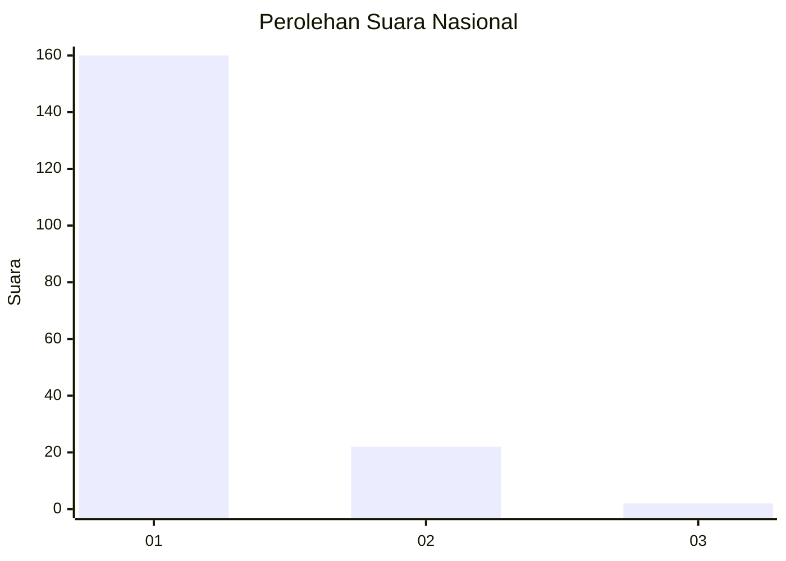
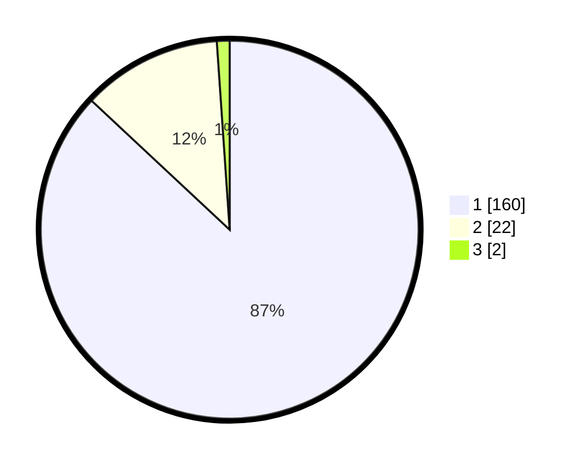

# Hasil

## Grafik

## Tabel

| No. | Nama Paslon    | Suara | Suara (raw) | Persentase |
|:--- |:-------------- | -----:| -----------:| ----------:|
| 1   | ANIES MUHAIMIN | 160   | [160][p-1]  | 86,96      |
| 2   | PRABOWO GIBRAN | 22    | [22][p-2]   | 11,96      |
| 3   | GANJAR MAHFUD  | 2     | [2][p-3]    | 1,09       |

[p-1]: https://github.com/gigit-pemilu/pemilu-2024/blob/main/pilpres/hitung-suara/sub/11-aceh/sub/06-aceh-besar/sub/06-sukamakmur/sub/2015-tampok-blang/sub/002-tps/sub/paslon-1.txt
[p-2]: https://github.com/gigit-pemilu/pemilu-2024/blob/main/pilpres/hitung-suara/sub/11-aceh/sub/06-aceh-besar/sub/06-sukamakmur/sub/2015-tampok-blang/sub/002-tps/sub/paslon-2.txt
[p-3]: https://github.com/gigit-pemilu/pemilu-2024/blob/main/pilpres/hitung-suara/sub/11-aceh/sub/06-aceh-besar/sub/06-sukamakmur/sub/2015-tampok-blang/sub/002-tps/sub/paslon-3.txt

## Foto C Plano

https://sirekap-obj-formc.kpu.go.id/ff19/pemilu/ppwp/11/06/06/20/15/1106062015002-20240214-203059--1b2c39bd-2307-45fd-9ae0-973df0b3c3c9.jpg

https://sirekap-obj-formc.kpu.go.id/ff19/pemilu/ppwp/11/06/06/20/15/1106062015002-20240214-203246--8883057f-fc44-44c3-b8ac-1455a446ea77.jpg

https://sirekap-obj-formc.kpu.go.id/ff19/pemilu/ppwp/11/06/06/20/15/1106062015002-20240214-203422--076fbd95-e483-4dbe-8791-23be7c5bf602.jpg

## Metadata

| Key        | Value               |
| ---------- | ------------------- |
| Time Stamp | 2024-02-15 22:00:27 |

